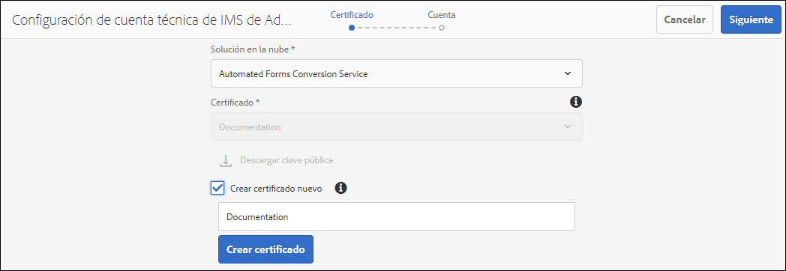
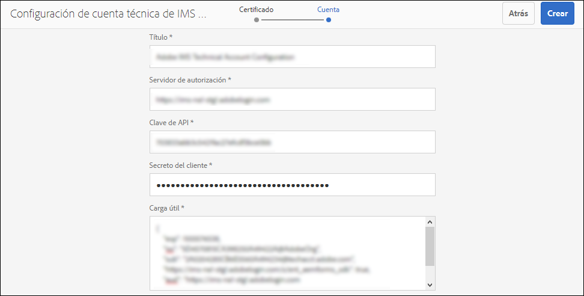
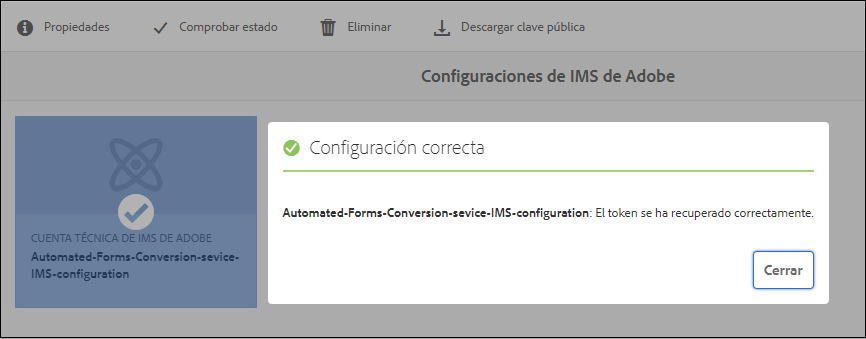

# Configurar el servicio de conversión automatizada de formularios {#about-this-help}

Esta ayuda describe cómo un administrador de AEM puede configurar el servicio de Automated forms conversion para automatizar la conversión de sus PDF forms a formularios adaptables. Esta ayuda es para administradores de TI y AEM de su organización. La información proporcionada se basa en el supuesto de que cualquier persona que lea esta Ayuda está familiarizada con las siguientes tecnologías:

* Instalación, configuración y administración de paquetes de Adobe Experience Manager y AEM,

* Uso de sistemas operativos Linux® y Microsoft® Windows®,

* Configuración de servidores de correo SMTP

<!--- >[!VIDEO](https://video.tv.adobe.com/v/29267/) 

**Watch the video or read the article to configure Automated Forms Conversion service** -->

## Incorporación{#onboarding}

El servicio está disponible de forma gratuita para AEM 6.4 Forms y AEM 6.5 clientes locales de Forms y clientes empresariales de servicio administrado por Adobe. Póngase en contacto con el equipo de ventas de Adobe o con su representante de Adobe para solicitar acceso al servicio. El servicio también está disponible de forma gratuita y está prehabilitado para los clientes de AEM Forms as a Cloud Service.

Adobe posibilita el acceso a su organización y otorga los pertinentes privilegios a la persona de su organización designada como administrador. El administrador puede otorgar acceso a los desarrolladores de AEM Forms (usuarios) de su organización para conectarse al servicio.

## Requisitos previos {#prerequisites}

Para utilizar el servicio de Automated forms conversion, es necesario lo siguiente:

* El servicio de automated forms conversion está habilitado para su organización
* Una cuenta de Adobe ID con privilegios de administrador para el servicio de conversión
* Una instancia de autor de AEM Forms como Cloud Service con el Service Pack AEM más reciente o con las últimas actualizaciones.
* Un usuario AEM (en la instancia de AEM) que es miembro del grupo de usuarios de formularios

## Configuración de entorno {#setuptheservice}

Antes de utilizar el servicio, prepare la instancia de autor de AEM para conectarse al servicio que se ejecuta en Adobe Cloud. Realice los siguientes pasos en la secuencia indicada para preparar la instancia para el servicio:

1. [Descargue e instale AEM 6.4, AEM 6.5 o AEM Forms incorporado como Cloud Service](#aemquickstart)
1. [Descargar e instalar AEM Service Pack más reciente](#servicepack)
1. [Descargue e instale el último paquete de complementos de AEM Forms](#downloadaemformsaddon)
1. (opcional) [Descargue e instale el último paquete del conector](#installConnectorPackage)
1. [Creación de temas y plantillas personalizados](#referencepackage)

### Descargue e instale AEM 6.4 o AEM 6.5 o AEM Forms incorporado como Cloud Service {#aemquickstart}


El servicio de automated forms conversion se ejecuta en AEM instancia de autor. Se necesita AEM 6.4, AEM 6.5 o AEM Forms como Cloud Service para configurar una instancia de autor AEM.

* Si no tiene AEM 6.4 o AEM 6.5 en funcionamiento, descárguelo desde las siguientes ubicaciones. Después de descargar AEM, para obtener instrucciones para configurar una instancia de autor AEM, consulte [implementación y mantenimiento](https://helpx.adobe.com/experience-manager/6-5/sites/deploying/using/deploy.html#defaultlocalinstall):

   * Si ya es cliente de AEM, descargue AEM 6.4 o AEM 6.5 del [sitio web de licencias de Adobe](http://licensing.adobe.com).

   * Si es socio de Adobe, utilice [Programa de formación de socios de Adobe](https://adobe.allegiancetech.com/cgi-bin/qwebcorporate.dll?idx=82357Q) para solicitar AEM 6.4 o AEM 6.5.

* Si utiliza AEM Forms como Cloud Service, consulte Incorporar a [AEM Forms como Cloud Service](https://experienceleague.adobe.com/docs/experience-manager-forms-cloud-service/forms/setup-environment/setup-forms-cloud-service.html?lang=en#setup-environment) y [configurar un entorno de desarrollo local](https://experienceleague.adobe.com/docs/experience-manager-forms-cloud-service/forms/setup-environment/setup-local-development-environment.html?lang=en#setup-environment).

### (Solo para AEM 6.4 y AEM 6.5) Descargue e instale AEM último Service Pack {#servicepack}

Descargue e instale AEM Service Pack más reciente. Para obtener instrucciones detalladas, consulte las [AEM 6.4 Notas de la versión del Service Pack](https://helpx.adobe.com/es/experience-manager/6-4/release-notes/sp-release-notes.html) o [AEM 6.5 Notas de la versión del Service Pack](https://helpx.adobe.com/es/experience-manager/6-5/release-notes/sp-release-notes.html).

### (Solo para AEM 6.4 y AEM 6.5) Descargue e instale el paquete de complementos de AEM Forms  {#downloadaemformsaddon}

Una instancia de AEM contiene funciones básicas de formularios. El servicio de conversión requiere todas las funciones de AEM Forms. Descargue e instale el paquete de complementos de AEM Forms para disponer de todas las funcionalidades de AEM Forms. El paquete es necesario para configurar y ejecutar el servicio de conversión. Para obtener instrucciones detalladas, consulte [Instalar y configurar las capacidades de captura de datos.](https://helpx.adobe.com/es/experience-manager/6-5/forms/using/installing-configuring-aem-forms-osgi.html)

>[!NOTE]
> Asegúrese de realizar las configuraciones obligatorias posteriores a la instalación después de instalar el paquete de complementos.


<!-- ### (Optional) Download and install connector package  {#installConnectorPackage}

The connector package provides early access to the [Auto-detect logical sections](convert-existing-forms-to-adaptive-forms.md#run-the-conversion) features and improvements delivered in release AFC-2020.03.1. Do not install the package if you do not require feature and improvements delivered in AFC-2020.03.1.  You can [download the connector package from AEM Package Share](https://www.adobeaemcloud.com/content/marketplace/marketplaceProxy.html?packagePath=/content/companies/public/adobe/packages/cq650/featurepack/AFCS-Connector-2020.03.1). -->


### Creación de temas y plantillas personalizados {#referencepackage}

Si inicia AEM 6.4 o AEM 6.5 en [modo de producción](https://helpx.adobe.com/experience-manager/6-5/sites/administering/using/production-ready.html) (modo de ejecución nosamplecontent), los paquetes de referencia no están instalados. Los paquetes de referencia contienen temas de muestra y plantillas. El servicio de automated forms conversion requiere al menos un tema y una plantilla para convertir un formulario PDF en un formulario adaptable. Cree un tema personalizado y una plantilla propia y apunte [configuración del servicio](#configure-the-cloud-service) para usar plantillas y temas personalizados antes de usar el servicio.

También puede descargar e instalar el paquete [AEM Forms Reference Assets](https://experience.adobe.com/#/downloads/content/software-distribution/es-ES/aemcloud.html) en la instancia de autor. Crea algunos temas de referencia y plantillas.

## Configure el servicio {#configure-the-service}

Antes de proceder a la configuración del servicio y conectar la instancia local con el servicio que se ejecuta en Adobe Cloud, obtenga información sobre las personas y los privilegios necesarios para conectarse al servicio. El servicio utiliza dos tipos diferentes de personalidades, administradores y desarrolladores:

* **Administradores**: Los administradores son responsables de administrar el software y los servicios de Adobe para su organización. Los administradores conceden acceso a los desarrolladores de su organización para que se conecten al servicio de Automated forms conversion que se ejecuta en Adobe Cloud. Cuando se aprovisiona un administrador para una organización, este recibe un correo electrónico con el título **[!UICONTROL 'You now have administrator rights to manage Adobe software and services for your organization']**. Si es administrador, compruebe si hay algún correo electrónico en su buzón con el título mencionado anteriormente y vaya a [conceder acceso a los desarrolladores de su organización](#adduseranddevs).


* **Desarrolladores**: Un desarrollador conecta una instancia de autor local de AEM Forms con el servicio de Automated forms conversion que se ejecuta en Adobe Cloud. Cuando un administrador concede derechos a un desarrollador para que se conecte al servicio de Automated forms conversion, se envía un mensaje de correo electrónico con el título Ahora tiene acceso de desarrollador para administrar las integraciones de API de Adobe para su organización al desarrollador. Si es un desarrollador, compruebe si hay un correo electrónico en su buzón con el título anteriormente mencionado y continúe con [Conecte la instancia de AEM local al servicio de Automated forms conversion en Adobe Cloud.](#connectafcadobeio)


### (Solo para administradores de AEM 6.4 y AEM 6.5) Conceda acceso a los desarrolladores de su organización {#adduseranddevs}

Una vez que el Adobe habilita el acceso para su organización y proporciona los privilegios necesarios al administrador, este puede iniciar sesión en el Admin Console (instrucciones detalladas a continuación), crear un perfil y agregar desarrolladores al perfil. Los desarrolladores pueden conectar una instancia local de AEM Forms al servicio de Automated forms conversion en Adobe Cloud.

Los desarrolladores son miembros de su organización designada para ejecutar el servicio de conversión. Solo los desarrolladores que se agregan al perfil de servicio de Automated forms conversion de Adobe tienen derecho a utilizar el servicio de Automated forms conversion. Realice los pasos siguientes para crear un perfil y agregarle desarrolladores. Se requiere un perfil como mínimo para conceder el acceso necesario a los desarrolladores de su organización:

1. Inicie sesión en [Admin Console](https://adminconsole.adobe.com/). Utilice **Adobe ID** del administrador aprovisionado para utilizar el servicio de Automated forms conversion para iniciar sesión. No utilice ningún otro ID o Federated ID para iniciar sesión.
1. Haga clic en la opción **[!UICONTROL Automated Forms Conversion]**.
1. Haga clic **[!UICONTROL New Profile]** en la pestaña **[!UICONTROL Products]**.
1. Especifique **[!UICONTROL Name]**, **[!UICONTROL Display Name]** y **[!UICONTROL Description]** para el perfil. Haga clic **[!UICONTROL Done]**. Se crea un perfil.

   

1. Agregue un desarrollador al perfil. Para agregar los desarrolladores:
   1. En el [Admin Console](https://adminconsole.adobe.com/enterprise), vaya a la pestaña Información general .
   1. Haga clic **[!UICONTROL Assign Developers]** en la tarjeta de producto requerida.
   1. Introduzca la dirección de correo electrónico de los desarrolladores y, opcionalmente, los nombres y apellidos.
   1. Seleccione perfiles de producto. Tocar **[!UICONTROL Save]**.

Repita los pasos anteriores para todos los usuarios. Para obtener más información sobre cómo agregar desarrolladores, consulte [Administrar desarrolladores](https://helpx.adobe.com/enterprise/using/manage-developers.html).

Una vez que un administrador agrega desarrolladores al perfil de Adobe I/O, se notifica a los desarrolladores por correo electrónico. Después de recibir el correo electrónico, los desarrolladores pueden [conectar una instancia local de AEM Forms con el servicio de Automated forms conversion en Adobe Cloud](#connectafcadobeio).

### (Solo para desarrolladores) Conecte la instancia local de AEM Forms al servicio de Automated forms conversion en Adobe Cloud {#connectafcadobeio}

Una vez que un administrador le proporcione acceso para desarrolladores, puede conectar la instancia local de AEM Forms al servicio de Automated forms conversion que se ejecuta en Adobe Cloud. Realice los siguientes pasos en la secuencia indicada para conectar la instancia de AEM Forms al servicio:

* [Configuración de notificaciones por correo electrónico](configure-service.md#configureemailnotification)
* [Agregar un usuario al grupo de usuarios de formularios](#adduserstousergroup)
* [Obtener certificados públicos](#obtainpubliccertificates)
* [Configuración de las API de servicio en Adobe Developer Console](#createintegration)
* [Configuración del servicio en la nube](configure-service.md#configure-the-cloud-service)

#### Configurar notificación por correo electrónico {#configureemailnotification}

El servicio de automated forms conversion utiliza el servicio de correo de Day CQ para enviar notificaciones por correo electrónico. Estas notificaciones por correo electrónico contienen información sobre conversiones correctas o fallidas. Si elige no recibir notificación, omita estos pasos. Realice los siguientes pasos para configurar el servicio de correo Day CQ:

* Para AEM 6.4 Forms o AEM 6.5 Forms:

   1. Vaya a AEM administrador de configuración en `http://localhost:4502/system/console/configMgr`
   1. Abra la configuración de Day CQ Mail Service . Especifique un valor para los campos **[!UICONTROL SMTP server host name]**, **[!UICONTROL SMTP server port]** y **[!UICONTROL From address]**. Haga clic **[!UICONTROL Save]**.

      Puede ponerse en contacto con el proveedor de servicios de correo electrónico o el administrador de TI para obtener información sobre el nombre de host y el puerto del servidor SMTP. Puede utilizar cualquier dirección de correo electrónico válida en el campo de formulario. Por ejemplo, notification@example.com o donotreply@example.com.

   1. Abra la configuración **[!UICONTROL Day CQ Link Externalizer]**. En el campo **[!UICONTROL Domains]**, especifique el nombre de host real o la dirección IP y el número de puerto para las instancias locales, de autor y de publicación. Haga clic **[!UICONTROL Save]**.

* Para AEM Forms as a Cloud Service, [registre un ticket de asistencia para habilitar el servicio de correo electrónico](https://experienceleague.adobe.com/docs/experience-manager-cloud-service/implementing/developing/development-guidelines.html?lang=en#sending-email).

#### Agregar un usuario al grupo de usuarios de formularios {#adduserstousergroup}

Especifique una dirección de correo electrónico en el perfil del usuario de AEM designado para ejecutar el servicio. Asegúrese de que el usuario es miembro del grupo [user](https://experienceleague.adobe.com/docs/experience-manager-65/forms/manage-administer-aem-forms/forms-groups-privileges-tasks.html) de usuarios de formularios. Se envían correos electrónicos a la dirección de correo electrónico del usuario que ejecuta la conversión. Para especificar una dirección de correo electrónico para el usuario y agregar el usuario al grupo de usuarios de formularios:

1. Inicie sesión en la instancia de autor de AEM Forms como administrador de AEM. Use sus credenciales de AEM locales para iniciar sesión. No use Adobe ID para iniciar sesión. Toque **[!UICONTROL Adobe Experience Manager]** > **[!UICONTROL Tools]** > **[!UICONTROL Security]** > **[!UICONTROL Users]**.

1. Seleccione un usuario designado para ejecutar el servicio de conversión y pulse **[!UICONTROL Properties]**. Se abre la página Editar configuración de usuario .
1. Especifique una dirección de correo electrónico en el campo **[!UICONTROL Email]** y pulse **[!UICONTROL Save]**. Los correos electrónicos se envían a la dirección de correo electrónico especificada cuando la conversión se completa o no se realiza correctamente.
1. Pulse la pestaña **Grupos**. En la ficha seleccionar grupo, escriba y seleccione el grupo **forms-users**. Toque **Guardar y cerrar**. El usuario es ahora miembro del grupo de usuarios de formularios.

#### (Sólo para AEM 6.4 y AEM 6.5) Obtener certificados públicos {#obtainpubliccertificates}

Un certificado público permite autenticar el perfil en el Adobe I/O.

1. Inicie sesión en la instancia de autor de AEM Forms. Ir a **[!UICONTROL Tools]**> **[!UICONTROL Security]** > **[!UICONTROL Adobe IMS Configurations]**. Tocar **[!UICONTROL Create]**. Aparece la página **[!UICONTROL Adobe IMS Technical Account Configuration]**.

   

1. Seleccione **[!UICONTROL Automated Forms Conversion Service]** en Cloud Solution.

1. Seleccione la casilla de verificación **[!UICONTROL Create new certificate]** y especifique un alias. El alias sirve como nombre del cuadro de diálogo. Tocar **[!UICONTROL Create certificate]**. Aparece un cuadro de diálogo. Haga clic **[!UICONTROL OK]**. Se crea el certificado.

1. Pulse **[!UICONTROL Download Public Key]** y guarde el archivo de certificado *AEM-Adobe-IMS.crt* en el equipo. El archivo de certificado se utiliza para [configurar las API de servicio en Adobe Developer Console](#createintegration). Tocar **[!UICONTROL Next]**.

1. Especifique los siguientes:

   * Título: Especifique un título.
   * Servidor de autorización: [https://ims-na1.adobelogin.com](https://ims-na1.adobelogin.com)\

   Deje los demás campos en blanco por ahora (para proporcionar más adelante). Mantenga la página abierta.

   <!--
   Comment Type: draft

   <li> </li>
   -->

   <!--
   Comment Type: draft

   <li>Step text</li>
   -->

#### (Solo para AEM 6.4 y AEM 6.5) Configure las API de servicio en Adobe Developer Console {#createintegration}

Para utilizar el servicio de Automated forms conversion, cree un proyecto y añada la API del servicio de configuración automatizada de Forms al proyecto en Adobe Developer Console. La integración genera la clave de API, el secreto del cliente y la carga útil (JWT).

1. Inicie sesión en [https://console.adobe.io/](https://console.adobe.io/). Utilice su cuenta de desarrollador de Adobe ID que el administrador haya aprovisionado para iniciar sesión en la consola de Adobe I/O para iniciar sesión.
1. Seleccione su organización en la esquina superior derecha. Si no conoce su organización, póngase en contacto con su administrador.
1. Tocar **[!UICONTROL Create new project]**. Aparece una pantalla para comenzar con el nuevo proyecto. Tocar **[!UICONTROL Add API]**. Aparece una pantalla con una lista de todas las API habilitadas para su cuenta.
1. Seleccione **[!UICONTROL Automated Forms Conversion service]** y pulse **[!UICONTROL Next]**. Aparece una pantalla para configurar la API.
1. Seleccione la opción [!UICONTROL Upload your public key], cargue el archivo AEM-Adobe-IMS.crt descargado en la sección [Obtener certificados públicos](#obtainpubliccertificates) y pulse **[!UICONTROL Next]**. Aparece la opción de credencial Crear una nueva cuenta de servicio (JWT). Tocar **[!UICONTROL Next]**.
1. Seleccione un perfil de producto y pulse **[!UICONTROL Save configured API]**. Seleccione el perfil creado mientras [concede acceso a los desarrolladores de su organización](#adduseranddevs). Si no conoce el perfil que desea seleccionar, póngase en contacto con su administrador.
1. Pulse **[!UICONTROL Service Account (JWT)]** para ver la clave de API, el secreto del cliente y otra información necesaria para conectar la instancia de AEM local al servicio de Automated forms conversion. La información de la página se utiliza para crear la configuración de IMS en el equipo local.

1. Abra la página Configuración de IMS en la instancia local. La página se ha mantenido abierta al final de la sección, [Obtener un certificado público](#obtainpubliccertificates).

   

1. En la página técnica de IMS de Adobe , especifique la clave de API y el secreto del cliente. Utilice los valores especificados en Cuenta de servicio (JWT) de la página de la consola de desarrollador de Adobe.

   >[!NOTE]
   >
   >
   >Para la carga útil, utilice el código proporcionado en la pestaña Generate JWT de la página Service Account (JWT) de Adobe Developer Console.

1. Tocar **[!UICONTROL Save]**. Se crea la configuración de IMS.

   >[!CAUTION]
   >
   >Cree solo una configuración de IMS. No cree más de una configuración IMS.

1. Seleccione la configuración de IMS y pulse **[!UICONTROL Check Health]**. Aparecerá un cuadro de diálogo. Tocar **[!UICONTROL Check]**. Cuando la conexión se realiza correctamente, aparece el mensaje *Token recuperado correctamente* .

   

   <br/> <br/>

#### Configuración del Cloud Service {#configure-the-cloud-service}

Cree una configuración de Cloud Service para conectar la instancia de AEM al servicio de conversión. También le permite especificar una plantilla, un tema y fragmentos de formulario para una conversión. Puede crear varias configuraciones de servicios de nube por separado para cada conjunto de formularios. Por ejemplo, puede tener una configuración independiente para los formularios de departamento de ventas y otra independiente para los formularios de asistencia al cliente. Siga estos pasos para crear una configuración de Cloud Service:

1. En la instancia de AEM Forms, pulse **[!UICONTROL Adobe Experience Manager]** > **[!UICONTROL Tools]** **[!UICONTROL Cloud Services]** > **[!UICONTROL Automate Forms Conversion Configuration]**.
1. Pulse la carpeta **[!UICONTROL Global]** y pulse **[!UICONTROL Create]**. Aparece la página para crear la configuración de Automated forms conversion. La configuración se crea en la carpeta Global . También puede crear la configuración en una carpeta diferente que existe o crear una carpeta para las configuraciones.

1. En la página **[!UICONTROL Create Automated Forms Conversion Configuration]**, especifique el valor para los campos siguientes y pulse **[!UICONTROL Next]**.

   | Campo | Descripción |
   |--- |--- |
   | Título | Título único para la configuración. El título se muestra en la IU utilizada para iniciar la conversión. |
   | Nombre | Nombre único para la configuración. La configuración se guarda en el repositorio CRX con el nombre especificado. El nombre puede ser idéntico al título. |
   | Ubicación en miniatura | Ubicación de la miniatura para la configuración. |
   | URL de servicio | URL del servicio de Automated forms conversion en Adobe Cloud. Utilice la dirección URL `https://aemformsconversion.adobe.io/`. |
   | Plantilla | Plantilla predeterminada que se aplicará a los formularios convertidos. Siempre puede especificar una plantilla diferente antes de iniciar la conversión. Una plantilla contiene estructura básica y contenido inicial para un formulario adaptable. Puede elegir una plantilla de las plantillas proporcionadas de forma predeterminada. También puede crear una plantilla personalizada. |
   | Tema | Tema predeterminado que se aplicará a los formularios convertidos. Siempre puede especificar un tema diferente antes de iniciar la conversión.  Puede hacer clic en el icono para elegir un tema que se proporciona de forma predeterminada. También puede crear un tema personalizado. |
   | Fragmentos existentes | Ubicación de los fragmentos existentes, si los hay. |
   | Meta-modelo personalizado | Ruta del archivo .schema.json del metamodelo personalizado. |


1. En la pestaña **[!UICONTROL Advanced]** de la página **[!UICONTROL Create Automated Forms Conversion Configuration]**, especifique el valor para el siguiente campo:

   <table>
   <thead>
   <tr>
   <th>Campo</th>
   <th>Descripción</th>
   </tr>
   </thead>
   <tbody>
   <tr>
   <td >Generar documento de registro</td>
   <td>Seleccione la opción para generar automáticamente el documento de registro para los formularios convertidos. La opción solo está disponible para formularios basados en XFA (XDP y PDF forms). Cuando se activa la opción, después de enviar un formulario, se puede permitir a los clientes mantener un registro, impreso o en formato de documento, de la información que han rellenado en el formulario para su referencia futura. Esto se denomina documento de registro.</td>
   </tr>
   <tr>
   <td>Activar Analytics</td>
   <td>(Solo para AEM 6.4 y AEM 6.5) Seleccione la opción para habilitar Adobe Analytics en todos los formularios convertidos. Antes de utilizar la opción , compruebe que Adobe Analytics está habilitado para su instancia de AEM Forms.</td>
   </tr>
   </tbody>
   </table>

   * Cuando el origen es un formulario basado en XFA con la extensión .XDP, el DOR de salida conserva el diseño XFA. De lo contrario, el servicio de conversión utiliza una plantilla predeterminada para generar DOR para otros formularios basados en XFA.
   * Cuando se envía un formulario XFA, los datos enviados se guardan como un elemento XML o un atributo. Por ejemplo, `<Amount currency="USD"> 10.00 </Amount>`. La moneda se guarda como un atributo y la cantidad de divisa, 10,00 se guarda como un elemento. Los datos de envío de un formulario adaptable no tienen atributos, solo tienen elementos. Por lo tanto, cuando un formulario basado en XFA se convierte en formulario adaptable, los datos de envío de formulario adaptable contienen un elemento para cada atributo. Por ejemplo,

   ```css
      {
         "Type": "Principal",
   
         "Amount": "10.00",
   
         "currency": "USD"
      }
   ```

1. Tocar **[!UICONTROL Create]**. Se crea la configuración de nube. La instancia de AEM Forms está lista para empezar a convertir formularios heredados a formularios adaptables.
