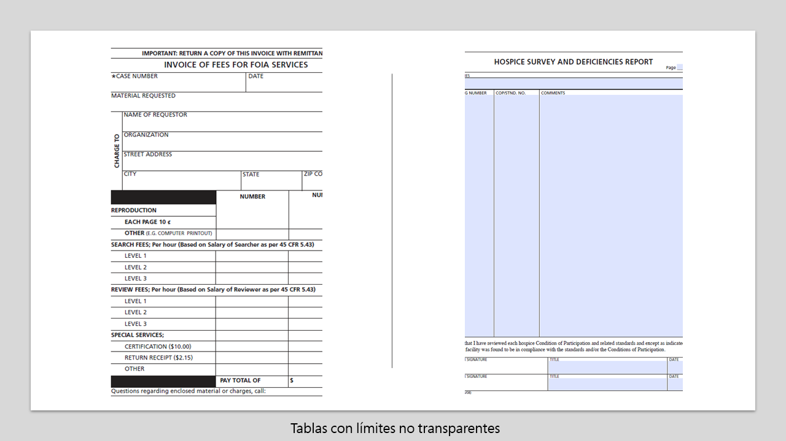

# Prácticas recomendadas y consideraciones {#do-not-publish-best-practices-and-considerations}

<!--
[DO NOT PUBLISH]
-->

El servicio de conversión automatizada de AEM Forms convierte un formulario PDF en un formulario adaptable. El servicio utiliza inteligencia artificial y algoritmos de aprendizaje automático para comprender el diseño y los campos del formulario de origen. Cada servicio de aprendizaje automático aprende continuamente de los datos de origen y produce una salida mejorada con cada repetición. Estos servicios aprenden de la experiencia como humanos.

El servicio de conversión automatizada de Forms se capacita en un gran conjunto de formularios. Identifica fácilmente los campos de un formulario de origen y genera formularios adaptables. Sin embargo, hay algunos campos y estilos en los PDF forms que son fácilmente visibles para el ojo humano pero difíciles de entender para el servicio. El servicio puede asignar tipos de campos o paneles diferentes de los aplicables a algunos campos o estilos. Todos estos patrones de estilo y campo se enumeran a continuación.

El servicio tiene el inicio de identificar y asignar los campos o paneles correctos a estos patrones, ya que sigue aprendiendo de los datos de origen. Por el momento, puede utilizar el editor [Revisar y corregir](review-correct-ui-edited.md) para corregir estos problemas. Antes de inicio de corregir los problemas o leer más, familiarícese con los componentes [de formulario](https://helpx.adobe.com/experience-manager/6-5/forms/using/introduction-forms-authoring.html)adaptables.

## General {#general}

<table border="1" cellpadding="1" cellspacing="0" style="border-collapse: separate; border-spacing: 0px;" width="100%"> 
 <tbody>
  <tr>
   <td width="30%">Patrones y resolución conocidos</td> 
   <td width="70%">Ejemplo</td> 
  </tr>
   <td>
<strong>Patrón</strong>
 
El servicio no convierte los PDF forms rellenados en formularios adaptables.
 
 
 
<strong>Resolución</strong>
 
Utilice formularios adaptables vacíos.
 </td> 
   <td style="text-align: left;"></td> 
  </tr>
  <tr>
   <td>
<strong>Patrón</strong>
 
El servicio puede no reconocer texto y campos de forma densa.
 
 
 
<strong>Resolución</strong>
 
Aumente la anchura entre el texto y los campos de un formulario denso antes de iniciar la conversión.
 </td> 
   <td style="text-align: left;"></td> 
  </tr>
  <tr>
   <td>
<strong>Patrón</strong>
 
El servicio no admite formularios digitalizados.
 
 
 
<strong>Resolución</strong>
 
No utilice formularios digitalizados. 
 </td> 
   <td></td> 
  </tr>
  <tr>
   <td>
<strong>Patrón</strong>
 
El servicio no extrae imágenes ni texto dentro de las imágenes. 
 
 
 
<strong>Resolución</strong>
 
Agregue manualmente imágenes o texto a los formularios convertidos.
 </td> 
   <td></td> 
  </tr>
  <tr>
   <td>
<strong>Patrón</strong>
 
No se convierten las tablas con límites y bordes punteados o no claros.
 
<strong>Resolución</strong>
 
Utilice tablas con bordes y límites explícitos claros. compatible.
 </td> 
   <td></td> 
  </tr>
 </tbody>
</table>

## Grupo de opciones  {#choice-group}

<table border="1" cellpadding="1" cellspacing="0" width="100%"> 
 <tbody>
  <tr>
   <td width="30%">Patrón</td> 
   <td width="70%">Ejemplo</td> 
  </tr>
  <tr>
   <td>
<strong>Patrón</strong>
 
Las opciones de grupo de opciones con formas distintas de cuadro o círculo no se convierten en los componentes de formulario adaptables correspondientes. 
 
 
 
<strong>Resolución</strong>
 
Cambie las formas de opciones de opciones a cuadro o círculo o utilice el editor Revisar y corregir para identificar las formas.
 </td> 
   <td> </td> 
  </tr>
 </tbody>
</table>

## Form fields {#form-fields}

<table border="1" cellpadding="1" cellspacing="0" width="100%"> 
 <tbody>
  <tr>
   <td width="30%">Patrón</td> 
   <td width="70%">Ejemplo</td> 
  </tr>
  <tr>
   <td width="25%">
<strong>Patrón</strong>
 
El servicio no identifica campos sin bordes claros.
 
 
 
<strong>Resolución</strong>
 
Utilice el editor Revisar y corregir para identificar estos campos.
 
 
 
 
 </td> 
   <td width="50%">  </td> 
  </tr>
  <tr>
   <td>
<strong>Patrón</strong>
 
El servicio deja algunos campos de formulario con rótulos en la parte inferior o derecha sin identificar.
 
 
 
<strong>Resolución</strong>
 
Utilice el editor Revisar y corregir para identificar dichos campos
 </td> 
   <td>    </td> 
  </tr>
  <tr>
   <td>
<strong>Patrón</strong>
 
El servicio combina o asigna un tipo incorrecto a algunos campos de formulario que se sitúan muy cerca entre sí o que no tienen bordes claros. 
 
 
 
<strong>Resolución</strong>
 
Utilice el editor Revisar y corregir para identificar estos campos.
 </td> 
   <td></td> 
  </tr>
  <tr>
   <td>
<strong>Patrón</strong>
 
El servicio puede no reconocer los campos con rótulos lejanos o una línea de puntos entre el rótulo y el campo de entrada.
 
 
 
<strong>Resolución</strong>
 
Utilice los campos de formulario con límites claros o utilice el editor Revisar y corregir para corregir estos problemas.
 </td> 
   <td></td> 
  </tr>
 </tbody>
</table>

## Listas {#lists}

<table border="1" cellpadding="1" cellspacing="0" width="100%"> 
 <tbody>
  <tr>
   <td width="30%">Patrón</td> 
   <td width="70%">Ejemplo</td> 
  </tr>
  <tr>
   <td>
<strong>Patrón</strong>
 
Las listas que contienen campos de formulario se combinan o no se convierten en los componentes de formulario adaptables correspondientes
 
<strong>Resolución</strong>
 
Utilice los campos de formulario con límites claros o utilice el editor Revisar y corregir para corregir estos problemas.
 </td> 
   <td></td> 
  </tr>
  <tr>
   <td>
<strong>Patrón</strong>
 
El servicio puede dejar algunas listas anidadas sin identificar
 
 
 
<strong>Resolución</strong>
 
Use el editor Revisar y corregir para corregir estos problemas.
 </td> 
   <td> </td> 
  </tr>
  <tr>
   <td>
<strong>Patrón</strong>
 
El servicio combina algunas listas que contienen grupos de opciones entre sí
 
<strong>Resolución</strong>
 
Use el editor Revisar y corregir para corregir estos problemas.
 </td> 
   <td> </td> 
  </tr>
 </tbody>
</table>

<!--
Comment Type: draft

<h3>Choice groups</h3>
-->

<!--
Comment Type: draft

<ul>
<li>Lists with form fields, nested lists, and nested choice groups are not supported.</li>
<li>Form fields with captions at bottom or right are not supported.</li>
<li>Form fiields without bordes are not supported.</li>
<li>Hidden form fields are not supported.</li>
<li>Button in PDF forms are not converted to adaptive form buttons.  </li>
<li>Tables with clear explicit boundaries and borders are supported.</li>
<li>Fields with far away captions are not supported.  </li>
<li>Choice groups with only box or circle shaped selectors are supported. </li>
</ul>
-->

