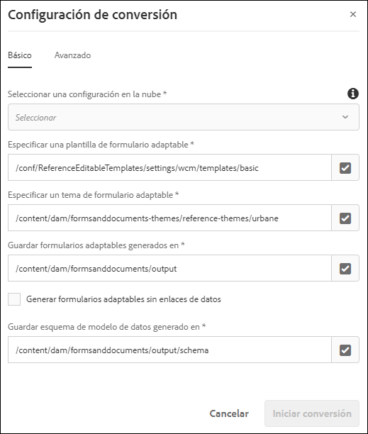

# Conversión de formularios PDF a formularios adaptables {#convert-print-forms-to-adaptive-forms}

El servicio de conversión automatizada de formularios de AEM Forms, con tecnología de Adobe Sensei, transforma automáticamente sus formularios PDF en formularios adaptables para dispositivos. Tanto si utiliza formularios PDF no interactivos, AcroForms o formularios PDF basados en XFA, el servicio de conversión automatizada de formularios puede transformarlos fácilmente en formularios adaptables. Para obtener información acerca de las capacidades, el flujo de trabajo de conversión y la información de incorporación, consulte el servicio de [conversión automatizada de formularios](introduction.md).

## Requisitos previos {#pre-requisites}

* [**Configuración del servicio de conversión**](configure-service.md)

* **Prepare las [plantillas](https://helpx.adobe.com/es/experience-manager/6-5/forms/using/template-editor.html) que se aplicarán a los formularios convertidos:** usar una plantilla permite aplicar la personalización de marca coherente a todos los formularios adaptables. Además, el servicio de conversión automatizada de formularios no extrae ni utiliza el encabezado y pie de página de los documentos PDF de origen. Puede utilizar plantillas de formulario adaptable para especificar el encabezado y el pie de página. El encabezado y el pie de página especificados en la plantilla se aplican al formulario adaptable durante la conversión. Cuando cree una carpeta para las plantillas, seleccione la opción **[!UICONTROL Browse configurations]** para todas.

* **Prepare las [temáticas](https://helpx.adobe.com/es/experience-manager/6-5/forms/using/themes.html) que se aplicarán a los formularios convertidos:** usarlas le permite asignar un estilo coherente a todos los formularios adaptables de su organización.

* **(Opcional)** [**Conversión de formularios PDF de origen en un formulario de Adobe Sign**](frequently-asked-questions.md)

## Inicio del proceso de conversión {#start-the-conversion-process}

Después de conectar la instancia de AEM con el servicio de conversión de AEM Forms, puede convertir los formularios PDF en adaptables. Para ello, siga estos pasos en el orden enumerado:

* [Carga de formularios PDF al servidor de AEM Forms](convert-existing-forms-to-adaptive-forms.md#upload-pdf-forms-to-your-aem-forms-server)
* [Ejecución de la conversión](convert-existing-forms-to-adaptive-forms.md#run-the-conversion)
* [Revisión y corrección de formularios convertidos](review-correct-ui-edited.md)

### Carga de formularios PDF al servidor de AEM Forms {#upload-pdf-forms-to-your-aem-forms-server}

El servicio de conversión transforma los formularios PDF disponibles en su instancia de AEM Forms en formularios adaptables. Puede cargar todos los formularios PDF a la vez o de forma gradual, según sea necesario. Antes de cargar los formularios, tenga en cuenta lo siguiente:

* Mantenga el número de formularios de una carpeta menor a 15 y el número total de páginas menor a 50.
* El tamaño de la carpeta debe ser inferior a 10 MB. No guarde los formularios en una subcarpeta.
* Mantenga el número de páginas del formulario menor a 15.
* No cargue formularios protegidos. El servicio no convierte los formularios protegidos con contraseña.
* No cargue formularios de origen con espacios en el nombre de archivo. Quite el espacio del nombre del archivo antes de cargar los formularios.
* No cargue [Portfolios PDF](https://helpx.adobe.com/es/acrobat/using/overview-pdf-portfolios.html). El servicio no convierte portafolios PDF en formularios adaptables.
* Lea las secciones [Problemas conocidos](known-issues.md) y [Prácticas recomendadas y consideraciones](styles-and-pattern-considerations-and-best-practices.md) e introduzca los cambios sugeridos en los formularios.

Siga estos pasos para cargar los formularios que desea convertir en una carpeta de su instancia de AEM Forms:

1. Inicie sesión en la instancia de AEM Forms.

1. Toque **[!UICONTROL Adobe Experience Manager]**  > **[!UICONTROL Navigation]**  > **[!UICONTROL Forms]** > **[!UICONTROL Forms & Documents]**.
1. Toque **[!UICONTROL Create]**> **[!UICONTROL Folder]**. Especifique el **Título** y **Nombre** de la carpeta. Toque **[!UICONTROL Create]**. Se crea una carpeta.
1. Toque para abrir la carpeta recién creada.
1. Toque **[!UICONTROL Create]**> **[!UICONTROL File Upload]**. Seleccione los formularios que desea cargar y haga clic en **[!UICONTROL Open]** y en **[!UICONTROL Upload]**. Se cargan los formularios.

### Ejecución de la conversión {#run-the-conversion}

Después de cargar los formularios y configurar el servicio, siga estos pasos para iniciar la conversión:

1. En la instancia de AEM Forms, toque el **[!UICONTROL Adobe Experience Manager]**  > **[!UICONTROL Navigation]**  > **[!UICONTROL Forms]** > **[!UICONTROL Forms & Documents]**.
1. Seleccione un formulario o la carpeta que contenga los formularios PDF (que desea convertir) y toque **[!UICONTROL Start Automated Conversion]**. Aparece el cuadro de diálogo **[!UICONTROL Conversion Settings]**.

   

1. En la pestaña **[!UICONTROL Basic]** del cuadro de diálogo Configuración de conversión:

   * **[!UICONTROL Select a cloud configuration]**. Al seleccionar una configuración, ya se han especificado la plantilla y temática predeterminadas. Si es necesario, puede definir una plantilla o una temática diferentes.
   * Especifique una ubicación para guardar los formularios adaptables generados y el esquema correspondiente. Puede utilizar rutas predeterminadas o especificar rutas personalizadas.
   * Utilice la opción **Generar formularios adaptables sin enlaces de modelo de datos** si desea generar un formulario adaptable con o sin enlaces de modelo de datos.
Si no selecciona esta opción, el servicio de conversión asocia automáticamente los formularios adaptables con un esquema JSON y crea un enlace de datos entre los campos disponibles en el formulario adaptable y el esquema JSON. El campo **[!UICONTROL Save generated data model schema at]** muestra la ubicación predeterminada para guardar el esquema JSON generado. También puede personalizar la ubicación para guardar el esquema generado.
Si selecciona esta opción, el servicio de conversión genera un formulario adaptable sin enlaces de modelo de datos. Después de una conversión correcta, puede asociar un formulario adaptable a un modelo de datos de formulario, un esquema XML o JSON. Para obtener más información, consulte [Creación de un formulario adaptable](https://helpx.adobe.com/es/experience-manager/6-5/forms/using/creating-adaptive-form.html).

   <!--

   Comment Type: draft

   <note type="note">
   
The XDP or XFA-based PDF form is not used to generate the Document of Record. The conversion service auto-generates the Document of Record only if you enable the Tools &gt; Cloud Services &gt; Automated Forms Conversion Configuration &gt; <strong>&lt;Properties of selected configuration&gt; &gt;</strong> Advanced &gt; Generate Document of Record option.

   
 

   </note>
   -->

1. En la pestaña **[!UICONTROL Additional]** del cuadro de diálogo Configuración de conversión, haga lo siguiente:
   * Seleccione la opción **[!UICONTROL Extract fragment from adaptive forms]** para permitir que el servicio de conversión identifique, extraiga y descargue fragmentos de formularios para los formularios convertidos. Al seleccionar **[!UICONTROL Extract fragment from adaptive forms]**, se activan las opciones para especificar rutas y guardar fragmentos de formulario extraídos y los esquemas de fragmentos de formulario correspondientes.
   * Especifique la ubicación de **[!UICONTROL existing adaptive form fragments]**, si tiene algunos fragmentos de formulario basados en esquemas JSON y esquemas menos adaptables. Además, si tiene previsto utilizar estos fragmentos en formularios adaptables generados automáticamente. El servicio de conversión coteja los fragmentos de formulario disponibles basados en esquemas JSON y esquemas menos adaptables con formularios PDF de entrada (solo no interactivos). Si hay una coincidencia, el fragmento de formulario adaptable encontrado se utiliza en los formularios adaptables correspondientes.

   >[!NOTE]
   >
   >
   > * Solo puede usar las opciones **[!UICONTROL  Extract Fragment]** o **[!UICONTROL Use existing adaptive form fragments]** a la vez. No puede utilizar ambas opciones simultáneamente.
   > * Puede usar la opción **[!UICONTROL Use existing adaptive form fragments]** solo con formularios PDF no interactivos. Otros tipos de formulario aún no son compatibles.
   > * Solo puede utilizar fragmentos independientes o enlazados a un esquema JSON con el servicio de conversión automatizada. No utilice fragmentos XFA. Los fragmentos XFA no son compatibles.

   * Seleccione la opción **[!UICONTROL Auto-detect multi-column layout of input forms]** para conservar el diseño del formulario de origen para pantallas grandes, como las de los ordenadores de sobremesa y portátiles. Esta opción es útil para conservar el diseño multicolumna de los formularios de origen. Por ejemplo, cuando un PDF de origen tiene una presentación de dos columnas, el servicio genera un formulario adaptable de salida con una presentación de dos columnas para pantallas grandes y una presentación de una sola columna para dispositivos de pantalla pequeños, como teléfonos móviles. La función tiene algunos problemas conocidos con la estructura del esquema de la fuente de datos. Para obtener más información, consulte el artículo [problemas conocidos](known-issues.md).
   * De forma predeterminada, el servicio crea un panel independiente de nivel superior para cada página de los formularios PDF. Ahora, puede utilizar la opción **[!UICONTROL Auto-detect logical sections]** para no crear paneles a nivel de página (paneles basados en el número de página) y crear solo paneles lógicos. También agrupa los campos que no pertenecen a ninguna sección con la sección lógica anterior y los campos de una sección lógica se distribuyen en dos páginas adyacentes en una sola sección lógica. Por ejemplo, si algunos campos de una sección lógica están al final de la página uno y otros al comienzo de la página dos, todos esos campos se agrupan en una sola sección lógica.

      >[!NOTE]
      > Debe utilizar el paquete del conector 1.1.38 o superior para la función **[!UICONTROL Auto-detect logical sections]**.

* (Solo para AEM Forms as a Cloud Service) La [conversión automática de secciones en fragmentos] se aplica a los formularios PDF con más de 15 páginas. Convierte las secciones de nivel superior detectadas en fragmentos. También activa la carga diferida para todos los fragmentos creados. Esto ayuda a mejorar la velocidad de procesamiento de los formularios convertidos y facilita la carga de formularios grandes en el editor de formularios adaptables.

   >[!NOTE]
   > No utilice plantillas de diseño adaptables mientras utiliza la opción Conversión automática de secciones a fragmentos.
   > Utilice el editor de revisiones y correcciones para combinar paneles pequeños con uno grande. Ayuda a reducir el número de fragmentos en el formulario adaptable convertido.
   > Si experimenta la excepción “demasiadas llamadas”,
   >
   > * reestructure el formulario para crear una jerarquía simplificada
   > * [aumente el valor del parámetro sling.max.calls] a un número lo suficientemente alto hasta que desaparezca la excepción.
   > * [aumentar el tamaño de la caché](https://experienceleague.adobe.com/docs/experience-manager-65/forms/install-aem-forms/configure-aem-forms/configure-adaptive-forms-cache.html?lang=es). Se produce el error si el formulario es demasiado complejo, tiene un gran número de tablas y una estructura jerárquica de varios niveles.

1. Pulse **[!UICONTROL Start Conversion]**. Se inicia la conversión. El progreso de la conversión se muestra en la carpeta o en el formulario hasta que la conversión esté en curso. El mensaje se reemplaza con otro mensaje de estado (Convertido, Parcialmente convertido o Error de conversión) una vez completada la conversión. También se envía un correo electrónico de estado en la dirección de correo electrónico configurada al finalizar la conversión:

   * En una conversión correcta, el formulario adaptable convertido y el esquema relacionado se descargan a la ruta especificada en la pestaña **[!UICONTROL Basic]** del cuadro de diálogo de conversión. Los fragmentos de formulario y el esquema correspondiente solo se descargan si la opción Extraer fragmento está seleccionada antes de iniciar la conversión.
   * En una conversión fallida, se muestra el mensaje **[!UICONTROL Conversion Failed]** si no se pueden convertir todos los formularios de entrada o si no se puede realizar, se muestra el mensaje **[!UICONTROL Partially Failed]** cuando solo unos pocos de todos los formularios de entrada no pueden convertirse. Se envía un correo electrónico de estado a la [dirección de correo electrónico configurada](configure-service.md#configureemailnotification) y se registra un error en el archivo error.log.

   Si está convirtiendo un formulario PDF basado en XFA en un formulario adaptable, el servicio de conversión asocia automáticamente el formulario PDF al formulario adaptable convertido como la plantilla Documento de registro. Tras la conversión, puede abrir las propiedades del formulario adaptable para ver la plantilla Documento de registro en la sección **[!UICONTROL Document of Record Template Configuration]** de la pestaña **[!UICONTROL Form Model]**.  

   El servicio de conversión carga automáticamente el formulario PDF en el formulario adaptable convertido como plantilla de Documento de registro solo si activa la opción **[!UICONTROL Tools]** > **[!UICONTROL Cloud Services]** > **[!UICONTROL Automated Forms Conversion Configuration]** > **[!UICONTROL Properties of selected configuration]** > **[!UICONTROL Advanced]** > **[!UICONTROL Generate Document of Record]**.

   <!--

   Comment Type: draft

   <note type="note">
   
By default, the adaptive form produces a JSON schema instead of XML schema on submission. JSON schema of a converted adaptive form is complaint with XML schema of an XFA-based form. You can use the <a href="https://sling.apache.org/apidocs/sling5/org/apache/sling/commons/json/xml/XML.html#toString">org.apache.sling.commons.json.xml API</a> to convert a JSON schema to XML schema. You can also use the following sample code for conversion:

   
<code class="code">import org.apache.sling.commons.json.JSONException;
   <discoiqbr /> import org.apache.sling.commons.json.JSONObject;
   <discoiqbr /> import org.apache.sling.commons.json.xml.XML;
   <discoiqbr />
   <discoiqbr /> public class ConversionUtils {
   <discoiqbr />
   <discoiqbr /> public static String jsonToXML(String jsonString) throws JSONException {
   <discoiqbr /> //https://sling.apache.org/apidocs/sling5/org/apache/sling/commons/json/xml/XML.html#toString(java.lang.Object)
   <discoiqbr /> //jar - http://maven.ibiblio.org/maven2/org/apache/sling/org.apache.sling.commons.json/2.0.18/
   <discoiqbr /> //Note: Need to extract boundData part before converting to XML
   <discoiqbr /> return XML.toString(new JSONObject(jsonString));
   <discoiqbr /> }
   <discoiqbr /> }</code>  

   </note>
   -->

   >[!NOTE]
   >
   >Si el proceso de conversión tarda más de 60 minutos y el formulario PDF sigue sin convertirse en un formulario adaptable, cree una carpeta en la instancia de AEM Forms, cargue el formulario PDF en la carpeta recién creada y reinicie la conversión.

## Revisión y corrección de formularios convertidos {#review-and-correct-the-converted-forms}

Los formularios del mundo real tienen requisitos complejos de captura de datos. Una vez completada la conversión automatizada, los clientes pueden revisar la calidad de conversión del formulario y realizar las actualizaciones necesarias en él. AEM Forms proporciona el editor [Revisar y corregir](review-correct-ui-edited.md) para realizar los cambios necesarios. Permite mejorar la identificación automatizada de los campos de formulario y convertir los campos identificados de un tipo a otro. Por ejemplo, puede ayudar a identificar la presentación en dos columnas de un formulario y cambiar un campo identificado automáticamente como botón de opción por un campo de opciones múltiples.
