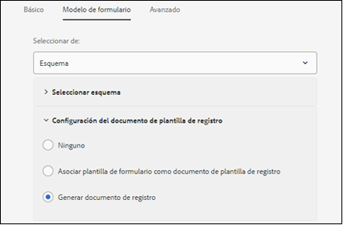
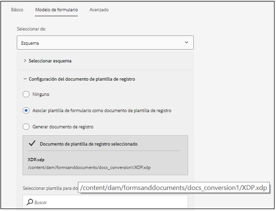

# Flujos de trabajo recomendados para activar la generación de documentos de registro en formularios adaptables {#recommended-workflows-dor-generation}

El documento de registro (DoR) le permite mantener un registro de la información que proporcione y envíe en un formulario adaptable para poder remitirlo más adelante.
El documento de trabajo utiliza una plantilla base para definir su diseño. Puede generar un documento de trabajo utilizando una plantilla predeterminada o asociando cualquier otra plantilla con el formulario adaptable.

Para obtener más información sobre la generación de un documento de registro, consulte [Generar documento de registro para formularios](https://helpx.adobe.com/experience-manager/6-5/forms/using/generate-document-of-record-for-non-xfa-based-adaptive-forms.html)adaptables.

El servicio [Conversión de formularios](../help/introduction.md) automatizados convierte los siguientes formularios de origen en formularios adaptables:

* formularios PDF no interactivos
* Acro Forms
* Formularios PDF basados en XFA

Según el formulario de origen que utilice para la conversión, puede generar un documento de trabajo mediante:

* una plantilla predeterminada
* el formulario de origen como plantilla: si selecciona esta opción, el servicio de conversión asocia automáticamente el formulario de origen con el formulario adaptable convertido como plantilla de DoR.
* asociar cualquier otra plantilla con el formulario adaptable convertido

La siguiente tabla ilustra un ejemplo de cómo la plantilla de DoR que utiliza afecta el diseño del DoR generado:

<table> 
 <tbody>
 <tr>
  <td>
<strong>Formulario de origen</strong>
</td>
  <td>
<strong>DoR generado</strong>
</td> 
   </tr>
  <tr>
   <td></td>
   <td>
Si utiliza la plantilla predeterminada para generar DoR: </td>
   </tr>
   <tr>
   <td></td>
   <td>
Si utiliza el formulario de origen como plantilla para generar DoR: 
</td>
   </tr>
  </tbody>
</table>

Como se ilustra en la tabla, si utiliza el formulario de origen como plantilla, el documento de trabajo conserva la presentación del formulario de origen.
En este artículo se describen las rutas recomendadas para generar un DoR en función de los tres tipos de formularios de origen.

<table> 
 <tbody> 
  <tr> 
   <th><strong>Formulario de origen</strong></th> 
   <th><strong>Métodos para generar DoR</strong></th> 
  </tr> 
  <tr> 
   <td>
Formularios PDF no interactivos
</td> 
   <td> 
    <ul> 
     <li><a href="#generate-document-of-record-using-cloud-configuration">Habilitar la generación de DoR antes de la conversión de formularios adaptables para generar DoR con una plantilla predeterminada</a></li> 
     <li><a href="#edit-adaptive-form-properties-generate-document-of-record">Editar propiedades de formulario adaptable después de la conversión de formulario adaptable para habilitar la generación de documentos de trabajo mediante plantillas de formulario predeterminadas o cualquier otra plantilla de formulario</a></li> 
    </ul> </td> 
  </tr>
  <tr> 
   <td>
Formularios Acro Forms o formularios PDF basados en XFA
</td> 
   <td> 
    <ul> 
     <li><a href="#use-input-form-as-template-to-generate-document-of-record">Habilitar la generación de DoR antes de la conversión de formularios adaptables para generar DoR usando el formulario de origen como plantilla</a></li> 
     <li><a href="#edit-adaptive-form-properties-to-generate-document-of-record">Editar propiedades de formulario adaptable después de la conversión de formulario adaptable para habilitar la generación de documentos de trabajo mediante la plantilla predeterminada, el formulario de origen como plantilla o cualquier otra plantilla de formulario</a></li> 
    </ul> </td> 
  </tr>    
 </tbody> 
</table>

## Generar documento de registro para formularios PDF no interactivos {#generate-document-of-record-non-interactive-pdf}

Si utiliza un formulario PDF no interactivo como formulario de origen para el servicio Conversión automatizada de formularios, puede:

* o bien habilitar la generación de DoR antes de la conversión de formulario adaptable para generar DoR con una plantilla predeterminada
* o editar las propiedades de formulario adaptable después de la conversión de formulario adaptable para habilitar la generación de documentos de trabajo con plantillas de formulario predeterminadas o de cualquier otro tipo

### Habilitar la generación de DoR antes de la conversión para generar DoR usando la plantilla predeterminada {#generate-document-of-record-using-cloud-configuration}

1. Seleccione **[!UICONTROL Tools]** > **[!UICONTROL Cloud Services]** > **[!UICONTROL Automated Forms Conversion Configuration]** > Propiedades de la configuración de nube utilizada para la conversión > **[!UICONTROL Advanced]** > **[!UICONTROL Generate Document of Record]** .

   

1. Toque **[!UICONTROL Save & Close]** para guardar la configuración.

1. [Ejecute la conversión](../help/convert-existing-forms-to-adaptive-forms.md). Asegúrese de utilizar la configuración de nube editada en el paso 1 de estas instrucciones.
Al enviar el formulario adaptable convertido, el documento de trabajo se genera automáticamente con la plantilla predeterminada.

### Editar las propiedades del formulario adaptable después de la conversión para habilitar la generación de DoR {#edit-adaptive-form-properties-generate-document-of-record}

Si no habilita la generación de DoR antes de convertir el formulario de origen en un formulario adaptable, puede hacerlo después de la conversión.

1. [Ejecute la conversión](../help/convert-existing-forms-to-adaptive-forms.md) en el formulario PDF no interactivo para generar un formulario adaptable.

1. Seleccione el formulario adaptable en la **[!UICONTROL output]** carpeta y toque **[!UICONTROL Properties]**.

1. En la **[!UICONTROL Form Model]** ficha, expanda la **[!UICONTROL Document of Record Template Configuration]** sección y seleccione **[!UICONTROL Generate Document of Record]**.

   

1. Toque **[!UICONTROL Save & Close]** para guardar la configuración.

Al enviar el formulario adaptable convertido, el documento de trabajo se genera automáticamente con la plantilla predeterminada. Si desea asociar cualquier otra plantilla de DoR con el formulario adaptable convertido, puede seleccionar **[!UICONTROL Associate form template as the Document of Record template]** una opción.

## Generar documento de registro para formularios Acro Forms o PDF basados en XFA {#generate-document-of-record-acroform-xfaform}

Si utiliza un formulario Acro Form o un formulario PDF basado en XFA como formulario de origen para el servicio Conversión automatizada de formularios, puede:

* o bien habilitar la generación de DoR antes de la conversión de formulario adaptable para generar DoR usando el formulario de origen como plantilla

* o editar las propiedades de formulario adaptable después de la conversión de formulario adaptable para habilitar la generación de documentos de trabajo mediante la plantilla predeterminada, el formulario de origen como plantilla o cualquier otra plantilla de formulario

### Habilitar la generación de DoR antes de la conversión para generar DoR mediante la plantilla de formulario de origen {#use-input-form-as-template-to-generate-document-of-record}

1. Seleccione **[!UICONTROL Tools]** > **[!UICONTROL Cloud Services]** > **[!UICONTROL Automated Forms Conversion Configuration]** > Propiedades de la configuración de nube utilizada para la conversión > **[!UICONTROL Advanced]** > **[!UICONTROL Generate Document of Record]** .

1. Toque **[!UICONTROL Save & Close]** para guardar la configuración.

1. [Ejecute la conversión](../help/convert-existing-forms-to-adaptive-forms.md). Asegúrese de utilizar la configuración de nube editada en el paso 1 de estas instrucciones.
El servicio de conversión asocia automáticamente el formulario Acro Form o el formulario PDF basado en XFA al formulario adaptable convertido como plantilla DoR.
Puede abrir las propiedades del formulario adaptable para ver la plantilla DoR en la **[!UICONTROL Document of Record Template Configuration]** sección de la **[!UICONTROL Form Model]** ficha.

   

   Al enviar el formulario adaptable convertido, el documento de trabajo se genera automáticamente mediante la plantilla de formulario de origen.

### Editar las propiedades del formulario adaptable después de la conversión para habilitar la generación de DoR {#edit-adaptive-form-properties-to-generate-document-of-record}

1. [Ejecute la conversión](../help/convert-existing-forms-to-adaptive-forms.md) en el formulario PDF no interactivo para generar un formulario adaptable.

1. Seleccione el formulario adaptable en la **[!UICONTROL output]** carpeta y toque **[!UICONTROL Properties]**.

1. En la **[!UICONTROL Form Model]** ficha, expanda la **[!UICONTROL Document of Record Template Configuration]** sección y seleccione **[!UICONTROL Generate Document of Record]** para habilitar la generación de DoR con la plantilla predeterminada.
También puede seleccionar la **[!UICONTROL Associate form template as the Document of Record template]** opción y seleccionar la plantilla para habilitar la generación de documentos de trabajo mediante la plantilla de formulario de origen o cualquier otra plantilla de formulario.

1. Toque **[!UICONTROL Save & Close]** para guardar la configuración.
