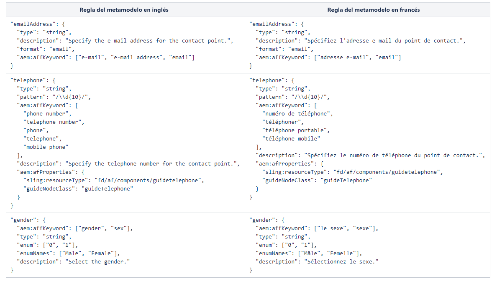

# Ampliación del metamodelo predeterminado {#extend-the-default-meta-model}

El servicio de conversión automatizada de formularios identifica y extrae objetos de los formularios de origen. El asignador semántico ayuda al servicio a decidir cómo se representan los objetos extraídos en un formulario adaptable. Por ejemplo, un formulario de origen puede tener muchos tipos de representaciones de una fecha. El asignador semántico asigna todas las representaciones de los objetos de formulario de fecha del formulario de origen con el componente de fecha de los formularios adaptables. El asignador semántico también permite que el servicio preconfigure y aplique validaciones, reglas, patrones de datos, texto de ayuda y propiedades de accesibilidad a los componentes de formulario adaptables durante la conversión.


El metamodelo es un esquema JSON. Antes de empezar con el metamodelo, asegúrese de tener una amplia experiencia con JSON. Debe tener experiencia en la creación, edición y lectura de datos guardados en formato JSON.

## Metamomodelo predeterminado {#default-meta-model}

El servicio de conversión automatizada de formularios tiene un metamodelo predeterminado. Es un esquema JSON y reside en Adobe Cloud con otros componentes del servicio de conversión automatizada de formularios. Puede encontrar una copia del metamodelo en el servidor de AEM local en: http://&lt;server>:&lt;port>/aem/forms.html/content/dam/formsanddocuments/metamodel/`global.schema.json`. También puede [hacer clic aquí](assets/en.globalschema.json) para acceder o descargar el esquema del idioma inglés. El metamodelo para [francés](assets/fr.globalschema.json), [alemán](assets/de.globalschema.json) [español](assets/es.globalschema.json), [italiano](assets/it.globalschema.json) y [portugués](assets/pt_br.globalschema.json) también están disponibles para descargar.

El esquema del metamodelo deriva de las entidades de esquema en https://schema.org/docs/schemas.html. Tiene las entidades Persona, DirecciónPostal, EmpresaLocal y otras más, tal y como se definen en https://schema.org. Cada entidad del metamodelo se adhiere al tipo de objeto de esquema JSON. El siguiente código representa una estructura del metamodelo de ejemplo:

```
   "Entity": {
      "id": "Entity",
      "properties": {
        "name": {
          "type": "string"
        },

        "description": {
          "type": "string",
          "description": "Description of the item"
        }
      }
    }
```

## Descargar el metamodelo predeterminado {#download-the-default-meta-model}

Realice los siguientes pasos para descargar el metamodelo predeterminado en el sistema de archivos local:

1. Inicie sesión en la instancia de AEM Forms.
1. Navegue hasta la carpeta **[!UICONTROL Forms]** > **[!UICONTROL Forms & Documents]** **>** **[!UICONTROL Meta Model]**.
1. Seleccione el archivo **[!UICONTROL global.schema.json]** y toque **[!UICONTROL Download]**. Aparece un cuadro de diálogo de descarga. Seleccione la opción **[!UICONTROL Download asset(s) as binary files]**. Toque **[!UICONTROL Download]**. Se descarga un archivo.

   <!--
   Comment Type: draft

   <li><p>Extract the archive and open the global.schema.json file for editing. </p> </li>
   -->

   <!--
   Comment Type: draft

   <li>Step text</li>
   -->

## Explicación del metamodelo {#understanding-the-meta-model}

Un metamodelo hace referencia a un archivo de esquema JSON que contiene entidades. Todas las entidades del archivo de esquema JSON incluyen un nombre y un ID. Cada entidad puede incluir varias propiedades. Las entidades y sus propiedades pueden variar en función del dominio. Puede aumentar un archivo de esquema con palabras clave y configuraciones de campo para asignar propiedades de esquema a los componentes de formulario adaptables.

```
"Event": {
      "id": "Eventid",
      "allOf": [
        {
          "$ref": "#Entity"
        },
        {
          "properties": {
            "startDate": {
              "type": "string",
              "format": "date",
              "description": "Specify the start date and time of the event in ISO 8601 date format."
            },
            "endDate": {
              "type": "string",
              "format": "date",
              "description": "Specify the end date and time of the event in ISO 8601 date format."
            },
            "location": {
              "$ref": "#PostalAddress",
              "description": "Specify the location of the event."
            }
          }
        }
      ]
    }
```

En este ejemplo, **Evento** representa el nombre de una entidad con un valor para **id** como **Eventid**. La entidad Evento incluye varias propiedades:

* startDate
* endDate
* ubicación

La construcción **allOf** en el metamodelo permite la herencia entre entidades.

Cada propiedad puede incluir además, lo siguiente:

* [Propiedades del esquema JSON](#jsonschemaproperties)
* [Búsqueda basada en palabras clave para aplicar las propiedades a los campos de formulario adaptables generados](#keywordsearch)
* [Propiedades adicionales](#additionalproperties)


Basado en las palabras clave a las que se hace referencia mediante **aem:affKeyword**, el servicio de conversión realiza una operación de búsqueda en los campos del formulario de origen. El servicio de conversión aplica las propiedades del esquema JSON y propiedades adicionales a los campos que cumplen los criterios de búsqueda.

En este ejemplo, el servicio de conversión busca las palabras clave tel., teléfono, teléfono móvil, teléfono de trabajo, teléfono de línea, número de teléfono, núm. de teléfono y número de tel. en el formulario de origen. En función de los campos que incluyen estas palabras clave, el servicio de conversión aplica el tipo, patrón y aem:afProperties a los campos de formulario adaptables después de la conversión.

### Propiedades del esquema JSON para campos de formulario adaptables generados {#jsonschemaproperties}

El metamodelo admite las siguientes propiedades comunes de esquema JSON para los campos de formulario adaptables generados mediante el servicio de conversión automatizada de formularios.

<table> 
 <tbody> 
  <tr> 
   <th><strong>Nombre de la propiedad</strong></th> 
   <th><strong>Descripción</strong></th> 
  </tr> 
  <tr> 
   <td><p>Título</p></td> 
   <td> 
    <p>El texto mencionado dentro de la propiedad Título en un metamodelo sirve como palabra clave de búsqueda para realizar acciones en los campos de formulario adaptables generados. Por ejemplo, modificar la etiqueta de un campo de formulario adaptable. Para obtener más información, consulte <strong>Modificación de la etiqueta de un campo del formulario</strong> en <a href="#custommetamodelexamples">Ejemplos de metamodelos personalizados.</a></p> </td> 
  </tr>
  <td><p>descripción</p></td> 
   <td> 
    <p>La propiedad descripción define el texto de ayuda para el campo de formulario adaptable generado. Para obtener más información, consulte <strong>Agregar texto de ayuda a un campo de formulario</strong> en <a href="#custommetamodelexamples">Ejemplos de metamodelos personalizados.</a></p> </td> 
  </tr>
  <td><p>tipo</p></td> 
   <td> 
    <p>La propiedad tipo define el tipo de datos del campo de formulario adaptable generado. Los valores posibles de la propiedad título incluyen los siguientes:</p>
    <ul> 
     <li>Cadena: genera un campo de formulario adaptable de tipo de datos de texto.</li> 
     <li>Número: genera un campo de formulario adaptable de tipo de datos numérico.</li>
     <li>Entero: genera un campo de formulario adaptable de tipo de datos numérico con el subtipo definido como entero.</li>
     <li>Booleano: genera un componente de formulario adaptable de conmutación.</li>
     </ul><p>Para obtener más información sobre el uso de la propiedad tipo en un metamodelo, consulte <strong>Modificación del tipo de campo de formulario</strong> en <a href="#custommetamodelexamples">Ejemplos de metamodelos personalizados.</a></p></td> 
  </tr>
  <td><p>patrón</p></td> 
   <td> 
    <p>La propiedad patrón restringe el valor del campo de formulario adaptable generado en función de una expresión regular. Por ejemplo, el siguiente código del metamodelo restringe el valor del campo de formulario adaptable generado a diez dígitos:<br>"pattern": "/\\d{10}/"<br>Del mismo modo, el siguiente código del metamodelo restringe el valor de un campo a un formato de fecha específico.<br> "pattern": "date{DD MMMM, YYYY}",</p> </td> 
  </tr>
  <td><p>formato</p></td> 
   <td> 
    <p>La propiedad formato restringe el valor del campo de formulario adaptable generado basándose en un patrón con nombre en lugar de una expresión regular. Los valores posibles de la propiedad formato incluyen las siguientes:<ul><li>Correo electrónico: genera un componente de formulario adaptable de correo electrónico.</li><li>Nombre de host: genera un componente de formulario adaptable de cuadro de texto.</li></ul>Para obtener más información sobre el uso de la propiedad formato en un metamodelo, consulte <strong>Modificación del formato de un campo de formulario</strong> en <a href="#custommetamodelexamples">Ejemplos de metamodelos personalizados.</a></p> </td> 
  </tr>
  <td><p>enum y enumNames</p></td> 
   <td> 
    <p>Las propiedades enum y enumNames restringen los valores de los campos desplegables, casilla de verificación o botón de opción a un conjunto fijo. Los valores enumerados en enumNames se muestran en la interfaz de usuario. Los valores enumerados con la propiedad enum se utilizan para el cálculo.<br>Para obtener más información, consulte <strong>Conversión de un campo de formulario en casillas de verificación de opción múltiple en el formulario adaptable</strong>, <strong>Conversión de un campo de texto en una lista desplegable del formulario adaptable</strong> y <strong>Agregar opciones adicionales a la lista desplegable</strong> en <a href="#custommetamodelexamples">Ejemplos de metamodelos personalizados.</a></p> </td> 
  </tr>
 </tbody> 
</table>

### Búsqueda basada en palabras clave para aplicar las propiedades a los campos de formulario adaptables generados {#keywordsearch}

El servicio de conversión automatizada de formularios realiza una búsqueda de palabras clave en el formulario de origen durante la conversión. Después de filtrar los campos que cumplen los criterios de búsqueda, el servicio de conversión aplica las propiedades definidas para esos campos en el metamodelo a los campos de formulario adaptable generados.

Se hace referencia a las palabras clave mediante la propiedad **aem:affKeyword**.

```
{
  "numberfields": {
      "type": "number",
      "aem:affKeyword": ["Bank account number"]
 }
}
```

En este ejemplo, el servicio de conversión utiliza el texto dentro de **aem:affKeyword** como palabra clave de búsqueda. Después de recuperar el texto **Número de cuenta bancaria** del formulario, el servicio de conversión convierte el campo en un **número** usando la propiedad **tipo**.

### Propiedades adicionales para los campos de formulario adaptables generados {#additionalproperties}

Puede usar la propiedad **aem:afProperties** en el metamodelo para definir las siguientes propiedades adicionales para los campos de formularios adaptables generados mediante el servicio de conversión automatizada de formularios:

<table> 
 <tbody> 
  <tr> 
   <th><strong>Nombre de la propiedad</strong></th> 
   <th><strong>Descripción</strong></th> 
  </tr> 
  <tr> 
   <td><p>multiLine</p></td> 
   <td> 
    <p>La propiedad multiLine convierte un campo de formulario de origen en un campo multilínea del formulario adaptable después de la conversión. Para obtener más información, consulte <strong>Conversión de un campo de cadena en un campo multilínea</strong> en <a href="#custommetamodelexamples">Ejemplos de metamodelos personalizados.</a></p> </td> 
  </tr>
  <td><p>mandatory</p></td> 
   <td> 
    <p>La propiedad mandatory define como obligatoria la entrada de un campo de formulario adaptable después de la conversión.<br>Para obtener más información, consulte <strong>Agregar validaciones a campos de formulario adaptables</strong> en <a href="#custommetamodelexamples">Ejemplos de metamodelos personalizados.</a></p>
    </td> 
  </tr>
  <td><p>jcr:title</p></td> 
   <td> 
    <p>La propiedad jcr:title junto con la propiedad title del esquema JSON permite modificar la etiqueta de un campo de formulario adaptable después de la conversión.<br>Para obtener más información, consulte <strong>Modificación de la etiqueta de un campo del formulario</strong> en <a href="#custommetamodelexamples">Ejemplos de metamodelos personalizados.</a><br>Consulte <a href="https://helpx.adobe.com/es/experience-manager/6-5/forms/using/adaptive-form-json-schema-form-model.html" target="_blank">Creación de formularios adaptables mediante el esquema JSON</a> para obtener información sobre más propiedades que se pueden aplicar a los campos de formulario adaptables mediante el esquema JSON.</p>
    <p></p></td> 
  </tr>
  <td><p>sling:resourceType y guideNodeClass</p></td> 
   <td> 
    <p>Las propiedades sling:resourceType y guideNodeClass permiten asignar un campo de formulario a un componente de formulario adaptable correspondiente.<br>Para obtener más información, consulte <strong>Convertir un campo de formulario en casillas de verificación de opción múltiple en el formulario adaptable</strong> y <strong>Convertir un campo de texto en una lista desplegable del formulario adaptable</strong> en los <a href="#custommetamodelexamples">Ejemplos de metamodelos personalizados.</a></p> </td> 
  </tr>
  <td><p>validatePictureClause</p></td> 
   <td> 
    <p>La propiedad validatePictureClause establece una validación en el formato permitido en el campo de formulario adaptable después de la conversión.<br>Para obtener más información, consulte <strong>Agregar validaciones a campos de formulario adaptables</strong> en los <a href="#custommetamodelexamples">Ejemplos de metamodelos personalizados.</p> </td> 
  </tr>
 </tbody> 
</table>

## Creación de un metamodelo personalizado en su propio idioma{#language-specific-meta-model}

Puede crear un metamodelo específico de un idioma. Este metamodelo ayuda a crear reglas de asignación en el idioma que elija. El servicio de conversión automatizada de formularios le permite crear metamodelos en los siguientes idiomas:

* Inglés (en)
* Francés (fr)
* Alemán (de)
* Español (es)
* Italiano (it)
* Portugués (pt-br)

Agregue la metaetiqueta *aem:Language* en la parte superior del metamodelo para especificar su idioma. Por ejemplo:

```JSON
"metaTags": {
        "aem:Language": "fr"
    }
```

Cuando no se especifica ningún idioma, el servicio considera que el metamodelo está en inglés.

### Consideraciones para crear un metamodelo específico de un idioma

* Asegúrese de que el nombre de cada clave esté en inglés. Por ejemplo, emailAddress.
* Asegúrese de que todas las referencias de entidad y los valores predefinidos de todas las claves de ID solo contengan caracteres ASCII. Por ejemplo, &quot;id&quot;: &quot;ContactPoint&quot; / &quot;$ref&quot;: &quot;#ContactPoint&quot;.
* Asegúrese de que todos los valores correspondientes a las claves siguientes estén en el idioma del metamodelo especificado:
   * aem:affKeyword
   * título
   * descripción
   * enumNames
   * shortDescription
   * validatePictureClauseMessage

   Por ejemplo, cuando el idioma del metamodelo sea francés (&quot;aem:Language&quot;: &quot;fr&quot;), asegúrese de que todas las descripciones y mensajes estén en francés.

* Asegúrese de que todas las [Propiedades del esquema JSON](#jsonschemaproperties) utilicen solo los valores admitidos. Por ejemplo, la propiedad tipo solo puede abarcar valores seleccionados de tipo Cadena, Número, Entero y Booleano.

La siguiente imagen muestra ejemplos del metamodelo en inglés y el metamodelo en francés correspondiente:



## Modificación de los campos de formulario adaptables utilizando un metamodelo personalizado {#modify-adaptive-form-fields-using-custom-meta-model}

Su organización puede tener otros patrones y validaciones, además de los que aparecen en el metamodelo predeterminado. Puede ampliar el metamodelo predeterminado para agregar patrones, validaciones y entidades específicas a su organización. El servicio de conversión automatizada de formularios aplica el metamodelo personalizado a los campos de formulario durante la conversión. Puede seguir actualizando el metamodelo a medida que aparecen nuevos patrones, validaciones y entidades específicas de su organización.

El servicio de conversión automatizada de formularios utiliza un metamodelo predeterminado guardado en la siguiente ubicación para asignar campos de formulario de origen a los campos de formulario adaptables durante la conversión:

http://&lt;server>:&lt;port>/aem/forms.html/content/dam/formsanddocuments/metamodel/global.schema.json

Sin embargo, puede guardar un metamodelo personalizado en una carpeta y modificar las propiedades del servicio de conversión para utilizar el metamodelo personalizado durante la conversión.

### Uso de un metamodelo personalizado durante la conversión {#use-custom-meta-model-during-conversion}

Ejecute los siguientes pasos para utilizar un metamodelo personalizado durante la conversión:

1. Cree una carpeta en **[!UICONTROL Forms]** > **[!UICONTROL Forms & Documents]** y cargue el archivo de esquema JSON del metamodelo personalizado en la carpeta.
1. Abra las propiedades del servicio de conversión mediante lo siguiente:

   **[!UICONTROL Tools]** > **[!UICONTROL Cloud Services]** > **[!UICONTROL Automated Forms Conversion Configuration]** > **&lt;Properties of selected configuration>**

1. En la pestaña **[!UICONTROL Basic]**, especifique la ubicación del metamodelo personalizado en el campo **[!UICONTROL Custom Meta-model]** y pulse **[!UICONTROL Save & Close]**.
1. [Ejecute la conversión](convert-existing-forms-to-adaptive-forms.md#start-the-conversion-process) para aplicar el metamodelo personalizado al proceso de conversión.

### Ejemplos de metamodelos personalizados {#custommetamodelexamples}

Algunos ejemplos comunes del uso de un metamodelo personalizado para modificar las propiedades de los campos de formulario adaptables son los siguientes:

* Modificación de la etiqueta de un campo del formulario
* Modificación del tipo de campo de formulario
* Agregar texto de ayuda a un campo de formulario
* Conversión de un campo de formulario en botones de opción múltiple en el formulario adaptable
* Modificación del formato de un campo de formulario
* Agregar validaciones a campos de formulario adaptables
* Conversión de un campo de formulario en opciones de lista desplegable en el formulario adaptable
* Agregar opciones adicionales a la lista desplegable
* Conversión de un campo de cadena en un campo multilínea

#### Modificación de la etiqueta de un campo del formulario {#modify-the-label-of-a-form-field}

**Ejemplo:** modifique la etiqueta de número de cuenta bancaria en el formulario a un número de cuenta personalizado en el formulario adaptable después de la conversión.

En este metamodelo personalizado, el servicio de conversión utiliza la propiedad **title** como palabra clave de búsqueda. Después de recuperar la variable **Número de cuenta bancaria** en el formulario, el servicio de conversión reemplaza el texto por la cadena **Número de cuenta del cliente** mencionada con la propiedad **jcr:title** en la sección **aem:afProperties**.

```
{
  "numberfields": {
      "type": "number",
   "title": "Bank account number",
   "aem:afProperties" : {
    "jcr:title" : "Customer account number"
   }
   }
}
```

#### Modificación del tipo de campo de formulario {#modify-the-type-of-a-form-field}

**Ejemplo**: modifique el campo **Número de cuenta bancaria** del tipo de texto del formulario antes de la conversión a un campo de tipo numérico en el formulario adaptable después de la conversión.

En este metamodelo personalizado, el servicio de conversión utiliza el texto dentro de **aem:affKeyword** como palabra clave de búsqueda. Después de recuperar el texto **Número de cuenta bancaria** del formulario, el servicio de conversión convierte el campo en un tipo de número mediante la propiedad **type**.

```
{
  "numberfields": {
      "type": "number",
      "aem:affKeyword": ["Bank account number"]
 }
}
```

#### Agregar texto de ayuda a un campo del formulario {#add-help-text-to-a-form-field}

**Ejemplo**: agregar texto de ayuda al campo **Número de cuenta bancaria** del formulario adaptable.

En este metamodelo personalizado, el servicio de conversión utiliza el texto dentro de **aem:affKeyword** como palabra clave de búsqueda. Después de recuperar el texto de formulario **Número de cuenta bancaria**, el servicio de conversión agrega el texto Ayuda al campo de formulario adaptable utilizando la propiedad **descripción**.

```
{
  "numberfields": {
      "type": "number",
      "aem:affKeyword": ["Bank account number"],
   "description": "Specify your bank account number."
 }
}
```

#### Conversión de un campo de formulario en casillas de verificación de opción múltiple en el formulario adaptable {#convert-a-form-field-to-multiple-choice-check-boxes-in-the-adaptive-form}

**Ejemplo**: convertir el campo de tipo de cadena **País** en el formulario antes de la conversión a casillas de verificación en el formulario adaptable después de la conversión.

En este metamodelo personalizado, el servicio de conversión utiliza texto dentro de **aem:affKeyword** como palabra clave de búsqueda. Después de recuperar la variable **País** en el formulario, el servicio de conversión convierte el campo en las siguientes casillas de verificación mediante la propiedad **enum**:

* India
* Inglaterra
* Australia
* Nueva Zelanda

Las propiedades **sling:resourceType** y **guideNodeClass** asignan un campo de formulario al componente de formulario adaptable de la casilla de verificación.

```
{
"title": {
    "aem:affKeyword": [
      "country"
    ],
    "type" : "string",
    "enum": [
      "India",
      "England",
      "Australia",
      "New Zealand"
    ],
    "aem:afProperties": {
      "sling:resourceType": "fd/af/components/guidecheckbox",
      "guideNodeClass": "guidecheckbox"
    }
  }
}
```

#### Modificación del formato de un campo de formulario {#modify-the-format-of-a-form-field}

**Ejemplo**: modifique el formato del campo **Dirección de correo electrónico** al formato del correo electrónico.

En este metamodelo personalizado, el servicio de conversión utiliza texto dentro de **aem:affKeyword** como palabra clave de búsqueda. Después de recuperar el texto **Dirección de correo electrónico** del formulario, el servicio de conversión convierte el campo en el formato del correo electrónico mediante la propiedad **formato**.

```
{
   "additionalDetails" : {
      "aem:affKeyword": ["E-mail Address"],
       "type" : "string",
       "format" : "email"
  } 
}
```

#### Agregar validaciones a campos de formulario adaptables {#add-validations-to-adaptive-form-fields}

**Ejemplo 1:** agregue una validación al **Código postal** del formulario adaptable.

En este metamodelo personalizado, el servicio de conversión utiliza texto dentro de **aem:affKeyword** como palabra clave de búsqueda. Después de recuperar el texto **Código postal** en el formulario, el servicio de conversión agrega una validación al campo utilizando la propiedad **validatePictureClause** definida en la sección **aem:afProperties**. En función de la validación, la entrada que especifique para el campo **Código postal** en el formulario adaptable después de la conversión debe incluir seis caracteres.

```
{
   "postalCode" : {
      "aem:affKeyword": ["Postal Code"],
      "type" : "string",
      "aem:afProperties" : {
        "validatePictureClause" : "\\d{6}"
      } 
   }
}
```

**Ejemplo 2:** agregue una validación al **Número de cuenta bancaria** del formulario adaptable.

En este metamodelo personalizado, el servicio de conversión utiliza texto dentro de **aem:affKeyword** como palabra clave de búsqueda. Después de recuperar el texto **Número de cuenta bancaria** en el formulario, el servicio de conversión agrega una validación al campo utilizando la propiedad **mandatory** definida en la sección **aem:afProperties**. En función de la validación, debe especificar un valor para el campo **Número de cuenta bancaria** antes de enviar el formulario después de la conversión.

```
{
  "numberfields": {
      "type": "number",
      "aem:affKeyword": ["Bank account number"],
   "aem:afProperties" : {
        "mandatory": "true"
      }   
   }
}
```

#### Conversión de un campo de texto en una lista desplegable del formulario adaptable {#convert-a-text-field-to-drop-down-list-in-the-adaptive-form}

**Ejemplo**: convertir el campo de tipo cadena **País** en el formulario antes de la conversión a las opciones desplegables en el formulario adaptable después de la conversión.

En este metamodelo personalizado, el servicio de conversión utiliza texto dentro de **aem:affKeyword** como palabra clave de búsqueda. Después de recuperar el texto **País** del formulario, el servicio de conversión convierte el campo en las siguientes opciones de lista desplegable utilizando la propiedad **enum**:

* India
* Inglaterra
* Australia
* Nueva Zelanda

Las propiedades **sling:resourceType** y **guideNodeClass** asignan un campo al componente del formulario adaptable desplegable.

```
{
"title": {
    "aem:affKeyword": [
      "country"
    ],
    "type" : "string",
    "enum": [
      "India",
      "England",
      "Australia",
      "New Zealand"
    ],
    "aem:afProperties": {
      "sling:resourceType": "fd/af/components/guidedropdownlist",
      "guideNodeClass": "guideDropDownlist"
    }
  }
}
```

#### Agregar opciones adicionales a la lista desplegable {#add-additional-options-to-the-drop-down-list}

**Ejemplo:** agregue **Sri Lanka** como opción adicional a una lista desplegable existente usando un metamodelo personalizado.

Para agregar una opción adicional, actualice la propiedad **enum** con la nueva opción. En este ejemplo, actualice la propiedad **enum** con **Sri Lanka** como opción adicional. Los valores enumerados en la propiedad **enum** se muestran en la lista desplegable.

```
{
"title": {
    "aem:affKeyword": [
      "country"
    ],
    "type" : "string",
    "enum": [
      "India",
      "England",
      "Australia",
      "New Zealand",
   "Sri Lanka"
    ],
    "aem:afProperties": {
      "sling:resourceType": "fd/af/components/guidecheckbox",
      "guideNodeClass": "guidecheckbox"
    }
  }
}
```

#### Conversión de un campo de cadena en un campo multilínea {#convert-a-string-field-to-a-multi-line-field}

**Ejemplo:** convertir el campo de tipo de cadena **Dirección** a un campo multilínea del formulario después de la conversión.

En este metamodelo personalizado, el servicio de conversión utiliza texto dentro de **aem:affKeyword** como palabra clave de búsqueda. Después de recuperar el texto **Dirección** del formulario, el servicio convierte el campo de texto en un campo multilínea utilizando la propiedad **multiLine** definida en la sección **aem:afProperties**.

```
{
 "multiLine" : {
   "aem:affKeyword": [
      "Address"
    ],
    "type" : "string",
    "aem:afProperties": {
      "multiLine": "true"
    }
  }
}
```
