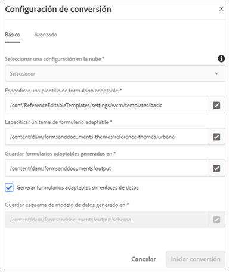
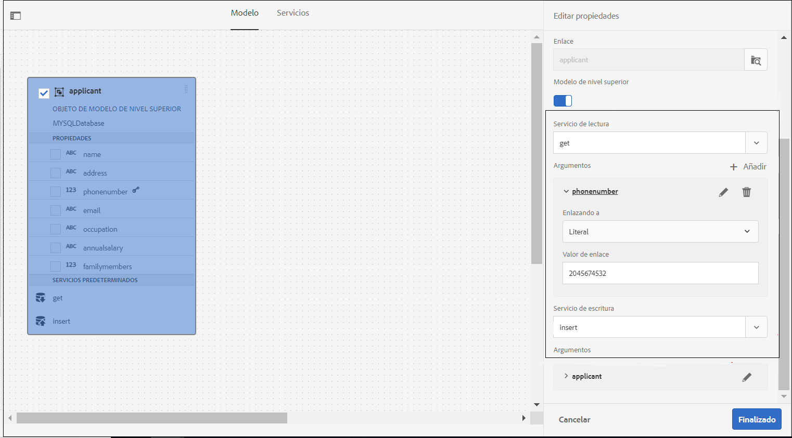
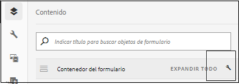
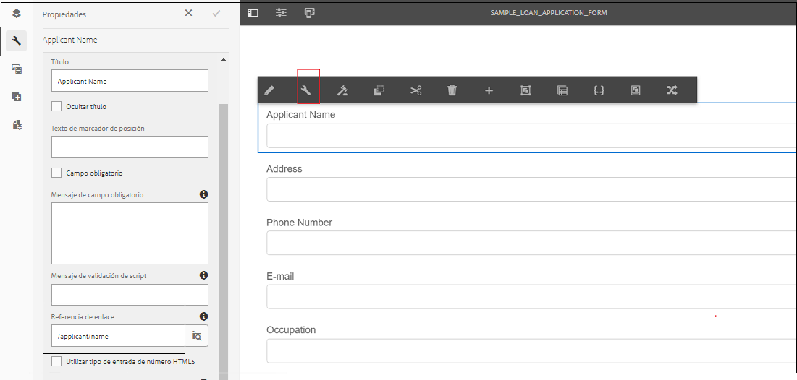
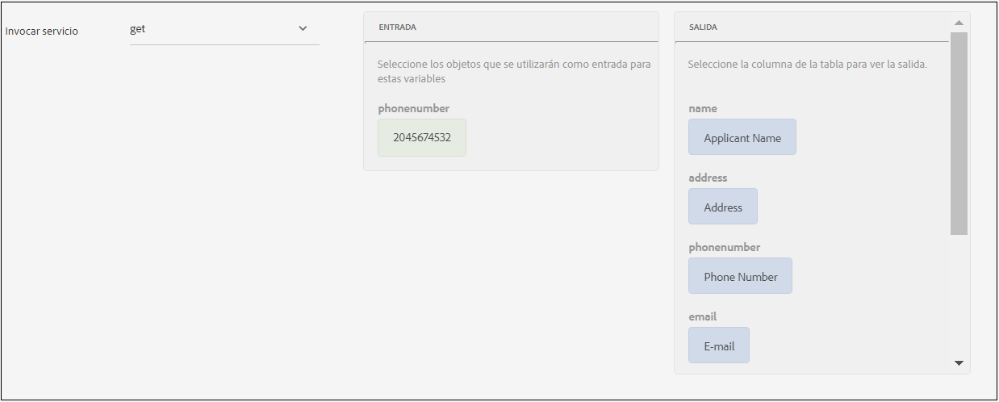

# Flujos de trabajo recomendados de relleno y envío basados en fuentes de datos para formularios adaptables {#recommended-data-source-btased-prefill-and-submit-workflows-for-adaptive-forms}

Puede utilizar cualquiera de los siguientes orígenes de datos con formularios adaptables convertidos mediante el servicio Conversión automatizada de formularios:

* Modelo de datos de formulario, OData o cualquier otro servicio de terceros
* Esquema JSON
* Esquema XSD

En función del origen de datos, puede elegir generar un formulario adaptable con o sin un modelo de datos.

En este artículo se describen los flujos de trabajo recomendados para rellenar previamente los valores de campo y las opciones de envío después de seleccionar un origen de datos y generar un formulario adaptable mediante el servicio de conversión.

<table> 
 <tbody> 
  <tr> 
   <th><strong>Fuente de datos</strong></th> 
   <th><strong>Flujo de trabajo recomendado</strong></th> 
  </tr> 
  <tr> 
   <td><p>Modelo de datos de formulario, OData o cualquier otro servicio de terceros</p></td> 
   <td> 
    <p><strong>Opción 1</strong>: Se selecciona modelo de datos de formulario, OData o cualquier otro servicio de terceros como origen de datos. Puede <a href="#generate-adaptive-forms-with-no-data-binding">generar un formulario adaptable sin enlace</a> de datos mediante el servicio Conversión automatizada de formularios. Los campos de formulario adaptables se enlazan manualmente a entidades del modelo de datos de formulario y se utiliza la opción Servicio de relleno previo del modelo de datos de formulario para rellenar previamente los valores de campo. La opción Enviar mediante el modelo de datos de formulario se utiliza para enviar el formulario adaptable.</p></td> 
  </tr>
  <tr> 
   <td></td> 
   <td> 
   <p><strong>Opción 2</strong>: Se selecciona modelo de datos de formulario, OData o cualquier otro servicio de terceros como origen de datos. Puede <a href="#generate-adaptive-forms-with-no-data-binding">generar un formulario adaptable sin enlace</a> de datos mediante el servicio Conversión automatizada de formularios. Los campos de formulario adaptables se enlazan mediante el editor de reglas para rellenar previamente los valores de campo. Si es necesario, modifique los valores de los campos y envíe los datos al repositorio crx.</p>
    </td> 
  </tr>
  <tr> 
   <td></td> 
   <td> 
    <p>Para obtener instrucciones paso a paso para ejecutar estos flujos de trabajo, consulte <a href="#sqldatasource">Uso de la base de datos, OData o cualquier servicio de terceros como fuente de datos.</a></p> </td> 
  </tr>
  <tr>
  <td><p>Esquema JSON</p></td> 
   <td> 
    <p>El esquema JSON se selecciona como origen de datos. En función de la fuente de datos seleccionada:</p></td> 
  </tr>
  <tr>
  <td></td> 
   <td> 
    <p><strong>Opción 1</strong>: Puede <a href="#generate-adaptive-forms-with-no-data-binding">generar un formulario adaptable sin enlace</a> de datos mediante el servicio Conversión automatizada de formularios y configurar el esquema JSON como el origen de datos. Los campos de formulario adaptables se enlazan manualmente al esquema JSON y se <a href="https://helpx.adobe.com/experience-manager/6-5/forms/using/prepopulate-adaptive-form-fields.html#Supportedprotocolsforprefillinguserdata" target="_blank">utiliza cualquiera de los protocolos</a> admitidos para rellenar previamente los valores de campo. Si es necesario, modifique los valores de los campos y envíe los datos al repositorio crx.</p></td> 
  </tr>
  <tr>
  <td></td> 
   <td> 
    <p>Para obtener instrucciones paso a paso para ejecutar los flujos de trabajo, consulte <a href="#jsondatasource">Uso del esquema JSON como origen de datos.</p></td> 
  </tr>
  <tr>
  <td></td> 
   <td> 
    <p><strong>Opción 2</strong>: Puede <a href="#generate-adaptive-forms-with-json-binding">generar un formulario adaptable con el enlace</a> de datos JSON mediante el servicio Conversión automatizada de formularios. El servicio de cumplimentación previa y el envío de formularios funcionan sin problemas. No necesita ningún paso de configuración.</p> </td> 
  </tr>
   <tr>
  <td></td> 
   <td> 
    <p>Para obtener instrucciones paso a paso para ejecutar los flujos de trabajo, consulte <a href="#jsonwithdatabinding">Uso del esquema JSON como origen de datos.</a></p> </td> 
  </tr>
  <tr>
  <td><p>Esquema XSD</p></td> 
   <td> 
    <p>El esquema XSD se selecciona como origen de datos. En función del origen de datos seleccionado, se <a href="#generate-adaptive-forms-with-no-data-binding">genera un formulario adaptable sin enlace</a> de datos mediante el servicio Conversión automatizada de formularios y se configura el esquema XSD como origen de datos. Los campos de formulario adaptables se enlazan manualmente al esquema XSD y se <a href="https://helpx.adobe.com/experience-manager/6-5/forms/using/prepopulate-adaptive-form-fields.html#Supportedprotocolsforprefillinguserdata" target="_blank">utiliza cualquiera de los protocolos</a> admitidos para rellenar previamente los valores de campo. Si es necesario, modifique los valores de los campos y envíe los datos al repositorio crx.</p>
    </td> 
  </tr>
  <tr>
  <td></td> 
   <td> 
    <p>Para obtener instrucciones paso a paso para ejecutar los flujos de trabajo, consulte <a href="#xsddatasource">Uso del esquema XSD como origen de datos.</a></p>
    </td> 
  </tr>
 </tbody> 
</table>


Para obtener más información sobre el servicio Conversión automatizada de formularios, consulte los siguientes artículos:

* [Introducción al servicio de conversión automatizada de formularios](introduction.md)
* [Configurar el servicio de conversión automatizada de formularios](configure-service.md)
* [Convertir la impresión de formularios en formularios adaptables](convert-existing-forms-to-adaptive-forms.md)
* [Revisar y corregir formularios convertidos](review-correct-ui-edited.md)

La información proporcionada en este artículo se basa en la suposición de que cualquiera que la lea tiene conocimientos básicos de conceptos de formularios adaptables.

## Requisitos previos {#pre-requisites}

* Configuración de una instancia de autor de [AEM](https://helpx.adobe.com/experience-manager/6-5/sites/deploying/using/deploy.html)
* Configuración del servicio de conversión de formularios [automatizados en la instancia de creación de AEM](configure-service.md)

## Formulario adaptable de ejemplo {#sample-adaptive-form}

Para ejecutar los casos de uso para rellenar previamente los valores de campo en un formulario adaptable y enviarlos al origen de datos, descargue el siguiente archivo PDF de muestra.

Formulario de solicitud de préstamo de muestra

[Obtener archivo](assets/sample_loan_application_form.pdf)

El archivo PDF sirve como entrada al servicio Conversión automatizada de formularios. El servicio convierte este archivo en un formulario adaptable. La siguiente imagen muestra la aplicación de préstamo de ejemplo en formato PDF.


## Preparar datos para el modelo de formulario {#prepare-data-for-form-model}

La integración de datos de AEM Forms le permite configurar y conectar orígenes de datos dispares. Después de generar un formulario adaptable mediante el proceso de conversión, puede definir el modelo de formulario basado en un modelo de datos de formulario, XSD o un esquema JSON. Puede utilizar una base de datos, Microsoft Dynamics o cualquier otro servicio de terceros para crear un modelo de datos de formulario.

Este tutorial utiliza la base de datos MySQL como origen para crear un modelo de datos de formulario. Cree un esquema de solicitud de **préstamo** en la base de datos y agregue una tabla de **solicitante** al esquema en función de los campos disponibles en el formulario adaptable.


Puede utilizar la siguiente instrucción DDL para crear la tabla de **candidatos** en la base de datos.

```sql
CREATE TABLE `applicant` (
   `name` varchar(45) DEFAULT NULL,
   `address` varchar(45) DEFAULT NULL,
   `phonenumber` int(11) NOT NULL,
   `email` varchar(45) DEFAULT NULL,
   `occupation` varchar(45) DEFAULT NULL,
   `annualsalary` varchar(45) DEFAULT NULL,
   `familymembers` int(11) DEFAULT NULL,
   PRIMARY KEY (`phonenumber`)
 ) ENGINE=InnoDB DEFAULT CHARSET=utf8
```

Si utiliza un esquema XSD como modelo de formulario para ejecutar los casos de uso, cree un archivo XSD con el siguiente texto:

```xml
<?xml version="1.0" encoding="utf-8" ?>
    <xs:schema targetNamespace="http://adobe.com/sample.xsd"
                    xmlns="http://adobe.com/sample.xsd"
                    xmlns:xs="http://www.w3.org/2001/XMLSchema">

<xs:element name="sample" type="SampleType"/>

  <xs:complexType name="SampleType">
    <xs:sequence>
      <xs:element name="name" type="xs:string"/>
   <xs:element name="address" type="xs:string"/>
   <xs:element name="phonenumber" type="xs:int"/>
   <xs:element name="email" type="xs:string"/>
   <xs:element name="occupation" type="xs:string"/>
   <xs:element name="annualsalary" type="xs:string"/>
   <xs:element name="familymembers" type="xs:string"/>
 </xs:sequence>
  </xs:complexType>

  </xs:schema>
```

O descargue el esquema XSD en el sistema de archivos local.

Ejemplo de esquema XSD de aplicación de préstamo

[Obtener archivo](assets/loanapplication.xsd)

Para obtener más información sobre el uso del esquema XSD como modelo de formulario en formularios adaptables, consulte [Creación de formularios adaptables mediante un esquema](https://helpx.adobe.com/experience-manager/6-5/forms/using/adaptive-form-xml-schema-form-model.html)XML.

Si utiliza un esquema JSON como modelo de formulario para ejecutar los casos de uso, cree un archivo JSON con el siguiente texto:

```JSON
{
    "$schema": "http://json-schema.org/draft-04/schema#",
    "definitions": {
        "loanapplication": {
            "type": "object",
            "properties": {
                "name": {
                    "type": "string"
                },
                "address": {
                    "type": "string"
                },
    "phonenumber": {
                    "type": "number"
                },
    "email": {
                    "type": "string"
                },
    "occupation": {
                    "type": "string"
                },
    "annualsalary": {
                    "type": "string"
                },
    "familymembers": {
                    "type": "number"
                }
            }
        }
 },
 "type": "object",
    "properties": {
        "employee": {
            "$ref": "#/definitions/loanapplication"
        }
    }
}
```

O descargue el esquema JSON en el sistema de archivos local.

Esquema JSON de aplicación de préstamo de muestra

[Obtener archivo](assets/demo_schema.json)

Para obtener más información sobre el uso del esquema JSON como modelo de formulario en formularios adaptables, consulte [Creación de formularios adaptables con el esquema](https://helpx.adobe.com/experience-manager/6-5/forms/using/adaptive-form-json-schema-form-model.html)JSON.

## Generar formularios adaptables sin enlace de datos {#generate-adaptive-forms-with-no-data-binding}

Utilice el servicio Conversión de formularios [automatizados para convertir](convert-existing-forms-to-adaptive-forms.md) el formulario [de solicitud de préstamo de](#sample-adaptive-form) ejemplo en un formulario adaptable sin enlace de datos. Asegúrese de seleccionar la **[!UICONTROL Generate adaptive form(s) without data bindings]** casilla de verificación para generar el formulario adaptable sin enlace de datos.



Después de generar un formulario adaptable sin enlace de datos, seleccione un origen de datos para el formulario adaptable:

* [Base de datos, OData o cualquier servicio de terceros](#sqldatasource)
* [Esquema JSON](#jsondatasource)
* [Esquema XSD](#xsddatasource)

>[!NOTE]
> Si el formulario adaptable que se convierte mediante el servicio Conversión automatizada de formularios contiene varios campos con el mismo nombre, asegúrese de que dichos campos están enlazados a entidades de origen de datos para evitar una posible pérdida de datos durante el envío.


### Utilizar base de datos, OData o cualquier servicio de terceros como fuente de datos {#sqldatasource}

Caso de uso: Puede generar un formulario adaptable sin enlace de datos mediante el servicio Conversión automatizada de formularios y configurar la base de datos MYSQL como el origen de datos. Los campos de formulario adaptables se enlazan manualmente a entidades del modelo de datos de formulario y se utiliza la **[!UICONTROL Form Data Model Prefill Service]** opción para rellenar previamente los valores de campo. Utilice la **[!UICONTROL Submit using Form Data Model]** opción para enviar el formulario adaptable.

Antes de ejecutar el caso de uso:

* [Configurar la base de datos MySQL como fuente de datos](https://helpx.adobe.com/experience-manager/6-5/forms/using/configure-data-sources.html#configurerelationaldatabase)
* [Crear el modelo de datos de formulario](https://helpx.adobe.com/experience-manager/6-5/forms/using/work-with-form-data-model.html)

En función del caso de uso, cree el modelo de datos de formulario de solicitud de **préstamo** y vincule el argumento de servicio de lectura a un **[!UICONTROL Literal]** valor. El valor literal del número telefónico debe ser de uno de los registros configurados en el esquema de **solicitante** de la base de datos MySQL. Los servicios utilizan el valor como argumento para recuperar detalles del origen de datos. También puede seleccionar Atributo [de perfil de usuario o Atributo](https://helpx.adobe.com/experience-manager/6-5/forms/using/work-with-form-data-model.html#bindargument) de solicitud en la lista **[!UICONTROL Binding To]** desplegable



>[!NOTE]
>
>Asegúrese de agregar **get** and **insert** services al modelo de datos de formulario, configurar y probar los servicios antes de ejecutar el caso de uso.

Siga estos pasos:

1. Seleccione el formulario **de solicitud de préstamo de** ejemplo convertido disponible en la **[!UICONTROL output]** carpeta y toque **[!UICONTROL Properties]**.
1. Puntee en la **[!UICONTROL Form Model]** ficha, seleccione **[!UICONTROL Form Data Model]** en la lista **[!UICONTROL Select From]** desplegable y toque **[!UICONTROL Select Form Data Model]** para seleccionar el modelo de datos de formulario de aplicación de **préstamo** . Toque **[!UICONTROL Save & Close]** para guardar el formulario.
1. Seleccione el formulario **de solicitud de préstamo de** ejemplo y toque **[!UICONTROL Edit]**.
1. En la **[!UICONTROL Content]** ficha, toque el icono de configuración:

   

   1. En la **[!UICONTROL Basic]** sección, seleccione **[!UICONTROL Form Data Model Prefill service]** en la lista **[!UICONTROL Prefill Service]** desplegable.

   1. En la **[!UICONTROL Submission]** sección, seleccione **[!UICONTROL Submit using Form Data Model]** en la lista **[!UICONTROL Submit Action]** desplegable.

   1. Seleccione el modelo de datos mediante el **[!UICONTROL Data Model to submit]** campo .
   1. Toque  done para guardar las propiedades.

1. Puntee en el cuadro de texto Nombre del solicitante y seleccione  (Configurar).

   1. En el campo Referencia de enlace, seleccione **Solicitante** > **Nombre** y toque el icono  para guardar las propiedades. Del mismo modo, cree un enlace de datos para **Dirección**, Número **de** teléfono, Correo **electrónico**, **Ocupación**, Salario **Anual (en dólares)****yNo. de los campos familiares** dependientes con las entidades del modelo de datos de formulario.
   

1. Toque **[!UICONTROL Preview]** para ver los valores de campo de formulario adaptable rellenados previamente.
1. Si es necesario, modifique los valores de los campos y envíe el formulario adaptable. Los valores de campo se envían a la base de datos MySQL. Puede actualizar la tabla de **candidatos** de la base de datos para ver los valores actualizados en la tabla.

**Caso de uso:** Puede generar un formulario adaptable sin enlace de datos mediante el servicio Conversión automatizada de formularios y configurar la base de datos MYSQL como el origen de datos. Los campos de formulario adaptables se enlazan mediante el editor de reglas para rellenar previamente los valores de campo. Si es necesario, modifique los valores de los campos y envíe los datos al repositorio crx.

Ejecute los siguientes pasos para utilizar el editor [de](https://helpx.adobe.com/experience-manager/6-5/forms/using/rule-editor.html) reglas para invocar el servicio del modelo de datos de formulario para enlazar campos y rellenar previamente valores en un formulario adaptable:

1. Seleccione el formulario **de solicitud de préstamo de** ejemplo en la **[!UICONTROL output]** carpeta y toque **[!UICONTROL Edit]**.
1. En la **[!UICONTROL Content]** ficha, toque el icono de configuración:

   

   En la **[!UICONTROL Basic]** sección, seleccione **[!UICONTROL Form Data Model Prefill service]** en la lista **[!UICONTROL Prefill Service]** desplegable.

1. Puntee en el cuadro de **[!UICONTROL Applicant Name]** texto y toque **[!UICONTROL Edit Rules]**.

   

1. Puntee **[!UICONTROL Create]** en la página Editor de reglas.
1. En la **[!UICONTROL Rule Editor]** página:

   1. Seleccione un estado para el cuadro de texto Nombre del solicitante. Por ejemplo, **[!UICONTROL is initialized]**, lo que resulta en la ejecución de la **[!UICONTROL Then]** condición cuando se procesa el formulario en **[!UICONTROL Preview]** modo.

   1. En la **[!UICONTROL Then]** sección, seleccione **[!UICONTROL Invoke Service]** en la lista **[!UICONTROL Select Action]** desplegable. Todos los servicios de la instancia de Forms se muestran en la lista desplegable.

   1. Seleccione un **[!UICONTROL Get]** servicio en la sección que enumera los modelos de datos de formulario. El campo Entrada muestra el **número** de teléfono, que es la clave principal definida para el modelo de datos del **solicitante** . El sistema recupera y antepone los valores del formulario adaptable a los campos de la sección Salida en función de este campo.

   1. Cree un enlace para los campos de formulario adaptables con las entidades del modelo de datos de formulario mediante la sección Salida. Por ejemplo, enlace el campo de formulario **[!UICONTROL Applicant Name]** adaptable con la entidad **name** .

   1. Tocar **[!UICONTROL Done]**. Puntee **[!UICONTROL Done]** nuevamente en la página Editor de reglas.
   

1. Toque **[!UICONTROL Preview]** para ver los valores de campo de formulario adaptable rellenados previamente.

   >[!NOTE]
   >
   >Asegúrese de que la propiedad **[!UICONTROL Return Array]** se establece en OFF para la propiedad **get** service en el modelo de datos de formulario asociado al formulario adaptable.

1. Si es necesario, modifique los valores de los campos y envíe el formulario adaptable. Los datos enviados están disponibles en la siguiente ubicación del repositorio crx:

   `http://host name:port/crx/de/index.jsp#/content/forms/fp/admin/submit/data/latest file available in the folder`

### Usar el esquema JSON como origen de datos {#jsondatasource}

**Caso de uso:** Puede generar un formulario adaptable sin enlace de datos mediante el servicio Conversión automatizada de formularios y configurar el esquema JSON como el origen de datos. Los campos de formulario adaptables se enlazan manualmente al esquema JSON y se utiliza la opción **Vista previa con datos** para rellenar previamente los valores de campo. Si es necesario, modifique los valores de los campos y envíe los datos al repositorio crx.

Antes de ejecutar el caso de uso, asegúrese de que:

* [un esquema JSON válido compatible con la estructura de esquema JSON](#prepare-data-for-form-model)
* [un formulario adaptable sin enlace de datos](#generate-adaptive-forms-with-no-data-binding)

Siga estos pasos:

1. Seleccione el formulario **de solicitud de préstamo de** ejemplo convertido disponible en la carpeta de **salida** y toque **[!UICONTROL Properties]**.
1. Toque la **[!UICONTROL Form Model]** ficha, seleccione **[!UICONTROL Schema]** en la lista **[!UICONTROL Select From]** desplegable y toque **[!UICONTROL Select Schema]** para cargar el esquema JSON **de** demo.schema guardado en el sistema de archivos local. Toque **[!UICONTROL Save & Close]** para guardar el formulario.
1. Seleccione el formulario **de solicitud de préstamo de** ejemplo y toque **[!UICONTROL Edit]**.
1. Puntee en el cuadro de texto Nombre del solicitante y seleccione  (Configurar).

   En el campo Referencia de enlace, seleccione **Solicitante** > **Nombre** y toque el icono  para guardar las propiedades. Del mismo modo, cree un enlace de datos para **Dirección**, Número **de** teléfono, Correo **electrónico**, **Ocupación**, Salario **Anual (en dólares)****yNo. de los campos familiares** dependientes con las entidades de esquema JSON.

1. Seleccione el formulario **de solicitud de préstamo de** ejemplo convertido disponible en la **[!UICONTROL output]** carpeta de nuevo y seleccione **[!UICONTROL Preview]** > **[!UICONTROL Preview with Data]**.</br>

   Descargar archivo de datos de muestra</br>

   [Obtener archivo](assets/json_data_file.txt)</br>

1. Si es necesario, modifique los valores de los campos y envíe el formulario adaptable. Los datos enviados están disponibles en la siguiente ubicación del repositorio crx:

   `http://host name:port/crx/de/index.jsp#/content/forms/fp/admin/submit/data/latest file available in the folder`

### Utilizar el esquema XSD como origen de datos {#xsddatasource}

**Caso de uso:** Puede generar un formulario adaptable sin enlace de datos mediante el servicio Conversión automatizada de formularios y configurar el esquema XSD como el origen de datos. Los campos de formulario adaptables se enlazan manualmente al esquema XSD y se utiliza la **Vista previa con datos** para rellenar previamente los valores de campo. Si es necesario, modifique los valores de los campos y envíe los datos al repositorio crx.

Antes de ejecutar el caso de uso, asegúrese de que:

* [un esquema XSD válido compatible con la estructura de esquema XML](#prepare-data-for-form-model)
* [un formulario adaptable sin enlace de datos](#generate-adaptive-forms-with-no-data-binding)

Siga estos pasos:

1. Seleccione el formulario **de solicitud de préstamo de** ejemplo convertido disponible en la **[!UICONTROL output]** carpeta y toque **[!UICONTROL Properties]**.
1. Toque la **[!UICONTROL Form Model]** ficha, seleccione **[!UICONTROL Schema]** en la lista **[!UICONTROL Select From]** desplegable y toque **[!UICONTROL Select Schema]** para cargar el esquema XSD de la aplicación de **** préstamo guardado en el sistema de archivos local. Seleccione el elemento raíz para el esquema XSD y toque **[!UICONTROL Save & Close]** para guardar el formulario.
1. Seleccione el formulario **de solicitud de préstamo de** ejemplo y toque **[!UICONTROL Edit]**.
1. Puntee en el cuadro de texto Nombre del solicitante y seleccione  (Configurar).
En el campo Referencia de enlace, seleccione **Solicitante** > **Nombre** y toque el icono  para guardar las propiedades. Del mismo modo, cree un enlace de datos para **Dirección**, Número **de** teléfono, Correo **electrónico**, **Ocupación**, Salario **Anual (en dólares)****yNo. de los campos de miembros** de la familia dependientes con las entidades de esquema XSD.

1. Seleccione de nuevo el formulario **de solicitud de préstamo de** ejemplo convertido disponible en la carpeta de **salida** y seleccione **[!UICONTROL Preview]** > **[!UICONTROL Preview with Data]**.</br>

   Descargar archivo de datos de muestra</br>

   [Obtener archivo](assets/loan-application-data-xml-data.zip)</br>


1. Si es necesario, modifique los valores de los campos y envíe el formulario adaptable. Los datos enviados están disponibles en la siguiente ubicación del repositorio crx:

   `http://host name:port/crx/de/index.jsp#/content/forms/fp/admin/submit/data/latest file available in the folder`

## Generar formularios adaptables con enlace JSON {#generate-adaptive-forms-with-json-binding}

Utilice el servicio Conversión de formularios [automatizados para convertir](convert-existing-forms-to-adaptive-forms.md) el formulario [de solicitud de préstamo de](#sample-adaptive-form) ejemplo en un formulario adaptable con enlace de datos. Asegúrese de no seleccionar la **[!UICONTROL Generate adaptive form(s) without data bindings]** casilla de verificación al generar el formulario adaptable.


### Usar el esquema JSON como origen de datos {#jsonwithdatabinding}

**Caso de uso:** Puede generar un formulario adaptable con enlace de datos JSON mediante el servicio Conversión automatizada de formularios. El servicio de cumplimentación previa y el envío de formularios funcionan sin problemas. No necesita ningún paso de configuración.

Antes de ejecutar el caso de uso, asegúrese de que tiene [un formulario adaptable con enlace](#generate-adaptive-forms-with-json-binding)de datos.

Siga estos pasos:

1. Seleccione el formulario **de solicitud de préstamo de** ejemplo convertido disponible en la **[!UICONTROL output]** carpeta de nuevo y seleccione **[!UICONTROL Preview]** > **[!UICONTROL Preview with Data]**.</br>

   Descargar archivo de datos de muestra</br>

   [Obtener archivo](assets/loan_application_data_source_json_data_binding.txt)</br>

1. Si es necesario, modifique los valores de los campos y envíe el formulario adaptable. Los datos enviados están disponibles en la siguiente ubicación del repositorio crx:

   `http://host name:port/crx/de/index.jsp#/content/forms/fp/admin/submit/data/latest file available in the folder`

## Convertir datos JSON de formulario adaptable enviados a formato XML {#convert-submitted-adaptive-form-data-to-xml}

Cuando se introducen valores en campos de formulario adaptables y se envían, los datos están disponibles en formato JSON en el repositorio crx. Puede convertir el formato de los datos JSON a XML mediante la API [org.apache.sling.commons.json.xml](https://sling.apache.org/apidocs/sling5/org/apache/sling/commons/json/xml/XML.html#toString) o el siguiente código de muestra:

```
import org.apache.sling.commons.json.JSONException;
import org.apache.sling.commons.json.JSONObject;
import org.apache.sling.commons.json.xml.XML;
 
public class ConversionUtils {
 
    public static String jsonToXML(String jsonString) throws JSONException {
        //https://sling.apache.org/apidocs/sling5/org/apache/sling/commons/json/xml/XML.html#toString(java.lang.Object)
        //jar - http://maven.ibiblio.org/maven2/org/apache/sling/org.apache.sling.commons.json/2.0.18/
        //Note: Need to extract boundData part before converting to XML
        return XML.toString(new JSONObject(jsonString));
    }
}
```
