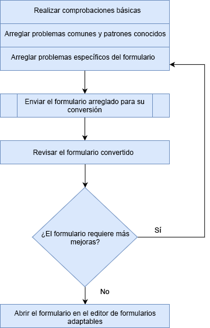

# Revisar y corregir formularios convertidos{#review-and-correct-converted-forms}

El servicio de conversión automatizada de formularios AEM Forms identifica los campos, el contenido y la presentación del documento PDF de entrada y convierte el documento PDF en un formulario adaptable. El formulario adaptable de salida puede tener algunos campos que faltan o que se han convertido incorrectamente. Puede utilizar el editor Revisar y corregir para realizar mejoras en los campos identificados y volver a generar el formulario adaptable para que el resultado se acerque a la experiencia deseada. Después de la primera conversión, puede abrir el documento PDF de entrada en el editor para:

* Ver todos los campos y contenidos identificados durante la conversión
* Identifique los campos y el contenido que se omiten durante la conversión
* Compruebe el tipo de campo y cambie su tipo, si es necesario
* Verificar las tablas identificadas, cambiar el tamaño de las columnas y modificar el contenido de las celdas
* Eliminar campos erróneamente identificados

Después de realizar los cambios necesarios, vuelva a enviar los formularios PDF al servicio de conversión. En una conversión correcta, los recursos actualizados, incluidos el formulario adaptable y el esquema, se descargan en la instancia de AEM Forms. Puede repetir el proceso hasta que se alcance la experiencia deseada. 

Se requiere el navegador Google Chrome, Mozilla FireFox o Microsoft Edge para utilizar la revisión y el editor correcto. El editor no admite Internet Explorer.

## Bienvenido al editor Revisar y corregir {#welcome-to-review-and-correct-editor}

El editor Revisar y corregir proporciona una interfaz fácil de usar. Tiene los siguientes componentes:

* Navegador de contenido: Puede utilizar el navegador de contenido para cambiar la posición de un elemento. El navegador de contenido permite arrastrar y soltar un objeto de formulario para cambiar su posición. Por ejemplo, mover una tabla antes de un cuadro de texto. Cambia el orden de tabulación del formulario adaptable de salida en consecuencia.
* Explorador de propiedades: Muestra las propiedades de un campo seleccionado. También puede modificar las propiedades.
* Barra de herramientas: La barra de herramientas se encuentra en la parte superior del editor. Muestra herramientas para agregar, modificar, agrupar, desagrupar y eliminar campos.
* Abrir propiedades: La opción Abrir propiedades aparece al tocar el  icono. Puede hacer clic en abrir propiedades para abrir propiedades del formulario y ver opciones adicionales.
* Botón Filtro: El botón de filtro  está en la parte superior del editor. Le permite filtrar los campos para que solo muestren textos, campos, opciones Grupos, paneles o todos los componentes.
* Botón Guardar: El **[!UICONTROL Save]** botón se encuentra en la esquina superior derecha del editor. También puede utilizar la flecha situada junto al botón Guardar para ver la opción de enviar el formulario para su conversión.

* Formulario PDF: El editor muestra el documento PDF de origen y lo superpone con los campos identificados. Puede utilizar las herramientas de la barra de herramientas para modificar los campos.
* Páginas: Un formulario de origen puede tener varias páginas. El editor proporciona un botón en la esquina superior derecha para navegar entre las páginas.

**************A. Explorador de contenido** B. Navegador de propiedades **C.** Barra de herramientas **D. Botón Propiedades** E. Botón Filtro **F. Botón Guardar** G. Formulario PDF superpuesto con campos identificados

Después de la primera conversión correcta, el servicio de conversión superpone el documento PDF de origen con campos y componentes identificados. Estos campos o componentes son del tipo: Texto, Campo, Panel, Grupo de opciones y tabla:

* Texto: Texto sin formato en el documento PDF de origen. Por ejemplo, el texto Aplicación de préstamo de la imagen que se muestra arriba.
* Campo: Combinación de texto o etiqueta de icono asociada a un valor o cuadro de entrada. Por ejemplo, el nombre del campo Primero en la imagen superior. Tiene una etiqueta de texto y un cuadro de entrada. Un campo admite los tipos de datos de texto, numérico, desplegable, fecha, correo electrónico, número de teléfono, firma, moneda y contraseña.
* Panel: Colección lógica de contenido y componentes. Por ejemplo, los paneles Detalles personales de Persona 1 y Persona 2 de la imagen superior.
* Grupo de opciones: Combinación de texto asociado con opciones de opción múltiple: y botón de radio. Por ejemplo, estado civil y cliente existente en la imagen superior.\
   Según el rótulo de grupo de opciones y sus opciones de opción múltiple, el servicio de conversión convierte automáticamente un grupo de opciones en un botón de opción de selección única o en una casilla de verificación de selección múltiple. Por ejemplo, si hay una opción **Seleccionar uno** , ya que el rótulo de grupo de opciones o las opciones de opción múltiple le permiten seleccionar una sola opción, **Sí** o **No**, el servicio de conversión convierte automáticamente el grupo de opciones en un botón de opción de selección única. Del mismo modo, si hay **Seleccionar todo lo que se aplica** o **Seleccionar varios** como el rótulo de grupo de opciones o las opciones de opción múltiple le permiten seleccionar varias opciones, el servicio de conversión convierte automáticamente el grupo de opciones en una casilla de verificación de selección múltiple.

* Tabla: Una tabla de dos dimensiones con información representada en columnas y filas. Puede agregar o quitar filas o columnas de una tabla.

## Comenzar a revisar una conversión {#start-reviewing-a-conversion}

Después de la primera conversión correcta, el servicio de conversión superpone el documento PDF de origen con campos y componentes identificados. Puede realizar mejoras en los campos identificados y volver a generar el formulario adaptable para que el resultado se acerque a la experiencia deseada. Puede empezar a revisar una conversión solo después de la primera conversión correcta.

### Antes de comenzar {#before-you-start}

* El editor Revisar y corregir no admite fragmentos. No utilice el editor para revisar las conversiones que tenían la opción **Extraer fragmento** activada durante las conversiones. Puede utilizar el editor [de formularios](https://helpx.adobe.com/experience-manager/6-5/forms/using/introduction-forms-authoring.html) adaptables para estas conversiones.

* El editor Revisar y corregir no tiene ninguna acción de deshacer. Utilice el botón Guardar sólo para guardar los cambios de forma permanente.

### Iniciar la revisión {#start-the-review}

Para empezar a revisar las conversiones, seleccione el documento PDF de origen utilizado para la conversión y toque y seleccione **Revisar conversiones**. El editor Revisar y corregir se abre en una nueva ficha. Puede empezar a revisar las conversiones. Realice las siguientes comprobaciones básicas antes de empezar a solucionar cualquier otro problema:

1. **Tipo de comprobación de todos los campos**: El servicio de conversión puede asignar un tipo incorrecto a un campo. Por ejemplo, se asigna texto en lugar de escribir teléfono en el campo de teléfono móvil. Puede situar el cursor sobre un campo para buscar el tipo de campo.

   Para cambiar el tipo de un campo, selecciónelo, abra el navegador de propiedades, seleccione un valor en el **[!UICONTROL Type]** menú desplegable y toque **[!UICONTROL Save]**. Se cambia el tipo.

   

1. **Quitar paneles** adicionales: El servicio de conversión puede generar paneles adicionales. Por ejemplo, se incluye un subpanel adicional en el panel principal, el espacio vacío se convierte en un panel y una casilla de verificación se convierte en un panel. Revise los límites de todos los paneles y elimine los paneles adicionales. Puede utilizar el botón de filtro  o el navegador de contenido para ver todos los paneles.

   Puede eliminar o desagrupar un panel para eliminarlo. Al utilizar la opción Eliminar, también se eliminan los campos secundarios o los componentes del panel:

   * Para eliminar un panel, selecciónelo y toque el icono Eliminar  de la barra de herramientas. En el cuadro de diálogo de confirmación, toque **[!UICONTROL Confirm]**. Toque **[!UICONTROL Save]** para guardar los cambios.

   * Para desagrupar un panel, selecciónelo y toque el icono de desagrupar en la barra de herramientas. El panel se desagrupa y los campos secundarios del panel no agrupado se ajustan al campo principal. Toque **[!UICONTROL Save]**para guardar los cambios.

1. **Crear grupos lógicos de texto**: Validar los textos identificados para que sean completos y correctos. También chequear, los textos se colocan lógicamente en paneles o grupos correctos. Por ejemplo, en un diseño de varias columnas, los textos de un grupo lógico y colocados en otro grupo.

   * Para comprobar si el texto está completo y es correcto, utilice el  botón de filtro para ver solo el texto, haga clic en cada texto y valide. Corrija los problemas de ortografía, errores tipográficos o gramática, si los hay.

   * Para agregar texto al formulario, toque el botón + y toque **[!UICONTROL Text]**. Dibuje el cuadro, abra el navegador de propiedades y escriba el texto que desee agregar al cuadro Contenido.

1. **** Revisar tablas: Asegúrese de que se identifican todos los bordes de la tabla. Además, asegúrese de que el contenido de las celdas esté correctamente identificado.

   * Para identificar los bordes perdidos, utilice la **[!UICONTROL Add Column]** opción o **[!UICONTROL Add Row]** .

   * Para quitar bordes adicionales, utilice la **[!UICONTROL Delete Column]** opción o **[!UICONTROL Delete Row]** .

Después de realizar los cambios necesarios, toque el **[!UICONTROL Save & Convert]** botón para volver a enviar los formularios PDF al servicio de conversión. Cada campo se convierte en un componente de campo adaptable correspondiente. Tras la conversión, los recursos actualizados, incluidos el formulario adaptable y el esquema, se descargan en la instancia de AEM Forms. Según la complejidad del formulario, el servicio puede tardar algún tiempo en completar la conversión.

Después de realizar las comprobaciones básicas, puede revisar el formulario para corregir problemas específicos de su organización. Estos problemas pueden estar relacionados con la adición de campos que faltan, etc. Puede ver la sección [Usar las herramientas](review-correct-ui-edited.md#use-the-review-and-correct-editor-tools) del editor Revisar y corregir para obtener información sobre todas las herramientas que proporciona el editor para solucionar estos problemas.

También puede trabajar para reconocer problemas idénticos que se producen en casi todos los formularios e informar de dichos patrones a Adobe. Utilice el editor Revisar y corregir hasta que se alcance la experiencia deseada.

## Uso de las herramientas del editor Revisar y corregir {#use-the-review-and-correct-editor-tools}

Con el editor Revisar y corregir, puede:

* [Adición de un componente al formulario](review-correct-ui-edited.md#add-a-component-to-the-form)
* [Agregar o editar una tabla](review-correct-ui-edited.md)
* [Cambiar el tipo de un componente](review-correct-ui-edited.md#change-type-a-component)

* [Creación o eliminación de un panel](review-correct-ui-edited.md#create-or-remove-a-panel)
* [Eliminación de un panel o componente](review-correct-ui-edited.md#delete-a-panel-or-component)
* [Definición de propiedades de un componente](review-correct-ui-edited.md#set-properties-of-a-component)
* [Envío de un formulario para conversión](review-correct-ui-edited.md#send-a-form-for-conversion)

### Adición de un componente al formulario {#add-a-component-to-the-form}

Es posible que el servicio de conversión no identifique algunos componentes del formulario de impresión. Por ejemplo, en un componente **Fecha de nacimiento** de un formulario no se identifica durante la conversión. Puede utilizar la herramienta **+** para identificar dichos componentes. La herramienta le permite agregar texto, campo, grupo de opciones, tabla y componentes de panel.

Para agregar un componente al formulario, toque **[!UICONTROL +]** y toque **[!UICONTROL Field]**. Dibuje un cuadro que cubra la etiqueta y el cuadro de entrada del campo. Por ejemplo, la imagen de ejemplo anterior utiliza el componente de campo para agregar al formulario la etiqueta **Fecha de nacimiento** y el cuadro de valor debajo. Al dibujar la casilla, el servicio de conversión identifica el tipo de campo. Puede cambiar el tipo de campo desde el navegador de propiedades, si es necesario. Después de crear el componente, abra el navegador de propiedades y defina las propiedades del componente.

Toque **[!UICONTROL Save]** para guardar las modificaciones o utilice el **[!UICONTROL Save & Convert]** botón para volver a enviar los formularios PDF al servicio de conversión.

### Agregar o editar una tabla {#addedittable}

La conversión puede dejar pocas celdas, límites o contenido de una celda de tabla sin identificar. Por ejemplo, no se identifica una fila de una tabla. Puede utilizar el editor Revisar y corregir para identificar dichos elementos. Puede realizar las siguientes acciones para una tabla:

* Para seleccionar una tabla, haga clic en cualquier celda de la tabla.
* Para modificar las propiedades de una celda como, por ejemplo, nombre, título o tipo, haga doble clic en una celda. También puede hacer doble clic en la celda para modificar el contenido, marcar un campo obligatorio y seleccionar otras propiedades.
* Para agregar o identificar una tabla completamente no identificada o nueva al formulario, utilice la **[!UICONTROL +]** herramienta.
* Para cambiar el tamaño de las celdas o filas de una tabla, haga clic en el área vacía de la tabla, coloque el puntero sobre el límite de la fila o columna cuando cambie el puntero del cursor, seleccione y mueva el límite. Después de cambiar el tamaño, haga clic en **[!UICONTROL Done]** para confirmar los cambios. Puede pulsar la **[!UICONTROL ESC]** tecla para descartar el cambio de tamaño.

* Para agregar o eliminar filas o columnas, seleccione una celda en la fila de la tabla y seleccione la **[!UICONTROL Add Row]**, **[!UICONTROL Add Column]**, **[!UICONTROL Delete Row]** o **[!UICONTROL Delete Column]** opción en el  menú.

* Para dividir una celda en una tabla, seleccione la **[!UICONTROL Spilt Vertical]** opción o en el **[!UICONTROL Split Horizontal]** del  menú.

* Para combinar celdas de una tabla, seleccione las celdas que desea combinar y seleccione la **[!UICONTROL Merge Cells]** opción en el menú  de la tabla.

### Cambiar el tipo de un componente {#change-type-a-component}

El servicio de conversión puede crear algunos campos de tipo incorrecto. Por ejemplo, en la imagen siguiente, el campo **Género** se identifica incorrectamente como campo **Texto** . Además, el contenido de la etiqueta es incorrecto. El campo debe ser un tipo de campo de opción y la etiqueta debe ser Sexo. Para cambiar el tipo de un componente y corregir su etiqueta:

Seleccione el campo que desea convertir, toque  y toque un tipo de campo. El campo se convierte al tipo de campo seleccionado. Un campo solo se puede convertir en tipos enumerados en la siguiente tabla. Un componente de panel solo se puede desagrupar, no transformar.

| **Componente** | **Convierte a** |
|---|---|
| Texto | Campo o grupo de opciones |
| Campo | Texto o grupo de opciones |
| Grupo de opciones | Texto o panel |

Una vez convertidas, abra el navegador de propiedades, especifique la etiqueta y otras propiedades requeridas. Toque **[!UICONTROL Save]** para guardar las modificaciones o utilice el botón Guardar y convertir para volver a enviar los formularios PDF al servicio de conversión.

### Creación o eliminación de un panel {#create-or-remove-a-panel}

El servicio de conversión agrega componentes relacionados y contenido de formularios impresos a un panel. Por ejemplo, el formulario puede tener un panel de direcciones con campos como, por ejemplo, nombre, número de trazado, área, ciudad, estado, código postal y país. Estos campos se agrupan en un panel. Un formulario puede tener varios paneles.

El servicio de conversión puede crear paneles que tengan componentes sin relación con otros o que dejen un componente relativo fuera del panel. Puede utilizar las herramientas de grupo o desgrupo para corregir estos paneles:

* Para quitar un panel, selecciónelo y toque desagrupar . El panel se elimina y los componentes secundarios del panel se mueven al componente principal. También puede utilizar la opción [Eliminar componente](review-correct-ui-edited.md#delete-a-panel-or-component) para eliminar un panel y sus elementos secundarios.

* Para crear un panel, utilice la tecla Ctrl (en Windows o Linux) o la tecla Control (en Mac) para seleccionar componentes relacionados y toque  para crear un panel. Abra el navegador de propiedades para especificar las propiedades del panel.

Toque **[!UICONTROL Save]** para guardar las modificaciones o utilice el **[!UICONTROL Save & Convert]** botón para volver a enviar los formularios PDF al servicio de conversión.

### Eliminación de un panel o componente {#delete-a-panel-or-component}

El servicio de conversión puede identificar algunos paneles o componentes incorrectos. La mayoría de estos componentes de estos paneles no están relacionados. Puede eliminar dichos paneles o componentes.

Para eliminar un panel o un componente, seleccione un panel o un componente y toque el  icono Eliminar. En el cuadro de diálogo de confirmación, toque **[!UICONTROL Confirm]**. Se elimina el panel o componente seleccionado. Al eliminar un panel, también se eliminan todos los elementos secundarios del mismo. Puede utilizar la tecla Ctrl (en Windows o Linux) o la tecla Control (en Mac) para seleccionar varios componentes o paneles.

### Definición de propiedades de un componente {#set-properties-of-a-component}

Cada componente del formulario tiene un conjunto de propiedades como nombre, título o tipo. Para definir las propiedades de un componente, selecciónelo y toque el navegador de propiedades. Se muestran las propiedades del componente seleccionado. Cambie o defina las propiedades.

Toque **[!UICONTROL Save]** para guardar las modificaciones o utilice el **[!UICONTROL Save & Convert]** botón para volver a enviar los formularios PDF al servicio de conversión.

### Envío de un formulario para conversión {#send-a-form-for-conversion}

Una vez que haya realizado todos los cambios necesarios en el editor Revisar y corregir, puede volver a enviar el formulario para su conversión. Para enviar el formulario para conversión, toque **[!UICONTROL Save & Convert]**. El formulario **[!UICONTROL Sent for conversion label]** se aplica a la carpeta que contiene el documento de origen y el formulario de origen actualizado se carga en el servicio de conversión que se ejecuta en Adobe I/O.

Según la complejidad del formulario, el servicio de conversión puede tardar algún tiempo en convertirse. Una vez finalizada la conversión, el formulario adaptable convertido y los recursos relacionados se descargan en el equipo. Puede revisar el formulario en el editor una vez finalizada la conversión y abrir el formulario adaptable en el editor [de formularios](https://helpx.adobe.com/experience-manager/6-5/forms/using/introduction-forms-authoring.html) adaptables para el conjunto final de correcciones, si es necesario.

Si vuelve a enviar un formulario para su conversión después de actualizar el formulario en el editor de formularios adaptables, se pierden todos los cambios realizados en el formulario adaptable. Puede abrir un formulario en revisión y corregir el editor solo después de una conversión correcta.

<!--
Comment Type: draft

<h3>Open adaptive forms editor</h3>
-->

<!--
Comment Type: draft

There can be instances where you require adaptive forms editor to make the changes like, applying a different theme to the form or fixing tables. Once you have made all the required changes in Review and Correct editor and converted the form, you can open your form in adaptive forms editor to make the final set of changes.

To open the form with adaptive forms editor, tap the  icon, and tap <strong>Open Adaptive Form Editor</strong>. The form opens in adaptive form editor. 

## Previous {#previous}

[Use Automated Forms Conversion service](convert-existing-forms-to-adaptive-forms.md)
