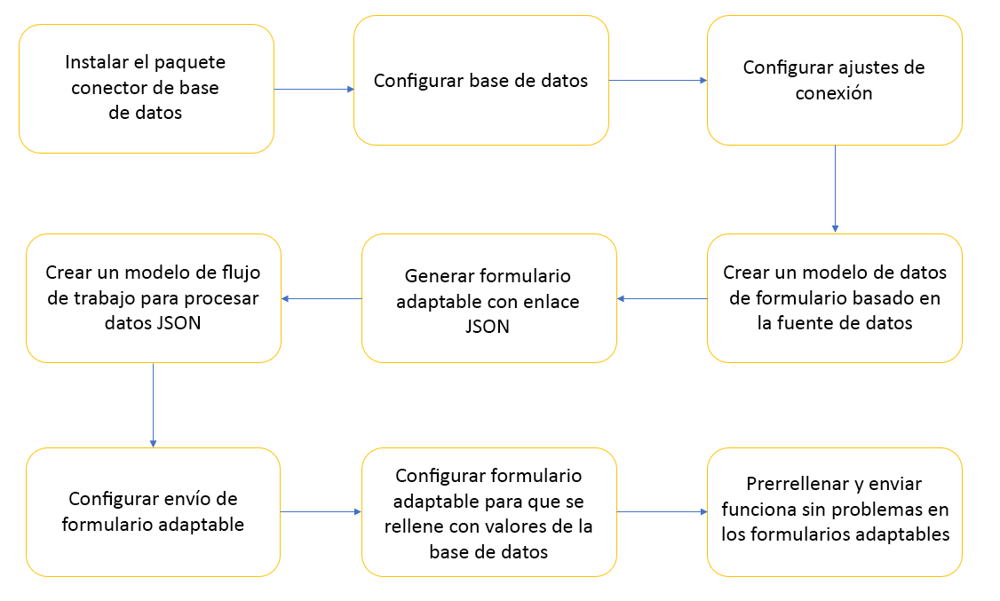
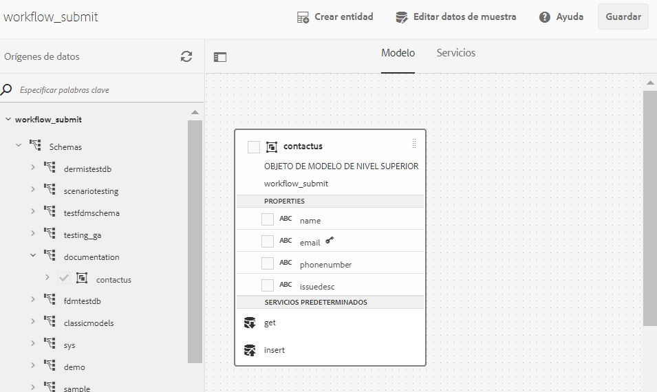
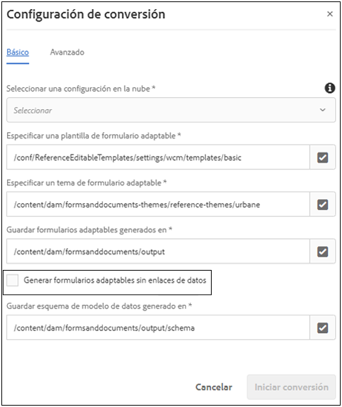
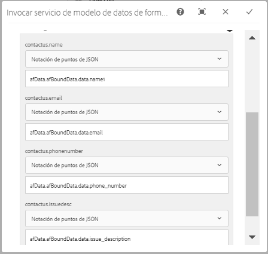
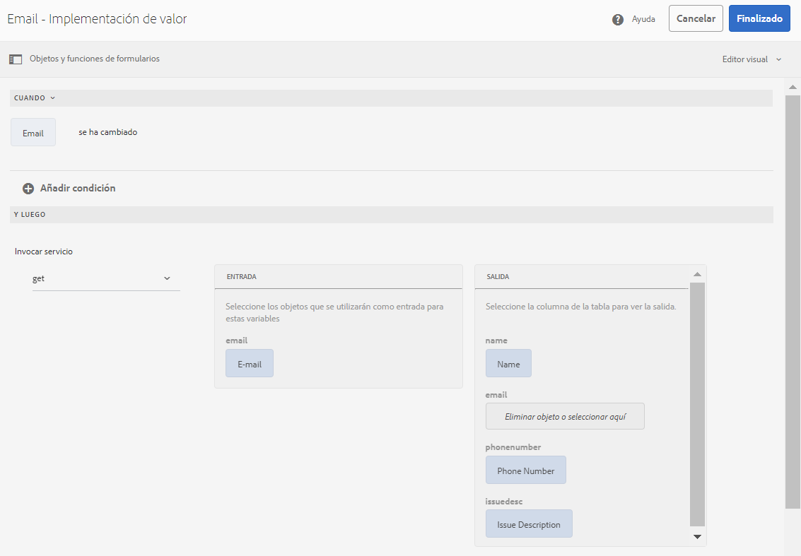

# Integración del formulario adaptable con la base de datos mediante el flujo de trabajo de AEM {#submit-forms-to-database-using-forms-portal}

El servicio de conversión automatizada de formularios le permite convertir un formulario PDF no interactivo, un AcroForm o un formulario PDF basado en XFA en un formulario adaptable. Al iniciar el proceso de conversión, tiene la opción de generar un formulario adaptable con o sin enlaces de datos.

Si selecciona generar un formulario adaptable sin enlaces de datos, puede integrar el formulario adaptable convertido con un modelo de datos de formulario, un esquema XML o JSON después de la conversión. Para el modelo de datos de formulario, es necesario enlazar manualmente los campos de formulario adaptables con el modelo de datos de formulario. Sin embargo, si genera un formulario adaptable con enlaces de datos, el servicio de conversión asocia automáticamente los formularios adaptables con un esquema JSON y crea un enlace de datos entre los campos disponibles en el formulario adaptable y el esquema JSON. A continuación, puede integrar el formulario adaptable con una base de datos de su elección, rellenar los datos del formulario y enviarlo a la base de datos. Del mismo modo, tras una integración correcta con la base de datos, se pueden configurar los campos del formulario adaptable convertido para recuperar los valores de la base de datos y rellenar automáticamente los campos.

La siguiente figura muestra las distintas etapas de integración de un formulario adaptable convertido con una base de datos:



En este artículo se describen las instrucciones paso a paso para ejecutar correctamente todas estas etapas de integración.

## Requisitos previos {#pre-requisites}

* Configuración de una instancia de autor de AEM 6.4 o 6.5
* Instalar el [Service pack más reciente](https://helpx.adobe.com/es/experience-manager/aem-releases-updates.html) para la instancia de AEM
* Última versión del paquete de complementos de AEM Forms
* Configuración del [servicio de conversión automatizada de formularios](configure-service.md)
* Configure una base de datos. La base de datos utilizada en la implementación de muestra es MySQL 5.6.24. Sin embargo, puede integrar el formulario adaptable convertido con cualquier base de datos de su elección.

## Formulario adaptable de ejemplo {#sample-adaptive-form}

Para ejecutar el caso de uso para integrar formularios adaptables convertidos con la base de datos mediante un flujo de trabajo AEM, descargue el siguiente archivo PDF como ejemplo.

Puede descargar el formulario de contacto de ejemplo utilizando lo siguiente:

[Obtener archivo](assets/sample_contact_us_form.pdf)

El archivo PDF sirve como entrada al servicio de conversión automatizada de formularios. El servicio convierte este archivo en un formulario adaptable. La siguiente imagen muestra el formulario de contacto en formato PDF.


## Instalar el archivo mysql-connector-java-5.1.39-bin.jar. {#install-mysql-connector-java-file}

Realice los siguientes pasos en todas las instancias de autor y publicación para instalar el archivo mysql-connector-java-5.1.39-bin.jar:

1. Vaya a `http://server:port/system/console/depfinder` y busque el paquete com.mysql.jdbc.
1. En la columna Exportado por, compruebe si el paquete fue exportado por algún otro paquete. Continúe si el paquete no se exporta mediante ningún otro.
1. Vaya a `http://server:port/system/console/bundles` y haga clic en **[!UICONTROL Install/Update]**.
1. Haga clic en **[!UICONTROL Choose File]** y busque para seleccionar el archivo mysql-connector-java-5.1.39-bin.jar. Seleccione también las casillas de verificación **[!UICONTROL Start Bundle]** y **[!UICONTROL Refresh Packages]**.
1. Haga clic en **[!UICONTROL Install]** o **[!UICONTROL Update]**. Una vez finalizado, reinicie el servidor.
1. (Solo Windows) Desactive el cortafuegos de su sistema operativo.

## Preparación de datos para el modelo de formulario {#prepare-data-for-form-model}

La integración de datos de AEM Forms le permite configurar y conectarse a fuentes de datos diferentes. Después de generar un formulario adaptable mediante el proceso de conversión, puede definir el modelo de formulario basado en un modelo de datos de formulario, XSD o un esquema JSON. Puede utilizar una base de datos, Microsoft Dynamics o cualquier otro servicio de terceros para crear un modelo de datos de formulario.

Este tutorial utiliza la base de datos MySQL como fuente para crear un modelo de datos de formulario. Cree un esquema en la base de datos y agregue la tabla de **contacto** al esquema en función de los campos disponibles en el formulario adaptable.


Utilice la siguiente instrucción DDL para crear la tabla **contacto** en la base de datos.

```sql
CREATE TABLE `contactus` (
   `name` varchar(45) NOT NULL,
   `email` varchar(45) NOT NULL,
   `phonenumber` varchar(10) DEFAULT NULL,
   `issuedesc` varchar(1000) DEFAULT NULL,
   PRIMARY KEY (`email`)
 ) ENGINE=InnoDB DEFAULT CHARSET=utf8
```

## Configuración de la conexión entre la instancia de AEM y la base de datos {#configure-connection-between-aem-instance-and-database}

Realice los siguientes pasos de configuración para crear una conexión entre la instancia de AEM y la base de datos MySQL:

1. Vaya a la página de configuración de la consola web de AEM en `http://server:port/system/console/configMgr`.
1. Busque y haga clic para abrir **[!UICONTROL Apache Sling Connection Pooled DataSource]** en modo de edición en la configuración de la consola web. Especifique los valores de las propiedades tal como se describe en la siguiente tabla:

   <table> 
    <tbody> 
    <tr> 
    <th><strong>Propiedad</strong></th> 
    <th><strong>Valor</strong></th> 
    </tr> 
    <tr> 
    <td><p>Nombre de la fuente de datos</p></td> 
    <td><p>Un nombre de fuente de datos para filtrar los controladores del grupo de fuentes de datos.</p></td>
    </tr>
    <tr> 
    <td><p>Clase de controlador JDBC</p></td> 
    <td><p>com.mysql.jdbc.Driver</p></td>
    </tr>
    <tr> 
    <td><p>URI de conexión JDBC</p></td> 
    <td><p>jdbc:mysql://[host]:[port]/[schema_name]</p></td>
    </tr>
    <tr> 
    <td><p>Nombre de usuario</p></td> 
    <td><p>Un nombre de usuario para autenticar y realizar acciones en tablas de base de datos</p></td>
    </tr>
    <tr> 
    <td><p>Contraseña</p></td> 
    <td><p>La contraseña asociada al nombre de usuario</p></td>
    </tr>
    <tr> 
    <td><p>Aislamiento de transacciones</p></td> 
    <td><p>READ_COMMITTED</p></td>
    </tr>
    <tr> 
    <td><p>Máximo de conexiones activas</p></td> 
    <td><p>1000</p></td>
    </tr>
    <tr> 
    <td><p>Conexiones máximas inactivas</p></td> 
    <td><p>100</p></td>
    </tr>
    <tr> 
    <td><p>Conexiones mínimas inactivas</p></td> 
    <td><p>10</p></td>
    </tr>
    <tr> 
    <td><p>Tamaño inicial</p></td> 
    <td><p>10</p></td>
    </tr>
    <tr> 
    <td><p>Espera máxima</p></td> 
    <td><p>100 000</p></td>
    </tr>
     <tr> 
    <td><p>Prueba a la vista previa</p></td> 
    <td><p>Comprobado</p></td>
    </tr>
     <tr> 
    <td><p>Prueba mientras está inactiva</p></td> 
    <td><p>Comprobado</p></td>
    </tr>
     <tr> 
    <td><p>Consulta de validación</p></td> 
    <td><p>Los valores de ejemplo son SELECT 1(mysql), select 1 from dual(oracle), SELECT 1(MS Sql Server) (validationQuery)</p></td>
    </tr>
     <tr> 
    <td><p>Tiempo de espera de consulta de validación</p></td> 
    <td><p>10 000</p></td>
    </tr>
    </tbody> 
    </table>

## Creación de un modelo de datos de formulario {#create-form-data-model}

Una vez configurado MySQL como fuente de datos, ejecute los siguientes pasos para crear un modelo de datos de formulario:

1. En la instancia de autor de AEM, vaya a **[!UICONTROL Forms]** > **[!UICONTROL Data Integrations]**.

1. Pulse **[!UICONTROL Create]** > **[!UICONTROL Form Data Model]**.

1. En el asistente **[!UICONTROL Create Form Data Model]**, especifique **workflow_submit** como nombre del formulario del modelo de datos, y toque **[!UICONTROL Next]**.

1. Seleccione la fuente de datos MySQL que ha configurado en la sección anterior y pulse **[!UICONTROL Create]**.

1. Toque **[!UICONTROL Edit]** y expanda la fuente de datos que aparece en el panel izquierdo para seleccionar la tabla **contacto** **[!UICONTROL get]** y **[!UICONTROL insert]** servicios y pulse **[!UICONTROL Add Selected]**.

   

1. Seleccione el objeto del modelo de datos en el panel derecho y pulse **[!UICONTROL Edit Properties]**. Seleccione **[!UICONTROL get]** y **[!UICONTROL insert]** de las listas desplegables **[!UICONTROL Read Service]** y **[!UICONTROL Write Service]**. Especifique los argumentos del servicio de lectura y pulse **[!UICONTROL Done]**.

1. En la pestaña **[!UICONTROL Services]**, seleccione el servicio **[!UICONTROL get]** y pulse **[!UICONTROL Edit Properties]**. Seleccione **[!UICONTROL Output Model Object]**, desactive la alternancia **[!UICONTROL Return array]** y pulse **[!UICONTROL Done]**.

1. Seleccione el servicio **[!UICONTROL Insert]** y pulse **[!UICONTROL Edit Properties]**. Seleccione el **[!UICONTROL Input Model Object]** y toque **[!UICONTROL Done]**.

1. Pulse **[!UICONTROL Save]** para guardar el modelo de datos de formulario.

Puede descargar el ejemplo del modelo de datos de formulario mediante lo siguiente:

[Obtener archivo](assets/DownloadedFormsPackage_1497728018502500.zip)

## Generación de formularios adaptables con enlace JSON {#generate-adaptive-forms-with-json-binding}

Utilice el [servicio de conversión automatizada de formularios para convertir](convert-existing-forms-to-adaptive-forms.md) el [formulario de contacto](#sample-adaptive-form) a uno adaptable con enlace de datos. Asegúrese de no seleccionar la casilla **[!UICONTROL Generate adaptive form(s) without data bindings]** al generar el formulario adaptable.



Seleccione el **formulario de contacto** que está disponible en la **[!UICONTROL output]** carpeta **[!UICONTROL Forms & Documents]** y pulse **[!UICONTROL Edit]**. Pulse **[!UICONTROL Preview]**, escriba los valores en los campos del formulario adaptable y pulse **[!UICONTROL Submit]**.

Inicie sesión en **crx-repository** y vaya a */content/forms/fp/admin/submit/data* para ver los valores enviados en formato JSON. A continuación, se muestran los datos de ejemplo en formato JSON al enviar el formulario **Contacto** adaptable y convertido:

```json
{
  "afData": {
    "afUnboundData": {
      "data": {}
    },
    "afBoundData": {
      "data": {
        "name1": "Gloria",
        "email": "abc@xyz.com",
        "phone_number": "2346578965",
        "issue_description": "Test message"
      }
    },
    "afSubmissionInfo": {
      "computedMetaInfo": {},
      "stateOverrides": {},
      "signers": {},
      "afPath": "/content/dam/formsanddocuments/docs_conversion/output/sample_form_json",
      "afSubmissionTime": "20191204014007"
    }
  }
}
```

Debe crear ahora un modelo de flujo de trabajo que pueda procesar estos datos y enviarlos a la base de datos MySQL utilizando el modelo de datos de formulario que ha creado en las secciones anteriores.

## Creación de un modelo de flujo de trabajo para procesar datos JSON {#create-workflow-model}

Siga estos pasos para crear un modelo de flujo de trabajo y enviar los datos de formulario adaptables a la base de datos:

1. Abra la consola Modelos de flujo de trabajo. La URL predeterminada es `https://server:port/libs/cq/workflow/admin/console/content/models.html/etc/workflow/models`.

1. Seleccione **[!UICONTROL Create]**, luego **[!UICONTROL Create Model]**. Aparecerá el cuadro de diálogo **[!UICONTROL Add Workflow Model]**.

1. Introduzca **[!UICONTROL Title]** y **[!UICONTROL Name]** (opcional). Por ejemplo, **workflow_json_submit**. Seleccione **[!UICONTROL Done]** para crear el modelo.

1. Seleccione el modelo de flujo de trabajo y pulse **[!UICONTROL Edit]** para abrir el modelo en modo de edición. Toque + y agregue el paso **[!UICONTROL Invoke Form Data Model Service]** al modelo del flujo de trabajo.

1. Seleccione el paso **[!UICONTROL Invoke Form Data Model Service]** y seleccione .

1. En la pestaña **[!UICONTROL Form Data Model]**, seleccione el modelo de datos de formulario que ha creado en el campo **[!UICONTROL Form Data Model path]** y seleccione **[!UICONTROL insert]** de la lista desplegable **[!UICONTROL Service]**.

1. En la pestaña **[!UICONTROL Input for Service]**, seleccione **[!UICONTROL Provide input data using literal, variable, or a workflow metadata, and a JSON file]** en la lista desplegable. Luego, seleccione la casilla **[!UICONTROL Map input fields from input JSON]**, seleccione **[!UICONTROL Relative to payload]** y agregue **data.xml** como el valor para el campo **[!UICONTROL Select input JSON document using]**.

1. En la sección **[!UICONTROL Service Arguments]**, agregue los siguientes valores para los argumentos del modelo de datos de formulario:

   

   Observe que los campos del modelo de datos de formulario, por ejemplo, contacto dot name, están asignados a **afData.afBoundData.data.name1**, que hace referencia a los enlaces del esquema JSON para el formulario adaptable que ya se ha enviado.

## Configuración del envío de formularios adaptables {#configure-adaptive-form-submission}

Ejecute los siguientes pasos para enviar el formulario adaptable al modelo de flujo de trabajo creado en la sección anterior:

1. Seleccione el formulario de contacto que ya se ha convertido y que está disponible en la carpeta **[!UICONTROL output]** en **[!UICONTROL Forms & Documents]** y seleccione **[!UICONTROL Edit]**.

1. Abra las propiedades del formulario adaptable seleccionando **[!UICONTROL Form Container]** y luego .

1. En la sección **[!UICONTROL Submission]**, seleccione **[!UICONTROL Invoke an AEM workflow]** de la lista desplegable **[!UICONTROL Submit Action]**. Luego seleccione el modelo de flujo de trabajo que creó en la sección anterior y especifique **data.xml** en el campo **[!UICONTROL Data File Path]**.

1. Pulse  para guardar las propiedades.

1. Seleccione **[!UICONTROL Preview]**, escriba los valores en los campos del formulario adaptable y seleccione **[!UICONTROL Submit]**. Los valores enviados ahora se muestran en la tabla de la base de datos MySQL en lugar de **crx-repository**.

## Configuración de formularios adaptables para rellenar los valores predeterminados de la base de datos de forma automática

Ejecute los siguientes pasos para configurar el formulario adaptable para rellenar de forma automática los valores predeterminados de la base de datos MySQL en función de la clave principal definida en la tabla (correo electrónico, en este caso):

1. Seleccione el campo **correo electrónico** en el formulario adaptable y pulse .

1. Toque **[!UICONTROL Create]** y seleccione **[!UICONTROL is changed]** de la lista desplegable **[!UICONTROL Select State]** en la sección **[!UICONTROL When]**.

1. En la sección **[!UICONTROL Then]**, seleccione **[!UICONTROL Invoke Service]** y **get** como el servicio para el modelo de datos de formulario que ha creado en la sección anterior de este artículo.

1. Seleccione **correo electrónico** en la sección **[!UICONTROL Input]** y los tres campos restantes del modelo de datos de formulario, **Nombre**, **Número de teléfono** y **Descripción del problema** en la sección **[!UICONTROL Output]**. Pulse **[!UICONTROL Done]** para guardar la configuración.

   

   Como resultado, en función de las entradas de correo electrónico existentes en la base de datos MySQL, puede rellenar automáticamente los valores predeterminados de los tres campos restantes en el modo **[!UICONTROL Preview]** de formulario adaptable. Por ejemplo, si especifica aya.tan@xyz.com en el campo **Correo electrónico** (en función de los datos existentes en la sección [Preparación del modelo de datos de formulario](#prepare-data-for-form-model) de este artículo) y en la pestaña fuera del campo, los tres campos restantes, **Nombre**, **Número de teléfono** y **Descripción del problema** se muestran automáticamente en el formulario adaptable.

Puede descargar el ejemplo de formulario adaptable convertido utilizando lo siguiente:

[Obtener archivo](assets/DownloadedFormsPackage_1498226829041200.zip)
