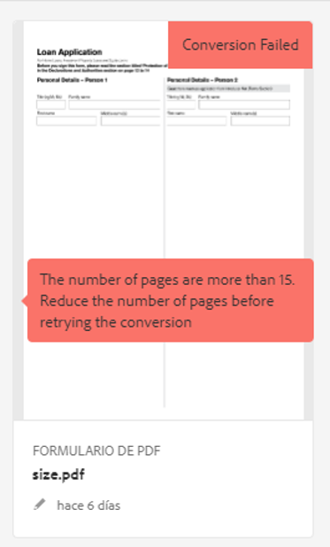
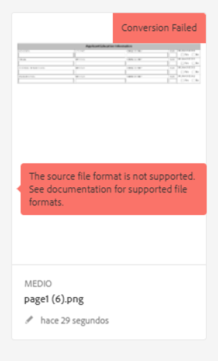
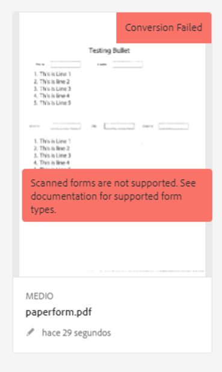
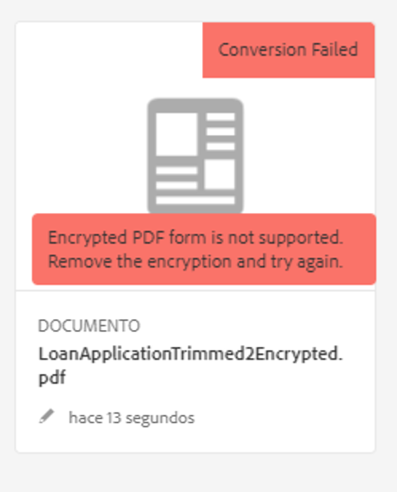
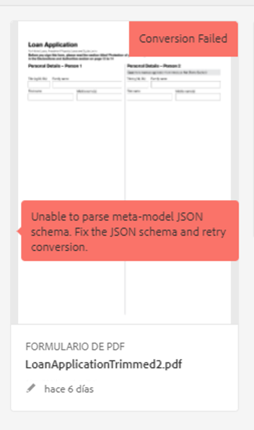

# Solución de problemas del servicio de conversión automatizada de formularios

<!--The article provides information on installation, configuration and administration issues that may arise in an Automated Forms Conversion Service production environment. --> The document  provides basic troubleshooting steps for common errors.

## Errores comunes {#commonerrors}

| Error | Ejemplo |
|--- |--- |
| **Mensaje** de error   El encabezado de token de acceso no está disponible.   **Motivo ** : Un administrador ha creado varias configuraciones IMS o la configuración IMS no puede acceder al servicio AFCS en Adobe Cloud.  **Resolución**   Si hay varias configuraciones, elimine todas las configuraciones y [cree una nueva configuración](configure-service.md#obtainpubliccertificates).   Si hay una sola configuración, use **[!UICONTROL Health Check]** para [comprobar la conectividad](configure-service.md#createintegrationoption). |  |
| **Mensaje** de error   No se puede conectar al servicio.    **Motivo ** : URL de servicio incorrecta o no se menciona ninguna URL de servicio en los servicios de nube del servicio de conversión automatizada de formularios.  **Resolución**   Corrección de la URL [del servicio](configure-service.md#configure-the-cloud-service) en los servicios de nube de servicios de conversión de formularios automatizados. |  |
| **Mensaje** de error   El servicio no pudo convertir el formulario.    **Razón **por la que los problemas de conectividad de red se producen al final, el servicio se ha reducido debido a un mantenimiento programado o a una interrupción en Adobe Cloud.  **Resolución**   Resuelva los problemas de conectividad de red al final y verifique el estado del servicio en https://status.adobe.com/ para una interrupción planificada o no planificada. |  |
| **Mensaje** de error   El número de páginas es mayor que 15.    **Motivo ** El formulario de origen tiene más de 15 páginas.  **Resolución**  Utilice Adobe Acrobat para dividir formularios con más de 15 páginas. Coloque el número de páginas de un formulario en menos de 15. |  |
| **Mensaje** de error   El número de archivos es superior a 15.    **Motivo ** La carpeta contiene más de 15 formularios.  **Resolución**   Coloque el número de formularios en una carpeta en menos o igual a 15. Coloque el número total de páginas en una carpeta menos de 50. Lleve el tamaño de la carpeta a menos de 10 MB. No mantenga los formularios en una subcarpeta. Organice los formularios de origen en un lote de 8 a 15 formularios. |  |
| **Mensaje** de error   El formato del archivo de origen no es compatible.    **Motivo ** La carpeta que contiene los formularios de origen tiene algunos archivos no admitidos.  **Resolución**   El servicio solo admite archivos .xdp y .pdf. Elimine los archivos con cualquier otra extensión de la carpeta y ejecute la conversión. |  |
| **Mensaje** de error   Los formularios digitalizados no son compatibles.    **Motivo ** El formulario PDF solo contiene imágenes escaneadas del formulario y no contiene ninguna estructura de contenido.  **Resolución**   El servicio no admite la conversión de formularios digitalizados o una imagen de un formulario a una solución lista para usar adaptable. Sin embargo, se utiliza Adobe Acrobat para convertir la imagen de un formulario en un formulario PDF. A continuación, utilice el servicio para convertir el formulario PDF en un formulario adaptable. Utilice siempre una imagen de alta calidad del formulario para la conversión en Acrobat. Mejora la calidad de la conversión. |  |
| **No se admite el formulario PDF cifrado de mensaje**   de error.    **Motivo ** La carpeta contiene formularios PDF cifrados.  **Resolución**   El servicio no admite la conversión de un formulario PDF codificado a un formulario adaptable. Elimine el cifrado, cargue el formulario no cifrado y ejecute la conversión. |  |
| **Mensaje** de error   No se puede analizar el esquema JSON de meta-modelo.    **Motivo ** El esquema JSON proporcionado al servicio no tiene el formato correcto, contiene caracteres no válidos o utiliza una sintaxis no válida para asignar componentes.  **Resolución**   Compruebe el formato del archivo JSON. Puede utilizar cualquier validador JSON en línea para comprobar el formato y la estructura del esquema. Consulte [Ampliación del artículo de metamodelo](extending-the-default-meta-model.md) predeterminado para obtener información sobre la sintaxis de metamodelo. |  |

<!--

<table>
<thead>
<tr>
<th>Error</th>
<th>Example</th>
</tr>
</thead>
<tbody>
<tr>
<td><strong>Error Message</strong> 
 The access token header is not available. 
 <strong>Reason</strong>   An administrator has created multiple IMS configurations or IMS configuration is not able to reach AFCS service on Adobe Cloud.   <strong>Resolution</strong>   If there are multiple configurations, delete all the configurations and <a href="configure-service.md#obtainpubliccertificates">create a new configuration</a>.   If there is a single configuration, use <strong> Health Check </strong> to <a href="configure-service.md#createintegrationoption">check connectivity</a>.</td>
<td></td>
</tr>
<tr>
<td><strong>Error Message</strong>   Unable to connect to the service.    <strong>Reason</strong>   Incorrect service URL or no service URL is mentioned in Automated Forms Conversion Service cloud services.   <strong>Resolution</strong>   Correct <a href="configure-service.md#configure-the-cloud-service">Service URL</a> in Automated Forms Conversion Service Cloud services.</td>
<td></td>
</tr>
<tr>
<td><strong>Error Message</strong>   The service failed to convert the form.    <strong>Reason</strong>   Network connectivity issues at your end, the service is down due to scheduled maintenance, or outage on Adobe Cloud.   <strong>Resolution</strong>   Resolve network connectivity issues at your end and check the status of the service on <a href="https://status.adobe.com/">https://status.adobe.com/</a> for a planned or unplanned outage.</td>
<td></td>
</tr>
<tr>
<td><strong>Error Message</strong>   The number of pages is more than 15.    <strong>Reason</strong>   The source form is more than 15 pages long.    <strong>Resolution</strong>   Use Adobe Acrobat to split forms with more than 15 pages. Bring the number of pages in a form to less than 15.</td>
<td></td>
</tr>
<tr>
<td><strong>Error Message</strong>   The number of files is more than 15.    <strong>Reason</strong>    The folder contains more than 15 forms.   <strong>Resolution</strong>   Bring the number of forms in a folder to less than or equal to 15. Bring the total number of pages in a folder less than 50. Bring the size of the folder to less than 10 MB. Do not keep forms in a sub-folder. Organize source forms into a batch of 8-15 forms.</td>
<td></td>
</tr>
<tr>
<td><strong>Error Message</strong>   The source file format is not supported.    <strong>Reason</strong>   The folder containing source forms have some unsupported files.   <strong>Resolution</strong>   The service supports only .xdp and .pdf files. Remove files with any other extension from the folder and run the conversion.</td>
<td></td>
</tr>
<tr>
<td><strong>Error Message</strong>   Scanned forms are not supported.    <strong>Reason</strong>   The PDF form contains only scanned images of the form and contains no content structure.   <strong>Resolution</strong>   The service does not support converting scanned forms or an image of a form to an adaptive out-of-the-box. However, you use Adobe Acrobat to convert the image of a form to a PDF Form. Then, use the service to convert the PDF Form to an adaptive form. Always use a high-quality image of the form for conversion in Acrobat. It improves the quality of the conversion.</td>
<td></td>
</tr>
<tr>
<td><strong>Error Message</strong>   Encrypted PDF form is not supported.    <strong>Reason</strong>   The folder contains encrypted PDF forms.   <strong>Resolution</strong>   The service does not support converting an encrypted PDF form to an adaptive form. Remove the encryption, upload the non-encrypted form, and run the conversion.</td>
<td></td>
</tr>
<tr>
<td><strong>Error Message</strong>   Unable to parse meta-model JSON schema.    <strong>Reason</strong>   The JSON schema supplied to the service is not properly formatted, contains invalid characters, or uses invalid syntax to map components.    <strong>Resolution</strong>   Check the formatting of the JSON file. You can use any online JSON validator to check the formatting and structure of the schema. See, <a href="extending-the-default-meta-model.md">Extend the default meta-model</a> article for information on meta-model syntax.</td>
<td></td>
</tr>
</tbody>
</table>
-->