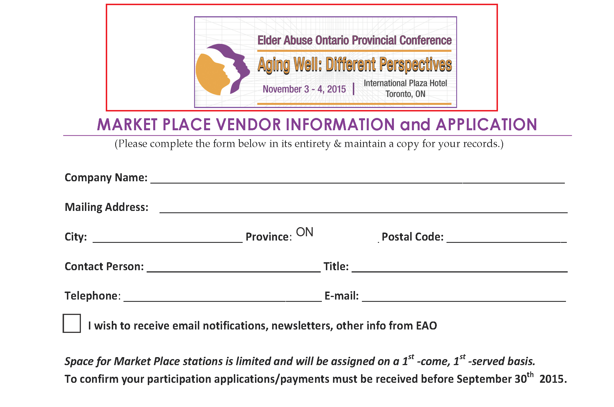
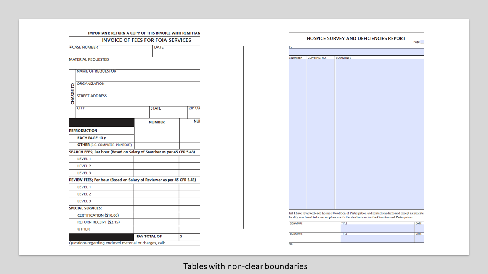
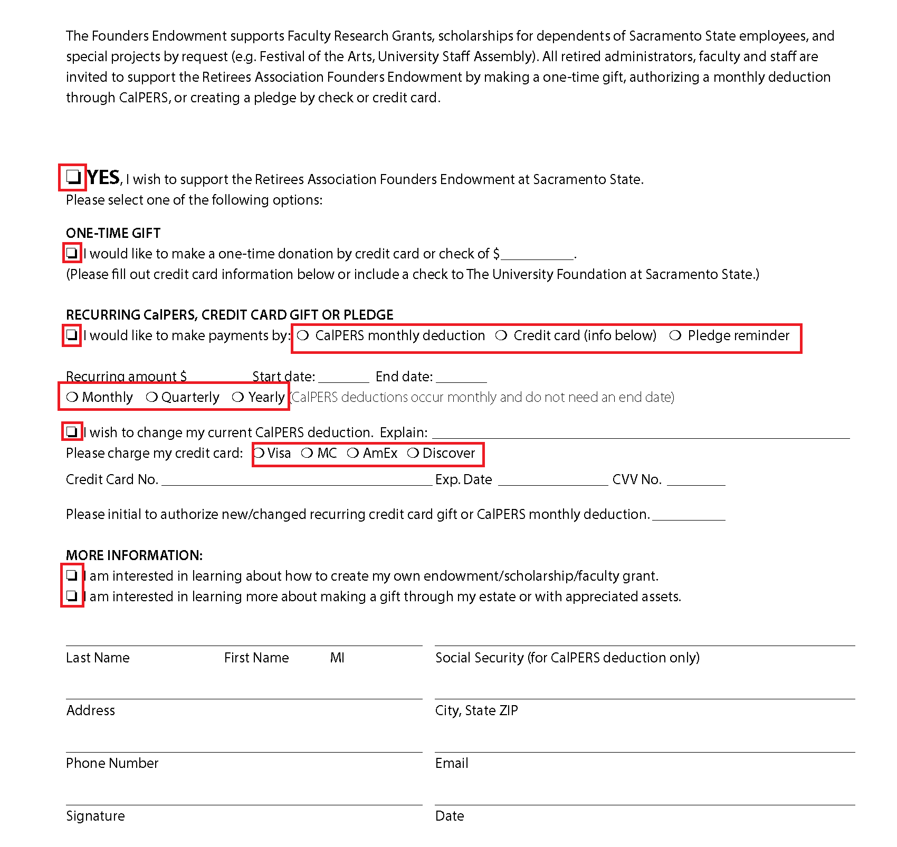
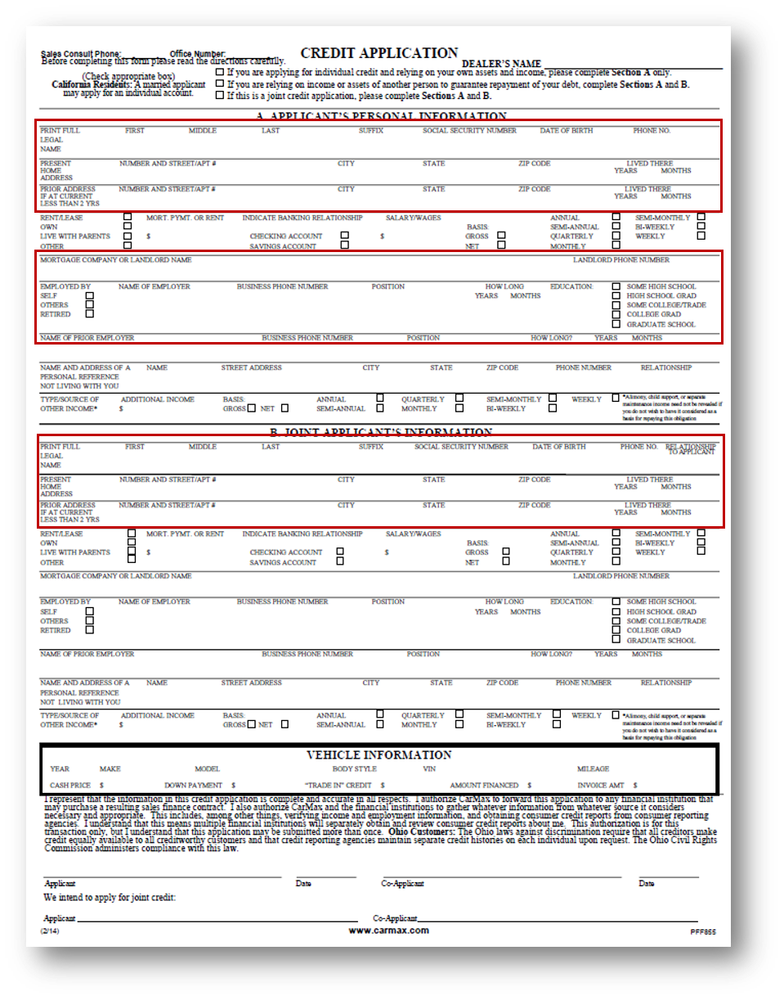
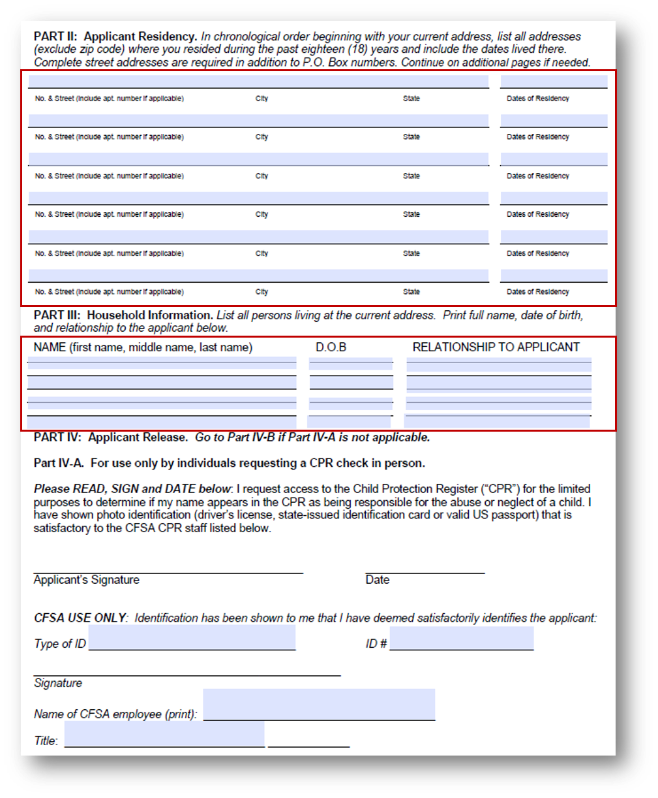
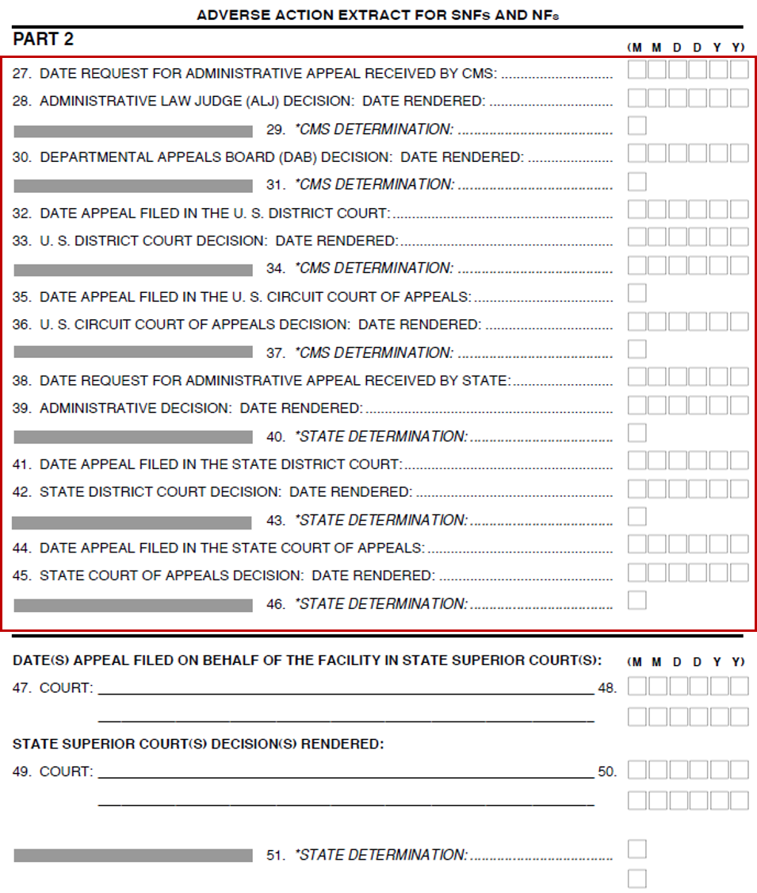
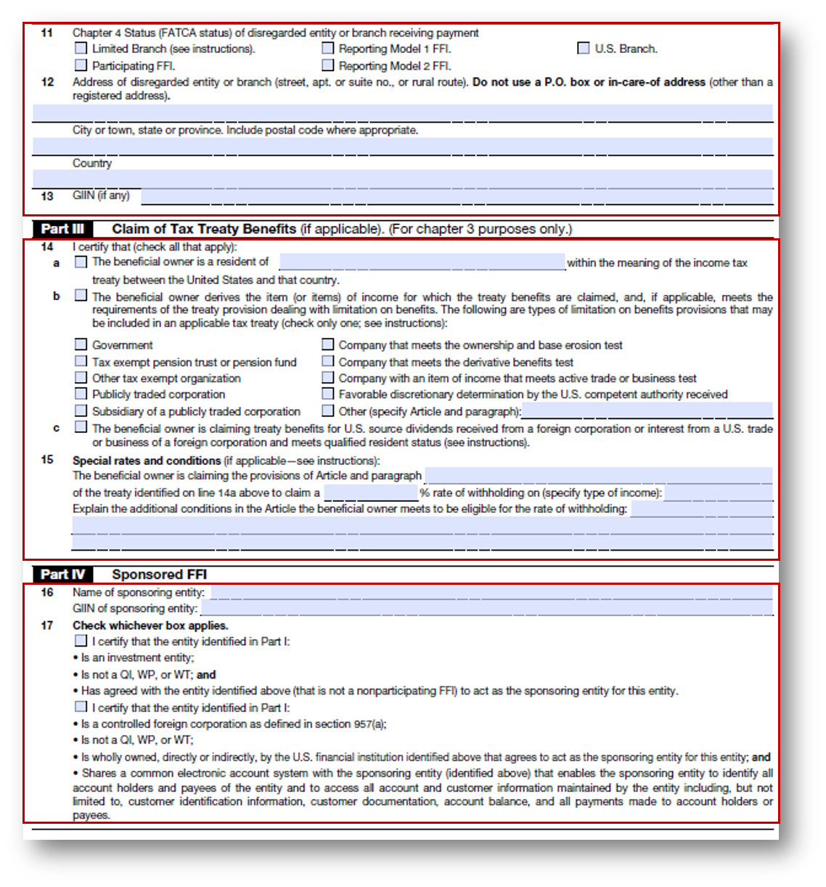
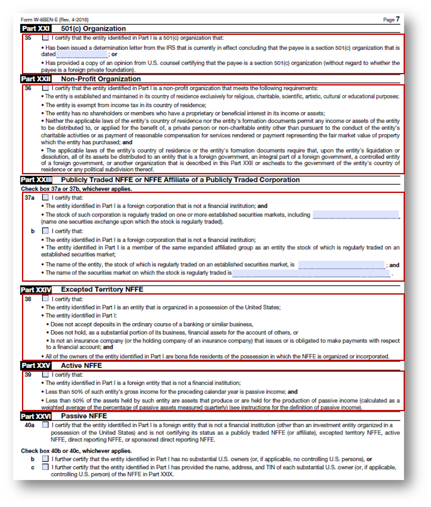
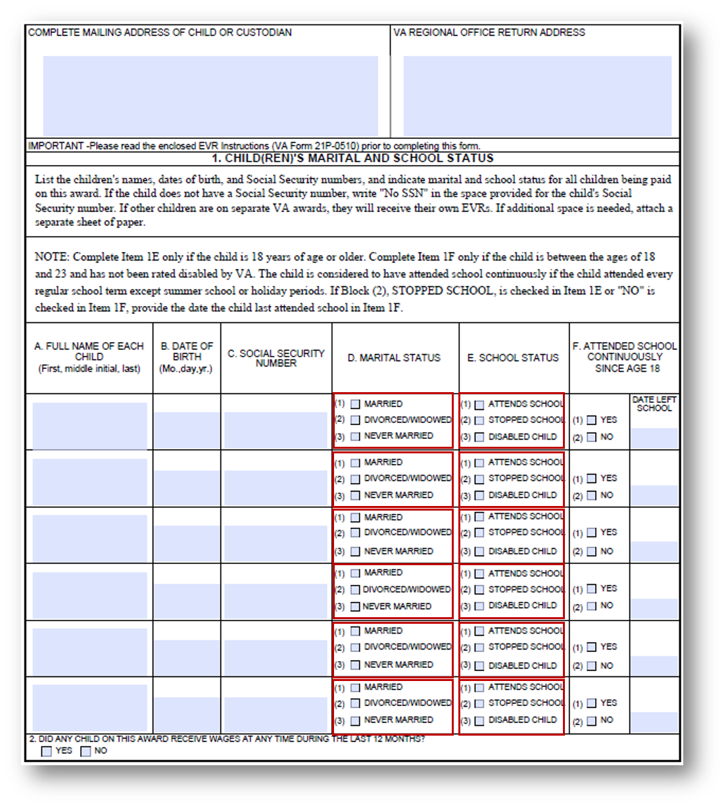

# Prácticas recomendadas y consideraciones {#do-not-publish-best-practices-and-considerations}

<!--
[DO NOT PUBLISH]
-->

El servicio de conversión automatizada de AEM Forms tiene la capacidad de transformar un formulario PDF en uno que sea adaptable. Este usa inteligencia artificial y algoritmos de aprendizaje automático para comprender los diseños y campos del formulario de origen. Todos los servicios de aprendizaje automático se alimentan continuamente de los datos de origen y producen mejores resultados con cada operación. Al igual que las personas, estos servicios recopilan información de las experiencias.

El servicio de conversión automatizada de formularios se entrena con un amplio conjunto de formularios. Identifica fácilmente los campos de un formulario de origen y los transforma en adaptables. Sin embargo, hay algunos campos y estilos en los formularios PDF que son fácilmente visibles para las personas, pero difíciles de identificar para el servicio. El servicio puede asignar tipos de campos o paneles diferentes a los aplicables a algunos campos o estilos. A continuación, se enumeran todos estos patrones de estilos y campos.

Al comienzo, el servicio identifica y asigna los campos o paneles correctos a estos patrones, a medida que sigue aprendiendo de los datos de origen. Por el momento, puede usar el editor [Revisar y corregir](review-correct-ui-edited.md) para solucionar estos problemas. Antes de comenzar a corregir los problemas o seguir leyendo, familiarícese con los [componentes del formulario adaptable](https://helpx.adobe.com/es/experience-manager/6-5/forms/using/introduction-forms-authoring.html).

## General {#general}

<table border="1" cellpadding="1" cellspacing="0" style="border-collapse: separate; border-spacing: 0px;" width="100%"> 
 <tbody>
  <tr>
   <td width="30%">Patrones conocidos y resoluciones</td> 
   <td width="70%">Ejemplos</td> 
  </tr>
   <td>
<strong>Patrón</strong>
 
El servicio no convierte los formularios PDF rellenados a formularios adaptables.
 
 
 
<strong>Resolución</strong>
 
Utilice formularios adaptables vacíos.
 </td> 
   <td style="text-align: left;"></td> 
  </tr>
  <tr>
   <td>
<strong>Patrón</strong>
 
El servicio puede no reconocer el texto y los campos de un formulario con mucho contenido.
 
 
 
<strong>Resolución</strong>
 
Aumente la anchura entre el texto y los campos del formulario antes de iniciar la conversión.
 </td> 
   <td style="text-align: left;"></td> 
  </tr>
  <tr>
   <td>
<strong>Patrón</strong>
 
El servicio no admite formularios escaneados.
 
 
 
<strong>Resolución</strong>
 
No los utilice. 
 </td> 
   <td></td> 
  </tr>
  <tr>
   <td>
<strong>Patrón</strong>
 
El servicio no extrae imágenes ni texto dentro de las imágenes. 
 
 
 
<strong>Resolución</strong>
 
Agregue manualmente las imágenes o el texto a los formularios convertidos.
 </td> 
   <td></td> 
  </tr>
  <tr>
   <td>
<strong>Patrón</strong>
 
Las tablas con límites y bordes con puntos o que no estén bien delimitados no se pueden convertir.
 
<strong>Resolución</strong>
 
Utilice tablas con límites y bordes claros, explícitos y admitidos.
 </td> 
   <td></td> 
  </tr>
 </tbody>
</table>

## Grupo de elección  {#choice-group}

<table border="1" cellpadding="1" cellspacing="0" width="100%"> 
 <tbody>
  <tr>
   <td width="30%">Patrón</td> 
   <td width="70%">Ejemplo</td> 
  </tr>
  <tr>
   <td>
<strong>Patrón</strong>
 
Las opciones del grupo de elección con formas distintas de recuadros o círculos no se convierten en los componentes correspondientes al formulario adaptable. 
 
 
 
<strong>Resolución</strong>
 
Cambie las formas de las opciones de elección a recuadros o círculos o utilice el editor Revisar y corregir para identificarlas.
 </td> 
   <td> </td> 
  </tr>
 </tbody>
</table>

## Campos del formulario {#form-fields}

<table border="1" cellpadding="1" cellspacing="0" width="100%"> 
 <tbody>
  <tr>
   <td width="30%">Patrón</td> 
   <td width="70%">Ejemplo</td> 
  </tr>
  <tr>
   <td width="25%">
<strong>Patrón</strong>
 
El servicio no identifica los campos que no tengan bordes bien delimitados.
 
 
 
<strong>Resolución</strong>
 
Utilice el editor Revisar y corregir para identificarlos.
 
 
 
 
 </td> 
   <td width="50%">  </td> 
  </tr>
  <tr>
   <td>
<strong>Patrón</strong>
 
El servicio no identifica algunos campos de formulario con subtítulos en la parte inferior o a la derecha.
 
 
 
<strong>Resolución</strong>
 
Utilice el editor Revisar y corregir para identificarlos.
 </td> 
   <td>    </td> 
  </tr>
  <tr>
   <td>
<strong>Patrón</strong>
 
El servicio combina o asigna un tipo incorrecto a algunos campos de formulario que están situados muy cerca unos de otros o que no tienen bordes bien definidos. 
 
 
 
<strong>Resolución</strong>
 
Utilice el editor Revisar y corregir para identificarlos.
 </td> 
   <td></td> 
  </tr>
  <tr>
   <td>
<strong>Patrón</strong>
 
El servicio puede no reconocer los campos con subtítulos muy alejados o con una línea de puntos entre el subtítulo y el campo de entrada.
 
 
 
<strong>Resolución</strong>
 
Utilice campos de formulario con límites bien definidos o use el editor Revisar y corregir para solucionar estos problemas.
 </td> 
   <td></td> 
  </tr>
 </tbody>
</table>

## Listas {#lists}

<table border="1" cellpadding="1" cellspacing="0" width="100%"> 
 <tbody>
  <tr>
   <td width="30%">Patrón</td> 
   <td width="70%">Ejemplo</td> 
  </tr>
  <tr>
   <td>
<strong>Patrón</strong>
 
Las listas que contienen campos de formulario se combinan o no se convierten en los componentes de formulario adaptable correspondientes.
 
<strong>Resolución</strong>
 
Utilice campos de formulario con límites bien definidos o use el editor Revisar y corregir para solucionar estos problemas.
 </td> 
   <td></td> 
  </tr>
  <tr>
   <td>
<strong>Patrón</strong>
 
El servicio puede dejar sin identificar algunas listas anidadas.
 
 
 
<strong>Resolución</strong>
 
Utilice el editor Revisar y corregir para solucionar estos problemas.
 </td> 
   <td> </td> 
  </tr>
  <tr>
   <td>
<strong>Patrón</strong>
 
El servicio combina algunas listas que contienen grupos de elección entre sí.
 
<strong>Resolución</strong>
 
Utilice el editor Revisar y corregir para solucionar estos problemas.
 </td> 
   <td> </td> 
  </tr>
 </tbody>
</table>

<!--
Comment Type: draft

<h3>Choice groups</h3>
-->

<!--
Comment Type: draft

<ul>
<li>Lists with form fields, nested lists, and nested choice groups are not supported.</li>
<li>Form fields with captions at bottom or right are not supported.</li>
<li>Form fiields without bordes are not supported.</li>
<li>Hidden form fields are not supported.</li>
<li>Button in PDF forms are not converted to adaptive form buttons.  </li>
<li>Tables with clear explicit boundaries and borders are supported.</li>
<li>Fields with far away captions are not supported.  </li>
<li>Choice groups with only box or circle shaped selectors are supported. </li>
</ul>
-->

