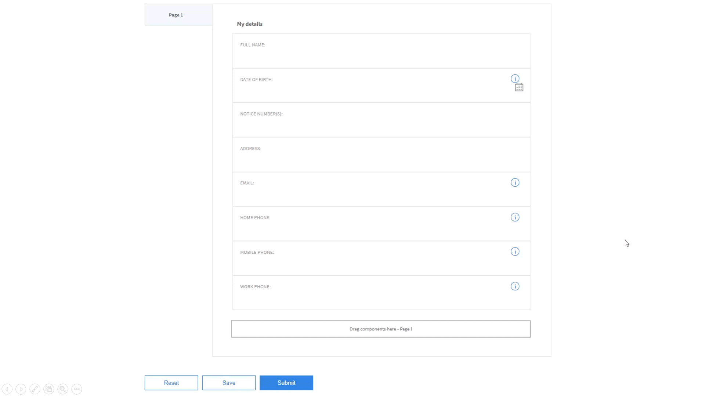
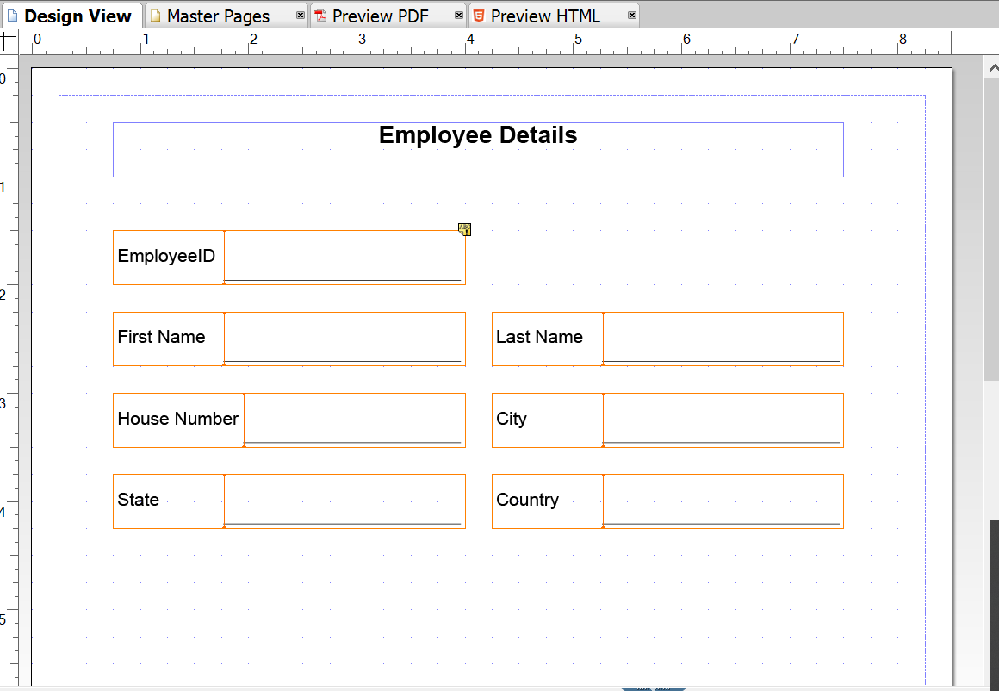
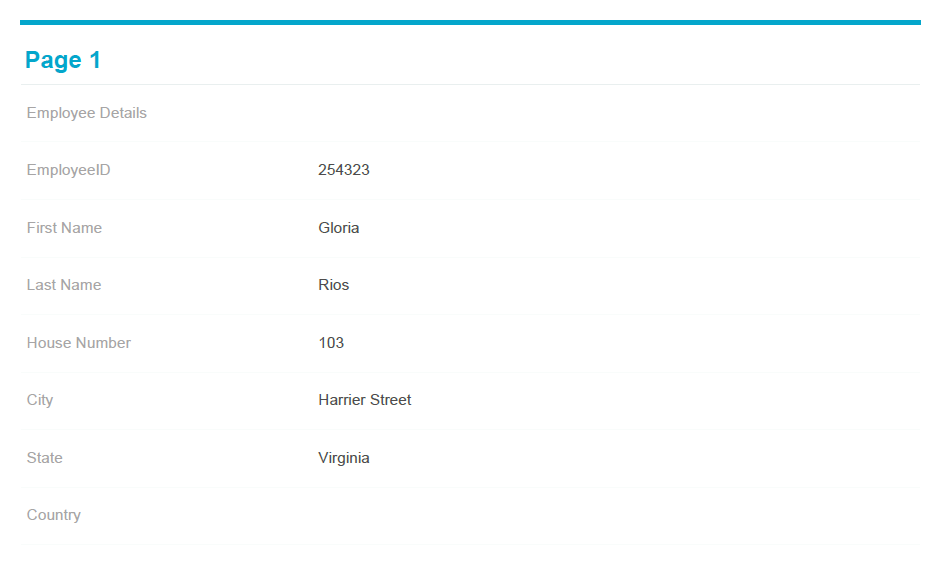
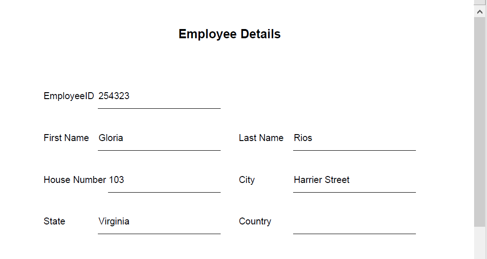
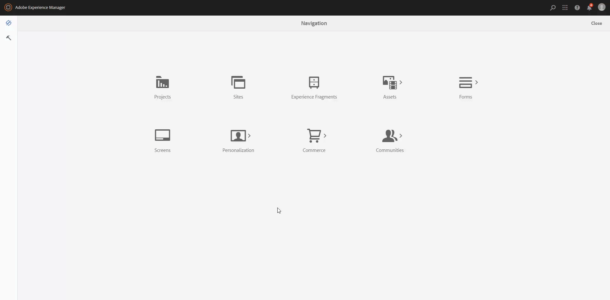
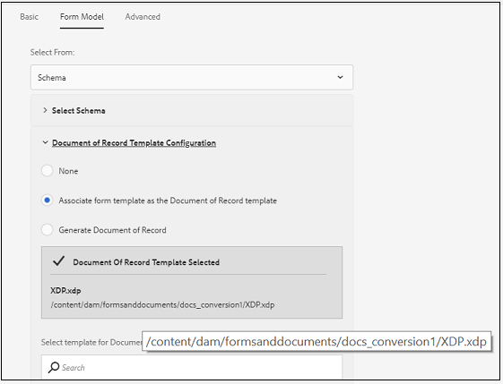

# Flujos de trabajo recomendados para permitir la generación de documentos de registros para formularios adaptables {#recommended-workflows-dor-generation}

El documento de registro (DoR) le permite mantener un registro de la información que proporciona y envía en un formulario adaptable para poder consultarla más adelante.
El DoR utiliza una plantilla básica para definir su diseño. Puede generar un documento de registro utilizando una plantilla predeterminada o asociando cualquier otra plantilla con el formulario adaptable.

Para obtener más información sobre la generación de un DoR, consulte [Generar documento de registro para formularios adaptables](https://helpx.adobe.com/es/experience-manager/6-5/forms/using/generate-document-of-record-for-non-xfa-based-adaptive-forms.html).

El [servicio de conversión automatizada de formularios](/help/using/introduction.md) convierte los siguientes formularios de origen en adaptables:

* Formularios PDF no interactivos
* AcroForms
* Formularios PDF basados en XFA

En función del formulario de origen que utilice para la conversión, puede generar un DoR utilizando lo siguiente:

* una plantilla predeterminada
* el formulario de origen como plantilla. Si selecciona esta opción, el servicio de conversión asocia automáticamente el formulario de origen con el formulario adaptable convertido como plantilla de DoR.
* asociar cualquier otra plantilla al formulario adaptable convertido.

La siguiente tabla ilustra un ejemplo de cómo la plantilla de documento de registro que utiliza afecta al diseño del documento de registro generado:

<table> 
 <tbody>
 <tr>
  <td>
<strong>Formulario de origen</strong>
</td>
  <td>
<strong>DoR generado</strong>
</td> 
   </tr>
  <tr>
   <td></td>
   <td>
Si utiliza la plantilla predeterminada para generar un DoR: </td>
   </tr>
   <tr>
   <td></td>
   <td>
Si utiliza el formulario de origen como plantilla para generar un DoR: 
</td>
   </tr>
  </tbody>
</table>

Como se ilustra en la tabla, si se usa el formulario de origen como plantilla, el DoR conserva el diseño del formulario de origen.
En este artículo se describen las rutas recomendadas para generar un DoR en función de los tres tipos de formularios de origen.

<table> 
 <tbody> 
  <tr> 
   <th><strong>Formulario de origen</strong></th> 
   <th><strong>Métodos para generar un DoR</strong></th> 
  </tr> 
  <tr> 
   <td>
Formularios PDF no interactivos
</td> 
   <td> 
    <ul> 
     <li><a href="#generate-document-of-record-using-cloud-configuration">Active la generación de un DoR antes de la conversión de formulario adaptable para generar un DoR con una plantilla predeterminada</a></li> 
     <li><a href="#edit-adaptive-form-properties-generate-document-of-record">Edite las propiedades del formulario adaptable después de la conversión del formulario adaptable para permitir la generación de un DoR mediante la plantilla de formulario predeterminada o cualquier otra plantilla de formulario</a></li> 
    </ul> </td> 
  </tr>
  <tr> 
   <td>
Formularios PDF basados en AcroForms o XFA
</td> 
   <td> 
    <ul> 
     <li><a href="#use-input-form-as-template-to-generate-document-of-record">Activar la generación de un DoR antes de la conversión de formulario adaptable para generar un DoR utilizando el formulario de origen como plantilla</a></li> 
     <li><a href="#edit-adaptive-form-properties-to-generate-document-of-record">Edite las propiedades del formulario adaptable después de la conversión del formulario adaptable para permitir la generación de un DoR utilizando la plantilla predeterminada, el formulario de origen como plantilla o cualquier otra plantilla de formulario</a></li> 
    </ul> </td> 
  </tr>    
 </tbody> 
</table>

## Generación de un documento de registro para formularios PDF no interactivos {#generate-document-of-record-non-interactive-pdf}

Si utiliza un formulario PDF no interactivo como formulario de origen para el servicio de conversión de formularios automatizados, puede hacer lo siguiente:

* Activar la generación de un DoR antes de la conversión de formulario adaptable para generar un DoR con una plantilla predeterminada.
* O bien, editar las propiedades del formulario adaptable después de la conversión para permitir la generación de un DoR mediante la plantilla de formulario predeterminada o cualquier otra plantilla de formulario.

### Habilitación de la generación de un DoR antes de la conversión para generar un DoR usando la plantilla predeterminada {#generate-document-of-record-using-cloud-configuration}

1. Seleccione la opción **[!UICONTROL Tools]** > **[!UICONTROL Cloud Services]** > **[!UICONTROL Automated Forms Conversion Configuration]** > Propiedades de la configuración de la nube utilizadas para la conversión > **[!UICONTROL Advanced]** > **[!UICONTROL Generate Document of Record]**.

   

1. Pulse **[!UICONTROL Save & Close]** para guardar la configuración.

1. [Ejecute la conversión](/help/using/convert-existing-forms-to-adaptive-forms.md). Asegúrese de utilizar la configuración de la nube editada en el paso 1 de estas instrucciones.
Al enviar el formulario adaptable convertido, el DoR se genera automáticamente utilizando la plantilla predeterminada.

### Edición de las propiedades de los formularios adaptables después de la conversión para generar un DoR {#edit-adaptive-form-properties-generate-document-of-record}

Si no habilita la generación de un DoR antes de convertir el formulario de origen en un formulario adaptable, puede hacerlo después de la conversión.

1. [Ejecute la conversión](/help/using/convert-existing-forms-to-adaptive-forms.md) en el formulario PDF no interactivo para generar un formulario adaptable.

1. Seleccione el formulario adaptable en la carpeta **[!UICONTROL output]** y pulse **[!UICONTROL Properties]**.

1. En la pestaña **[!UICONTROL Form Model]**, expanda la sección **[!UICONTROL Document of Record Template Configuration]** y seleccione **[!UICONTROL Generate Document of Record]**.

   

1. Pulse **[!UICONTROL Save & Close]** para guardar la configuración.

Al enviar el formulario adaptable convertido, el DoR se genera automáticamente utilizando la plantilla predeterminada. Si desea asociar cualquier otra plantilla DoR con el formulario adaptable convertido, puede seleccionar la opción **[!UICONTROL Associate form template as the Document of Record template]**.

## Generación del documento de registro para formularios PDF basados en AcroForms o XFA {#generate-document-of-record-acroform-xfaform}

Si usa un formulario PDF basado en AcroForm o XFA como formulario de origen para el servicio de Formularios de conversión automatizados, puede hacer lo siguiente:

* Permitir la generación de un DoR antes de la conversión de formulario adaptable que genere un DoR utilizando el formulario de origen como plantilla

* Edite las propiedades del formulario adaptable después de la conversión del formulario adaptable para permitir la generación de un DoR utilizando la plantilla predeterminada, el formulario de origen como plantilla o cualquier otra plantilla de formulario

### Habilitación de la generación de un DoR antes de la conversión para generar un DoR usando la plantilla del formulario de origen {#use-input-form-as-template-to-generate-document-of-record}

1. Seleccione la opción **[!UICONTROL Tools]** > **[!UICONTROL Cloud Services]** > **[!UICONTROL Automated Forms Conversion Configuration]** > Propiedades de la configuración en la nube utilizadas para la conversión > **[!UICONTROL Advanced]** > **[!UICONTROL Generate Document of Record]**.

1. Pulse **[!UICONTROL Save & Close]** para guardar la configuración.

1. [Ejecute la conversión](/help/using/convert-existing-forms-to-adaptive-forms.md). Asegúrese de utilizar la configuración de la nube editada en el paso 1 de estas instrucciones.
El servicio de conversión asocia automáticamente el AcroForm o el formulario PDF basado en XFA al formulario adaptable convertido como plantilla DoR.
Puede abrir las propiedades del formulario adaptable para ver la plantilla DoR en la sección **[!UICONTROL Document of Record Template Configuration]** de la pestaña **[!UICONTROL Form Model]**.

   

   Al enviar el formulario adaptable convertido, el DoR se genera automáticamente mediante la plantilla de formulario de origen.

### Edición de las propiedades de los formularios adaptables después de la conversión para generar un DoR {#edit-adaptive-form-properties-to-generate-document-of-record}

1. [Ejecute la conversión](/help/using/convert-existing-forms-to-adaptive-forms.md) en el formulario PDF no interactivo para generar un formulario adaptable.

1. Seleccione el formulario adaptable en la carpeta **[!UICONTROL output]** y pulse **[!UICONTROL Properties]**.

1. En la pestaña **[!UICONTROL Form Model]**, expanda la sección **[!UICONTROL Document of Record Template Configuration]** y seleccione **[!UICONTROL Generate Document of Record]** para habilitar la generación de un DoR utilizando la plantilla predeterminada.
También puede seleccionar la opción **[!UICONTROL Associate form template as the Document of Record template]** y la plantilla para habilitar la generación de un DoR mediante la plantilla de formulario de origen o cualquier otra plantilla de formulario.

1. Pulse **[!UICONTROL Save & Close]** para guardar la configuración.
