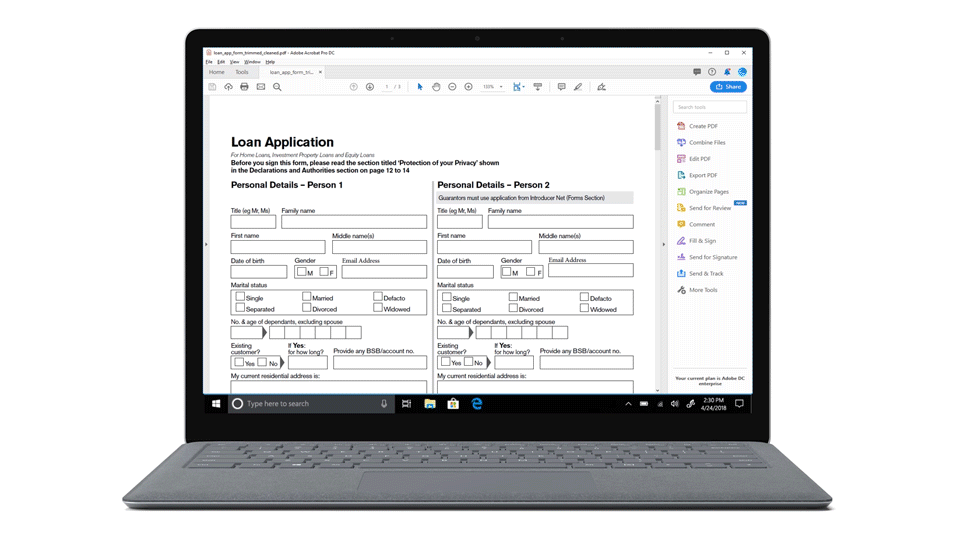

# Introducción {#introduction-to-automated-forms-conversion-service}

El servicio de conversión automática de formularios ayuda a acelerar la digitalización y la modernización de la experiencia de captura de datos mediante la conversión automática de formularios PDF a formularios adaptables. El servicio, con tecnología de Adobe Sensei, convierte automáticamente sus formularios PDF en formularios adaptables y basados en HTML5. Además de maximizar las inversiones ya efectuadas en formularios PDF y XFA, el servicio aplica las validaciones, los estilos y el diseño pertinentes en los campos de los formularios adaptables durante la conversión. El servicio ayuda en los aspectos siguientes:

* Reduce los esfuerzos manuales necesarios para convertir la impresión de formularios en formularios adaptables
* Aplica los correspondientes patrones y validaciones durante la conversión
* Genera documentos de registro durante la conversión
* Agrupa campos comunes en fragmentos de formulario reutilizables
* Activa Adobe Analytics durante la conversión

## Incorporación {#onboarding}

El servicio está disponible de forma gratuita para los clientes a plazo de AEM Forms 6.4 y AEM Forms 6.5 locales y los clientes empresariales de Managed Services de Adobe. Póngase en contacto con el equipo de ventas de Adobe o con su representante de Adobe para solicitar acceso al servicio. El servicio también está disponible de forma gratuita y está prehabilitado para los clientes de AEM Forms as a Cloud Service.

Adobe posibilita el acceso a su organización y otorga los pertinentes privilegios a las personas de su organización designadas como administradores. El administrador puede otorgar acceso a los desarrolladores de AEM Forms (usuarios) de su organización para conectarse al servicio. Consulte [Configurar el servicio de conversión automatizada de formularios](configure-service.md) para obtener más información.

## Idiomas y formularios PDF admitidos {#supported-languages-and-pdf-forms}

El servicio admite formularios PDF no interactivos, formularios creados con Adobe Acrobat, conocidos como AcroForms, y formularios basados en XFA creados con AEM Forms o Adobe LiveCycle.

El servicio también es compatible con formularios PDF, que está habilitado para Adobe Sign. Si el formulario PDF de origen tiene etiquetas de texto de Adobe Sign, el servicio conserva toda la información relacionada con Adobe Sign durante la conversión y asocia la información del firmante presente en el PDF de origen con los correspondientes campos del formulario adaptable. La función está disponible únicamente para AcroForms.

El servicio puede convertir formularios en inglés, francés, alemán, español, italiano y portugués a formularios adaptables. Puede traducir los formularios adaptables que se generan a otro idioma mediante el [flujo de trabajo de traducción de AEM](https://helpx.adobe.com/es/experience-manager/6-5/forms/using/using-aem-translation-workflow-to-localize-adaptive-forms.html).

## Flujo de trabajo de conversión  {#conversion-workflow}

El servicio de conversión automatizada de formularios se ejecuta en Adobe Cloud. Conecta la instancia de AEM al servicio, carga formularios en la instancia de AEM e inicia la conversión. El proceso de conversión completo es el siguiente:

### 1. Configuración del entorno {#set-up-the-environment}

El servicio de conversión automatizada de formularios se ejecuta en Adobe Cloud. [Configure la cuenta de Adobe I/O de su organización. Después, conecte la instancia local de AEM Forms](configure-service.md) con el servicio de conversión que se ejecuta en Adobe Cloud.

### 2. Conversión de formularios PDF en formularios adaptables {#use-the-conversion-service}

Tras configurar el entorno de AEM Forms, para convertir los formularios PDF en formularios adaptables, [cargue formularios PDF](convert-existing-forms-to-adaptive-forms.md) en la instancia de AEM e [inicie la conversión](convert-existing-forms-to-adaptive-forms.md#run-the-conversion). Antes de cargar los formularios, tenga en cuenta lo siguiente:

* No cargue los formularios que estén protegidos. El servicio no convierte formularios cifrados y protegidos por contraseña.
* No cargue formularios escaneados, coloreados, rellenos ni en ningún idioma que no sea inglés, francés, alemán, español, italiano y portugués. Estas clases de formulario no se admiten.
* No cargue formularios PDF con espacios en el nombre del archivo.
* No cargue [Portfolios PDF](https://helpx.adobe.com/es/acrobat/using/overview-pdf-portfolios.html). El servicio no convierte portafolios PDF en formularios adaptables.
* Aplique los cambios sugeridos en formularios PDF que se indican en el artículo [Prácticas recomendadas y consideraciones](styles-and-pattern-considerations-and-best-practices.md).
* Lea el artículo [Problemas conocidos](known-issues.md) para prevenir problemas.

### 3. Revisión de formularios convertidos {#review-converted-forms}

Los formularios del mundo real pueden tener requisitos complejos de captura de datos en cuanto al diseño de campos, nombres o sugerencias implícitas que la lógica de detección, basada en inteligencia artificial o aprendizaje automático, podría no capturar con precisión. Tras finalizar la conversión automatizada, puede utilizar el [editor de revisiones y correcciones](review-correct-ui-edited.md) para revisar el formulario convertido, realizar los cambios pertinentes y generar un resultado más en consonancia con las expectativas. Después de realizar los cambios necesarios, envíe el formulario nuevamente para la conversión.

El tiempo necesario para la conversión automatizada depende de distintos factores, como, por ejemplo, el tamaño del formulario de entrada, la complejidad del formulario o el préstamo en la cola de procesamiento del servicio. El progreso se notificar regularmente al usuario a través del indicador de estado de la carpeta o el archivo. Cuando se completa la conversión, también se envía una notificación por correo electrónico a la dirección de correo electrónico configurada.
