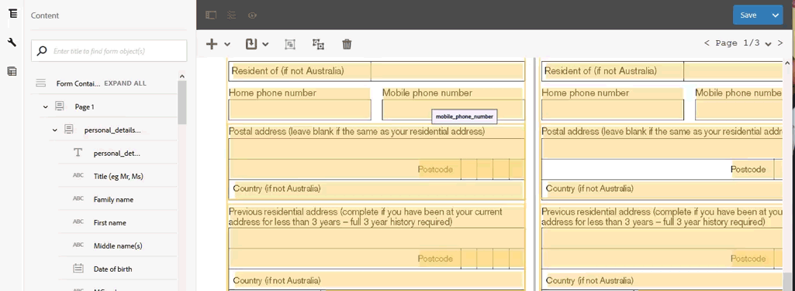

# Revisar y corregir formularios convertidos{#review-and-correct-converted-forms}

El servicio de conversión automatizada de formularios de AEM Forms identifica los campos, el contenido y la presentación del documento PDF de entrada y lo convierte en un formulario adaptable. El formulario adaptable de salida puede tener algunos campos que faltan o que se han convertido incorrectamente. Puede utilizar el editor Revisar y corregir para realizar mejoras en los campos identificados y volver a generar el formulario adaptable para obtener un resultado más parecido a la experiencia deseada. Después de la primera conversión, puede abrir el documento PDF de entrada en el editor para lo siguiente:

* Ver todos los campos y contenidos identificados durante la conversión.
* Identificar los campos y el contenido que se omiten durante la conversión.
* Comprobar el tipo de campo y cambiarlo, si es necesario.
* Verificar las tablas identificadas, cambiar el tamaño de las columnas y modificar el contenido de la celda.
* Eliminar los campos mal identificados.

Después de realizar los cambios necesarios, vuelva a enviar los formularios PDF al servicio de conversión. Si la conversión se realiza correctamente, se descargan en la instancia de AEM Forms los recursos actualizados, incluidos el formulario adaptable y el esquema. Puede repetir el proceso hasta que se alcance la experiencia deseada. 

Se necesita Google Chrome, Mozilla Firefox o Microsoft Edge para usar el editor Revisar y corregir. El editor no es compatible con Internet Explorer.

## Bienvenido al editor Revisar y corregir {#welcome-to-review-and-correct-editor}

El editor Revisar y corregir tiene una interfaz fácil de usar. Tiene los siguientes elementos.

* Navegador de contenido: puede utilizar el navegador de contenido para cambiar la posición de un elemento. El navegador de contenido le permite arrastrar y soltar un objeto de formulario para cambiar su posición. Por ejemplo, si mueve una tabla antes de un cuadro de texto. Cambia el orden de las pestañas del formulario adaptable de salida según corresponda.
* Explorador de propiedades: muestra las propiedades de un campo seleccionado. También puede modificar las propiedades.
* Barra de herramientas: la barra de herramientas se encuentra en la parte superior del editor. Muestra herramientas para agregar, modificar, agrupar, desagrupar y eliminar campos.
* Abrir propiedades: la opción Abrir propiedades aparece al pulsar el icono . Puede hacer clic en abrir propiedades para abrir las propiedades del formulario y ver más opciones.
* Botón Filtro: el botón de filtro  se encuentra en la parte superior del editor. Permite filtrar los campos para mostrar solo textos, campos, opciones de Grupos, paneles o todos los componentes.
* Botón Guardar: el botón **[!UICONTROL Save]** se encuentra en la esquina superior derecha del editor. También puede utilizar la flecha situada junto al botón Guardar para ver la opción que permite enviar el formulario para la conversión.

* Formulario PDF: el editor muestra el documento PDF de origen y lo superpone con los campos identificados. Puede utilizar las herramientas de la barra de herramientas para modificar los campos.
* Páginas: un formulario de origen puede tener varias páginas. El editor tiene un botón en la esquina superior derecha para desplazarse entre las páginas.

**A.** Navegador de contenido **B.** Explorador de propiedades **C.** Barra de herramientas **D.** Botón Propiedades **E.** Botón Filtro **F.** Botón Guardar **G.** Formulario PDF superpuesto con campos identificados

Después de la primera conversión correcta, el servicio de conversión superpone el documento PDF de origen con los campos y componentes identificados. Estos campos o componentes son de tipo: texto, campo, panel, grupo de opciones y tabla.

* Texto: texto sin formato en el documento PDF de origen. Por ejemplo, el texto de aplicación de préstamo de la imagen mostrada arriba.
* Campo: combinación de texto o etiqueta de icono asociada a un valor o cuadro de entrada. Por ejemplo, el primer nombre del campo de la imagen superior. Tiene una etiqueta de texto y un cuadro de entrada. Un campo admite los tipos de datos de texto, numérico, desplegable, fecha, correo electrónico, número de teléfono, firma, moneda y contraseña.
* Panel: recopilación lógica del contenido y componentes. Por ejemplo, detalles personales de los paneles Persona 1 y Persona 2 en la imagen superior.
* Grupo de opciones: combinación de texto asociado con opciones de opción múltiple, casilla de verificación y botón de opción. Por ejemplo, estado civil y cliente existente en la imagen superior.\
  Según el rótulo del grupo de opciones y sus opciones de selección múltiple, el servicio de conversión convierte automáticamente un grupo de opciones en un botón de opción de selección única o en una casilla de verificación de selección múltiple. Por ejemplo, si existe **Seleccionar cualquiera** como el rótulo del grupo de opciones o las opciones de selección múltiple, le permiten seleccionar una sola opción, **Sí** o **No**, el servicio de conversión convierte automáticamente el grupo de opciones en un botón de opción de selección única. Del mismo modo, si existe **Seleccionar todos los que correspondan** o **Seleccionar varias** como el rótulo del grupo de opciones o las opciones de selección múltiple permiten seleccionar varias opciones, el servicio de conversión convierte automáticamente el grupo de opciones en una casilla de verificación de selección múltiple.

* Tabla: una tabla 2-d con información representada en columnas y filas. Puede agregar o quitar filas o columnas de una tabla.

## Comenzar a revisar una conversión {#start-reviewing-a-conversion}

Después de la primera conversión correcta, el servicio de conversión superpone el documento PDF de origen con los campos y componentes identificados. Puede realizar mejoras en los campos identificados y volver a generar el formulario adaptable para que el resultado se acerque a la experiencia deseada. Puede comenzar a revisar una conversión solo después de haber realizado una primera conversión correcta.

### Antes de comenzar {#before-you-start}

* El editor Revisar y corregir no admite fragmentos. No utilice el editor para revisar las conversiones que tenían la opción **Extraer fragmento** activada durante las conversiones. Puede usar la variable [editor de formularios adaptables](https://helpx.adobe.com/es/experience-manager/6-5/forms/using/introduction-forms-authoring.html) para dichas conversiones.

* El editor Revisar y corregir no tiene la acción Deshacer. Utilice el botón Guardar solo para guardar los cambios de forma permanente.

### Iniciar la revisión {#start-the-review}

Para empezar a revisar las conversiones, seleccione el documento PDF de origen utilizado para la conversión y seleccione y pulse **Revisar conversiones**. Se abre el editor Revisar y corregir en una nueva pestaña. Puede coemnzar a revisar las conversiones. Realice las siguientes comprobaciones básicas antes de empezar a solucionar cualquier otro problema:

1. **Tipo de comprobación de todos los campos**: el servicio de conversión puede asignar un tipo incorrecto a un campo. Por ejemplo, se asigna texto de tipo en lugar de escribir el teléfono en el campo de teléfono móvil. Puede situar el cursor sobre un campo para buscar el tipo.

   Para cambiar el tipo de un campo, selecciónelo, abra el explorador de propiedades y seleccione un valor de la lista desplegable **[!UICONTROL Type]** y pulse **[!UICONTROL Save]**. El tipo ha cambiado.

   

1. **Eliminar paneles adicionales**: el servicio de conversión puede generar paneles adicionales. Por ejemplo, se incluye un subpanel adicional en el panel principal, el espacio vacío y la casilla de verificación se convierten en un panel. Revise los límites de todos los paneles y elimine los paneles adicionales. Puede utilizar el botón de filtro  o el explorador de contenido para ver todos los paneles.

   Puede eliminar o desagrupar un panel para eliminarlo. Al utilizar la opción de eliminación, también se eliminan los campos o componentes secundarios del panel:

   * Para eliminar un panel, selecciónelo y pulse el icono Eliminar  en la barra de herramientas. En el cuadro de diálogo de confirmación, pulse **[!UICONTROL Confirm]**. Pulse **[!UICONTROL Save]** para guardar los cambios.

   * Para desagrupar un panel, selecciónelo y pulse el icono Desagrupar de la barra de herramientas. El panel se desagrupa y los campos secundarios del panel no agrupado se ajustan al campo principal. Pulse **[!UICONTROL Save]** para guardar los cambios.

1. **Crear grupos lógicos de texto**: validar los textos identificados para que sean completos y correctos. Compruebe también que los textos se coloquen lógicamente en los paneles o grupos correctos. Por ejemplo, en un diseño de varias columnas, los textos de un grupo lógico y colocados en otro grupo.

   * Para revisar la integridad y exactitud del texto, utilice el botón de filtro  para ver solo texto, haga clic en cada texto y valídelos. Corrija los problemas de ortografía, errores tipográficos o gramática, si los hay.

   * Para agregar texto al formulario, pulse el botón + y pulse **[!UICONTROL Text]**. Dibuje el cuadro, abra el explorador de propiedades y escriba el texto que desee agregar al cuadro Contenido.

1. **Revise las tablas:** asegúrese de que se identifiquen todos los bordes de la tabla. Asegúrese también de que el contenido de las celdas esté identificado correctamente.

   * Para identificar los bordes que faltan, use la variable **[!UICONTROL Add Column]** o **[!UICONTROL Add Row]**.

   * Para quitar bordes adicionales, utilice la opción **[!UICONTROL Delete Column]** o **[!UICONTROL Delete Row]**.

Después de realizar los cambios necesarios, pulse el botón **[!UICONTROL Save & Convert]** para reenviar los formularios PDF al servicio de conversión. Cada campo se convierte en el correspondiente componente del campo adaptable. Después de la conversión, los recursos actualizados, incluido el formulario adaptable y el esquema, se descargan en la instancia de AEM Forms. Según la complejidad del formulario, el servicio puede tardar algún tiempo en completar la conversión.

Después de realizar las comprobaciones básicas, puede revisar el formulario para corregir los problemas específicos de su organización. Estos problemas pueden estar relacionados con la adición de campos que faltan, etc. Puede visualizar la sección [Uso de las herramientas del editor Revisar y corregir](review-correct-ui-edited.md#use-the-review-and-correct-editor-tools) para obtener más información sobre todas las herramientas que proporciona el editor para solucionar estos problemas.

También puede trabajar para reconocer problemas idénticos que ocurren en casi todos los formularios e informar de dichos patrones a Adobe. Utilice el editor de revisiones y correcciones hasta que logre la experiencia deseada.

## Uso de las herramientas del editor Revisar y corregir {#use-the-review-and-correct-editor-tools}

Con el editor Revisar y corregir puede hacer lo siguiente:

* [Agregar un componente al formulario](review-correct-ui-edited.md#add-a-component-to-the-form)
* [Agregar o editar una tabla](review-correct-ui-edited.md)
* [Cambiar el tipo de un componente](review-correct-ui-edited.md#change-type-a-component)

* [Crear o quitar un panel](review-correct-ui-edited.md#create-or-remove-a-panel)
* [Eliminar un panel o componente](review-correct-ui-edited.md#delete-a-panel-or-component)
* [Definir propiedades de un componente](review-correct-ui-edited.md#set-properties-of-a-component)
* [Enviar un formulario para su conversión](review-correct-ui-edited.md#send-a-form-for-conversion)

### Agregar un componente al formulario {#add-a-component-to-the-form}

Es posible que el servicio de conversión no identifique algunos componentes del formulario de impresión. Por ejemplo, el componente **Fecha de nacimiento** de un formulario no se identifica durante la conversión. Puede usar la herramienta **+** para identificar dichos componentes. Esta herramienta permite agregar texto, campos, grupos de opciones, tablas y componentes de panel.

Para agregar un componente al formulario, pulse **[!UICONTROL +]** y toque **[!UICONTROL Field]**. Dibuje una etiqueta de cierre y un cuadro de entrada para el campo. Por ejemplo, la imagen de ejemplo anterior utiliza el componente de campo para agregar la etiqueta **Fecha de nacimiento** y el cuadro de valor debajo del formulario. Al dibujar el cuadro, el servicio de conversión identifica el tipo de campo. Puede cambiar el tipo de campo desde el explorador de propiedades, si es necesario. Después de crear el componente, abra el explorador de propiedades y defina las propiedades del componente.

Toque el botón **[!UICONTROL Save]** para guardar las modificaciones o use el botón **[!UICONTROL Save & Convert]** para reenviar los formularios PDF al servicio de conversión.

### Agregar o editar una tabla {#addedittable}

La conversión puede dejar algunas celdas, límites o contenido de una celda de tabla sin identificar. Por ejemplo, no se identifica la fila de una tabla. Puede utilizar el editor Revisar y corregir para identificar estos elementos. Puede realizar las siguientes acciones para una tabla:

* Para seleccionar una tabla, haga clic en cualquier celda de esta.
* Para modificar las propiedades de una celda, por ejemplo, de nombre, título o tipo, haga doble clic en esa celda. También puede hacer doble clic en la celda para modificar el contenido, marcar un campo como obligatorio y seleccionar otras propiedades.
* Para agregar o identificar una tabla sin identificar o nueva en el formulario, utilice la herramienta **[!UICONTROL +]**.
* Para cambiar el tamaño de las celdas o filas de una tabla, haga clic en el área vacía de la tabla, pase el ratón sobre el límite de fila o columna; cuando cambie el puntero del cursor, seleccione y mueva el límite. Después de cambiar el tamaño, haga clic en **[!UICONTROL Done]** para confirmar los cambios. Puede pulsar el botón **[!UICONTROL ESC]** para descartar el cambio de tamaño.

* Para agregar o eliminar filas o columnas, seleccione una celda de la fila de la tabla y seleccione la opción **[!UICONTROL Add Row]**, **[!UICONTROL Add Column]**, **[!UICONTROL Delete Row]** o **[!UICONTROL Delete Column]** desde el menú .

* Para dividir una celda en una tabla, seleccione la opción **[!UICONTROL Spilt Vertical]** o **[!UICONTROL Split Horizontal]** desde el menú .

* Para combinar las celdas de una tabla, seleccione las que desea combinar y, a continuación, elija la opción **[!UICONTROL Merge Cells]** del menú de tabla .

### Cambiar el tipo de un componente {#change-type-a-component}

El servicio de conversión puede crear algunos campos de tipo incorrecto. Por ejemplo, en la imagen siguiente, el campo **Sexo** se identifica incorrectamente como un campo de **Texto**. Además, el contenido de la etiqueta es incorrecto. El campo debe ser un tipo de campo de opción y la etiqueta debe ser Sexo. Para cambiar el tipo de un componente y corregir su etiqueta, haga lo siguiente:

Seleccione el campo que desea convertir, presione  y pulse un tipo de campo. El campo se convierte en el tipo de campo seleccionado. Un campo solo se puede convertir en los tipos enumerados en la siguiente tabla. Un componente de panel solo se puede desagrupar, no transformar.

| **Componente** | **Convierte a** |
|---|---|
| Texto | Campo o grupo de opciones |
| Campo | Texto o grupo de opciones |
| Grupo de elección | Texto o panel |

Una vez convertido, abra el explorador de propiedades, especifique la etiqueta y otras propiedades necesarias. Pulse el botón **[!UICONTROL Save]** para guardar las modificaciones o utilice el botón Guardar y convertir para reenviar los formularios PDF al servicio de conversión.

### Crear o quitar un panel {#create-or-remove-a-panel}

El servicio de conversión agrega componentes relacionados y contenido de impresión de formularios a un panel. Por ejemplo, el formulario puede tener un panel de direcciones con campos como, por ejemplo, nombre, número de trazado, área, ciudad, estado, código postal y país. Estos campos se agrupan en un panel. Un formulario puede tener varios paneles.

El servicio de conversión puede crear paneles que tengan componentes sin relación con otros o dejar un componente relativo fuera del panel. Puede utilizar las herramientas de agrupar o desagrupar para corregir estos paneles:

* Para quitar un panel, selecciónelo y pulse desagrupar . El panel se elimina y los componentes secundarios del panel se mueven al componente principal. También puede usar la variable [eliminar componente](review-correct-ui-edited.md#delete-a-panel-or-component) para eliminar un panel y sus elementos secundarios.

* Para crear un panel, utilice la tecla Ctrl (en Windows o Linux) o la tecla Control (en Mac) para seleccionar componentes relacionados y pulse  para crear un panel. Abra el explorador de propiedades para especificar las propiedades del panel.

Pulse el botón **[!UICONTROL Save]** para guardar las modificaciones o use el botón **[!UICONTROL Save & Convert]** para reenviar los formularios PDF al servicio de conversión.

### Eliminar un panel o componente {#delete-a-panel-or-component}

El servicio de conversión puede identificar algunos paneles o componentes incorrectos. La mayoría de estos componentes de los paneles no están relacionados. Puede eliminar estos paneles o componentes.

Para eliminar un panel o componente, selecciónelo y pulse el icono eliminar . En el cuadro de diálogo de confirmación, pulse **[!UICONTROL Confirm]**. Se elimina el panel o componente seleccionado. Al eliminar un panel, también se eliminan todos los elementos secundarios del panel. Puede utilizar la tecla Ctrl (en Windows o Linux) o la tecla Control (en Mac) para seleccionar varios componentes o paneles.

### Definir propiedades de un componente {#set-properties-of-a-component}

Cada componente del formulario tiene un conjunto de propiedades como nombre, título o tipo. Para establecer las propiedades de un componente, selecciónelo y pulse el explorador de propiedades. Se muestran las propiedades del componente seleccionado. Cambiar o establecer las propiedades.

Pulse el botón **[!UICONTROL Save]** para guardar las modificaciones o usar el botón **[!UICONTROL Save & Convert]** para reenviar los formularios PDF al servicio de conversión.

### Enviar un formulario para su conversión {#send-a-form-for-conversion}

Una vez que haya realizado todos los cambios necesarios en el editor Revisar y corregir, puede volver a enviar el formulario para su conversión. Para enviar el formulario para la conversión, pulse **[!UICONTROL Save & Convert]**. La **[!UICONTROL Sent for conversion label]** se aplica a la carpeta que contiene el documento de origen, y el formulario de origen actualizado se carga en el servicio de conversión que se ejecuta en Adobe I/O.

Según la complejidad del formulario, el servicio de conversión puede tardar algún tiempo en convertirse. Una vez finalizada la conversión, se descargan en el equipo el formulario adaptable convertido y los recursos relacionados. Puede revisar el formulario en el editor una vez completada la conversión. Si es necesario, también puede abrir el formulario adaptable en el [editor de formularios adaptables](https://helpx.adobe.com/es/experience-manager/6-5/forms/using/introduction-forms-authoring.html) para las últimas correcciones.

Si vuelve a enviar el formulario para su conversión después de actualizarlo en el editor de formularios adaptables, todos los cambios realizados se pierden. Puede abrir un formulario en el editor Revisar y corregir solo después de una conversión correcta.

<!--
Comment Type: draft

<h3>Open adaptive forms editor</h3>
-->

<!--
Comment Type: draft

There can be instances where you require adaptive forms editor to make the changes like, applying a different theme to the form or fixing tables. Once you have made all the required changes in Review and Correct editor and converted the form, you can open your form in adaptive forms editor to make the final set of changes.

To open the form with adaptive forms editor, tap the  icon, and tap <strong>Open Adaptive Form Editor</strong>. The form opens in adaptive form editor. 

## Previous {#previous}

[Use Automated Forms Conversion service](convert-existing-forms-to-adaptive-forms.md)
-->
