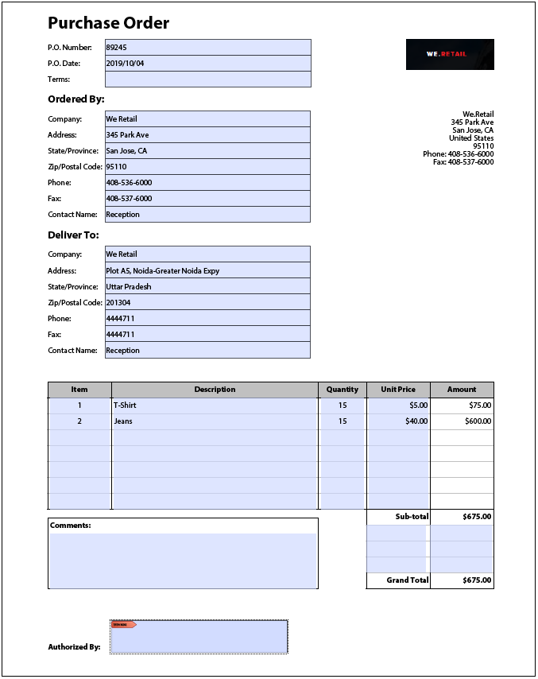

# Prácticas recomendadas y patrones complejos conocidos {#Best-practices-and-considerations2}

Este documento proporciona directrices y recomendaciones de las que pueden beneficiarse los administradores, autores y desarrolladores de formularios al trabajar con el [!DNL Automated Forms Conversion service]. Se analizan las prácticas recomendadas, desde la preparación de formularios de origen hasta la corrección de patrones complejos que requieren un esfuerzo adicional para la conversión automatizada. Estas prácticas recomendadas contribuyen colectivamente al rendimiento general y al resultado del [!DNL Automated Forms Conversion service].

## Prácticas recomendadas

El servicio de conversión transforma los formularios PDF disponibles en la instancia de [!DNL Forms] de AEM en formularios adaptables. Las prácticas recomendadas que se enumeran a continuación le ayudarán a aumentar la velocidad y la precisión de la conversión. Además, estas prácticas recomendadas también permiten ahorrar tiempo en las actividades posteriores a la conversión.

### Antes de cargar los formularios de origen

Puede cargar todos los formularios PDF a la vez o de forma gradual, según sea necesario. Antes de cargar los formularios, tenga en cuenta lo siguiente:

* Mantenga el número de formularios de una carpeta menor a 15 y el número total de páginas menor a 50.
* El tamaño de la carpeta debe ser inferior a 10 MB. No guarde formularios en una subcarpeta.
* Mantenga el número de páginas del formulario menor a 15.
* Organice los documentos de origen en un lote de 8 a 15 documentos. Reúna en un solo lote los formularios de origen con fragmentos de formulario adaptable comunes.
* No cargue formularios protegidos. El servicio no convierte los formularios protegidos con contraseña.
* No cargue [Portafolios PDF](https://helpx.adobe.com/es/acrobat/using/overview-pdf-portfolios.html). El servicio no convierte portafolios PDF en formularios adaptables.
* No cargue formularios de origen con espacios en el nombre de archivo. Quite el espacio del nombre del archivo antes de cargar los formularios.
* No cargue formularios escaneados, rellenados ni en ningún idioma que no sea inglés, francés, alemán, español, italiano o portugués. No se admiten estas clases de formulario.

Cuando utilice un formulario XDP de origen para la conversión, siga estos pasos antes de cargarlo:

* Analice el formulario XDP y corrija los problemas visuales. Asegúrese de que el documento de origen utiliza los controles y estructuras deseados. Por ejemplo, el formulario de origen puede tener casillas de verificación en lugar de botones de opción para una selección única. Cambie las casillas de verificación por botones de opción para crear un formulario adaptable con los componentes deseados.
* [Agregue enlaces al formulario XDP](http://www.adobe.com/go/learn_aemforms_designer_65_es) antes de iniciar la conversión. Cuando los enlaces están disponibles en el formulario XDP de origen, el servicio los aplica automáticamente a los campos de formulario adaptable correspondientes durante la conversión. Ahorra el tiempo de introducirlos manualmente.
* [Agregue etiquetas de Adobe Sign](https://helpx.adobe.com/es/sign/using/text-tag.html) al archivo XDP. El servicio convierte automáticamente las etiquetas de Adobe Sign en los campos de formulario adaptable correspondientes. Los formularios adaptables admiten un número limitado de campos de Adobe Sign. Para ver la lista completa de los campos admitidos, consulte la documentación [Uso de Adobe Sign en un formulario adaptable](https://experienceleague.adobe.com/docs/experience-manager-65/forms/adaptive-forms-advanced-authoring/working-with-adobe-sign.html?lang=es).
* Convierta las tablas complejas de los documentos XDP en tablas simples, si es posible. Se considera compleja una tabla con campos de formulario en celdas de tabla, celdas de tamaño desigual, celdas separadas por filas o columnas, fusionadas, bordes parciales o sin bordes visibles. Una tabla con cualquiera de los elementos mencionados anteriormente se considera compleja.
<!-- * Use sub-forms in XDP documents to create panels in adaptive forms. Service converts each sub-form to one or more adaptive form panels during conversion. -->

### Antes de iniciar la conversión

* Cree plantillas para el formulario adaptable. Estas especifican una estructura uniforme para los formularios de su organización o departamento.
* Especifique el encabezado y el pie de página en las plantillas de formulario adaptable. El servicio ignora el encabezado y el pie de página de los documentos de origen y utiliza los especificados en la plantilla de formulario adaptable.
* Cree temáticas de formulario adaptable. Las temáticas proporcionan una apariencia uniforme a los formularios de su organización o departamento.
* Configure el modelo de datos de formulario para que puedan guardarse y recuperarse desde una fuente de datos. Cree y configure servicios de lectura y escritura para el modelo de datos de formulario.
* Cree fragmentos de formulario adaptable y configure el servicio para que utilice sus fragmentos de formulario adaptable.
* Prepare modelos de flujo de trabajo comunes para los formularios que requieran la automatización de procesos empresariales.
* Configure Adobe Analytics, si es necesario.

## Reconocimiento de patrones complejos

El [!DNL Forms Automated Conversion service] de AEM utiliza inteligencia artificial y algoritmos de aprendizaje automático para comprender el diseño y los campos del formulario de origen. Todos los servicios de aprendizaje automático se alimentan continuamente de los datos de origen y producen mejores resultados con cada operación. Estos servicios adquieren conocimientos a partir de la experiencia, como las personas.

[!DNL Automated Forms Conversion service] está entrenado con un amplio conjunto de formularios. Identifica fácilmente los campos de un formulario de origen y los transforma en adaptables. Sin embargo, hay algunos campos y estilos en los formularios PDF que son fácilmente visibles para las personas, pero difíciles de identificar para el servicio. El servicio puede asignar tipos de campos o paneles diferentes a los aplicables a algunos campos o estilos. A continuación, se enumeran todos estos patrones de estilos y campos.

Al comienzo, el servicio identifica y asigna los campos o paneles correctos a estos patrones, a medida que sigue aprendiendo de los datos de origen. Por el momento, puede usar el editor [Revisar y corregir](review-correct-ui-edited.md) para solucionar estos problemas. Antes de comenzar a corregir los problemas o a leer más, familiarícese con los [componentes de formulario adaptable](https://helpx.adobe.com/es/experience-manager/6-5/forms/using/introduction-forms-authoring.html).

### Patrones generales {#general}

| Patrón | Ejemplo |
|--- |--- |
| **Patrón**  El servicio no convierte los formularios PDF rellenados a formularios adaptables.   **Resolución**  Utilice formularios adaptables vacíos. |  |
| **Patrón**  El servicio puede no reconocer el texto y los campos de un formulario con mucho contenido.   **Resolución**   Aumente la anchura entre el texto y los campos de un formulario con mucho contenido antes de iniciar la conversión. |  |
| **Patrón**  El servicio no admite formularios escaneados.   **Resolución**  No los utilice. |  |
| **Patrón**  El servicio no extrae imágenes ni texto en imágenes.   **Resolución**   Agregue manualmente las imágenes o el texto a los formularios convertidos. |  |
| **Patrón**  Las tablas con límites y bordes con puntos o que no estén bien delimitados no se pueden convertir.   **Resolución**  Utilice tablas con límites y bordes delimitados y explícitos. y admitidos. |  |
| **Patrón**   Los formularios adaptables no admiten texto vertical por defecto. Por lo tanto, el servicio no convierte el texto vertical en el texto correspondiente de los formularios adaptables.   **Resolución**   Utilice el editor de formularios adaptables para agregar texto vertical, si es necesario. |  |

### Grupo de elección  {#choice-group}

| Patrón | Resolución |
|--- |--- |
| **Patrón**   Las opciones del grupo de elección con formas distintas de recuadros o círculos no se convierten en los componentes correspondientes al formulario adaptable.   **Resolución**   Cambie las formas de las opciones de elección a recuadros o círculos o utilice el editor Revisar y corregir para identificarlas. |  |

### Campos del formulario {#form-fields}

| Patrón | Resolución |
|--- |--- |
| **Patrón**   El servicio no identifica los campos que no tengan bordes bien delimitados.   **Resolución**   Utilice el editor Revisar y corregir para identificarlos. |  |
| **Patrón**   Es posible que el servicio no identifique algunos campos de formulario de grupo de elección con subtítulos en la parte inferior o derecha de un formulario.   **Resolución**   Utilice el editor Revisar y corregir para identificarlos. |  |
| **Patrón**   El servicio combina o asigna un tipo incorrecto a algunos campos de formulario que están situados muy cerca unos de otros o que no tienen bordes bien definidos.   **Resolución**   Utilice el editor Revisar y corregir para identificarlos. |  |
| **Patrón**   El servicio puede no reconocer los campos con subtítulos muy alejados o con una línea de puntos entre el subtítulo y el campo de entrada.   **Resolución**   Utilice campos de formulario con límites bien definidos o utilice el editor Revisar y corregir para solucionar estos problemas. |  |

### Listas {#lists}

| Patrón | Resolución |
|--- |--- |
| **Patrón**  Las listas que contienen campos de formulario se combinan o no se convierten en los componentes de formulario adaptable correspondientes.   **Resolución**  Utilice campos de formulario con límites delimitados o utilice el editor Revisar y corregir para solucionar estos problemas. |  |
| **Patrón**  El servicio puede no identificar algunas listas anidadas.   **Resolución**   Utilice el editor Revisar y corregir para solucionar estos problemas. |  |
| **Patrón**   El servicio combina algunas listas que contienen grupos de elección entre sí.   **Resolución**   Utilice el editor Revisar y corregir para solucionar estos problemas. |  |

<!--
Comment Type: draft

<h3>Choice groups</h3>
-->

<!--
Comment Type: draft

<ul>
<li>Lists with form fields, nested lists, and nested choice groups are not supported.</li>
<li>Form fields with captions at bottom or right are not supported.</li>
<li>Form fields without borders are not supported.</li>
<li>Hidden form fields are not supported.</li>
<li>Button in PDF forms are not converted to adaptive form buttons.  </li>
<li>Tables with clear explicit boundaries and borders are supported.</li>
<li>Fields with far away captions are not supported.  </li>
<li>Choice groups with only box or circle shaped selectors are supported. </li>
</ul>
-->
